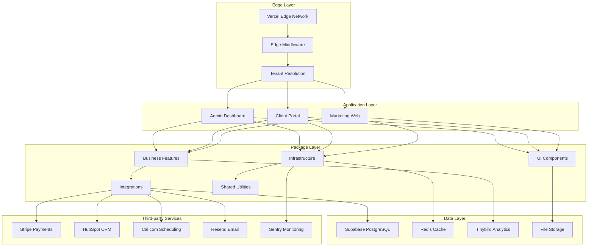
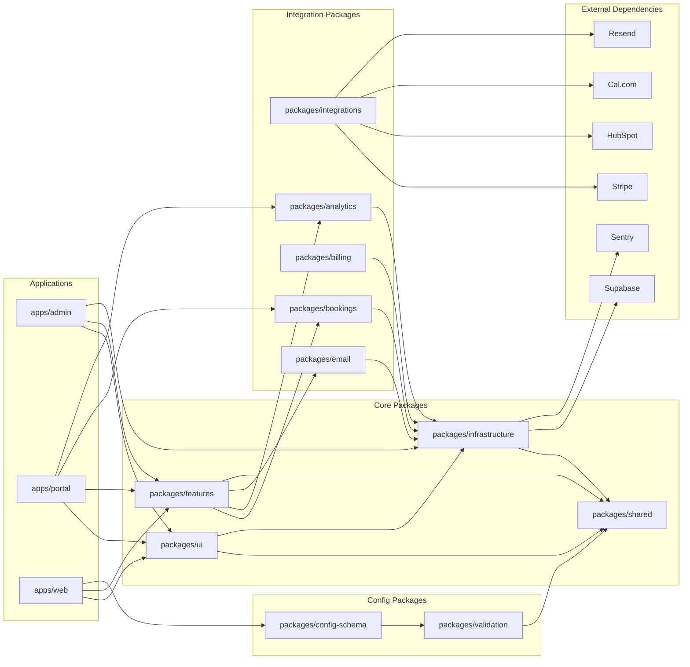
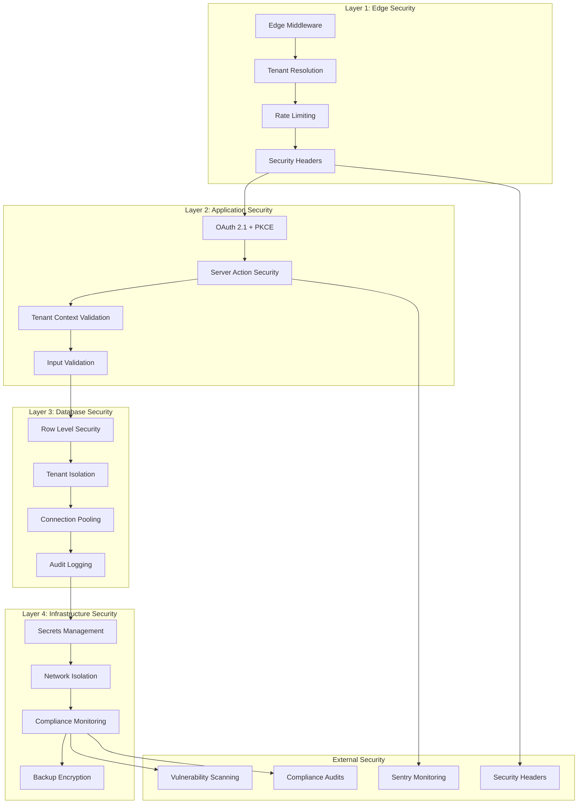
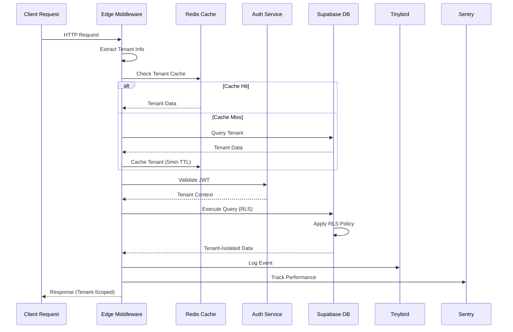
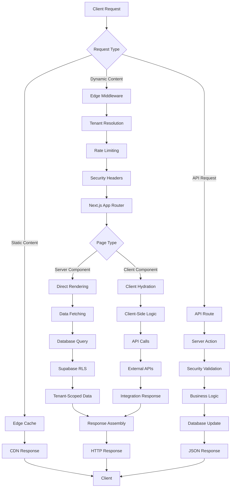
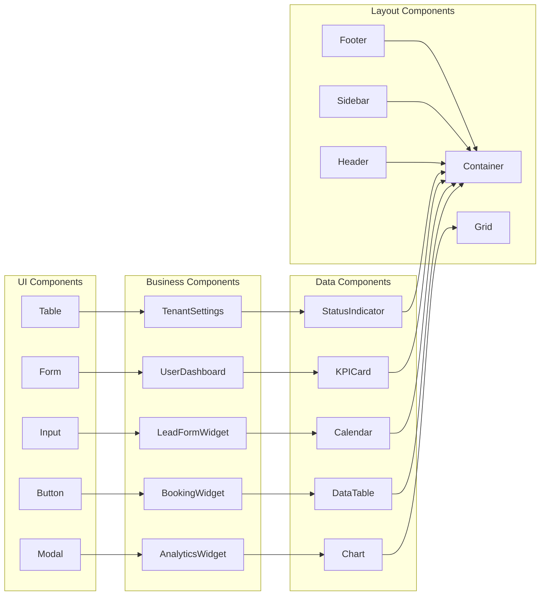
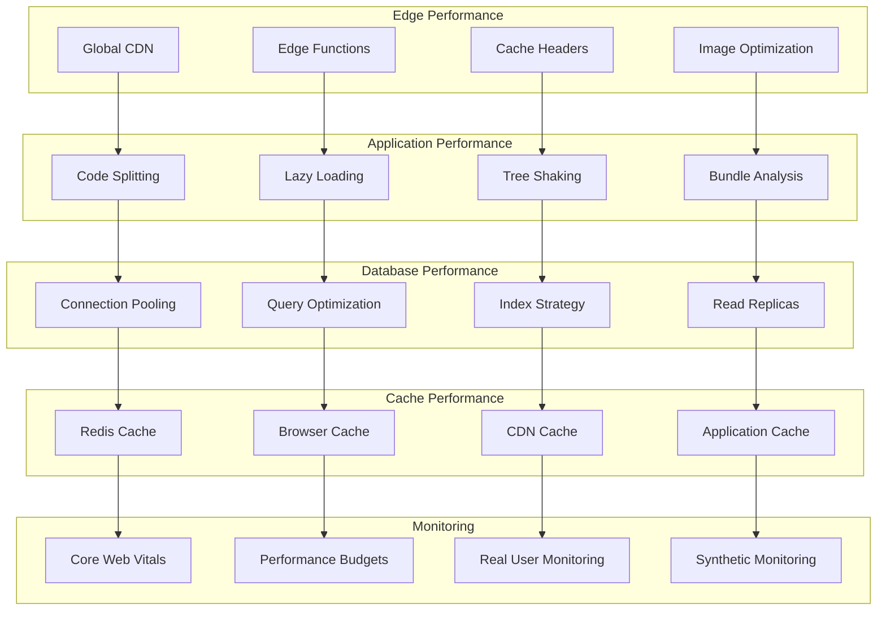
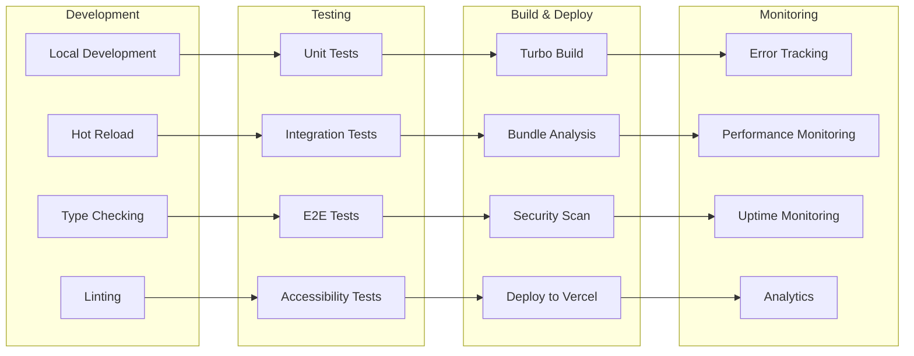

```mermaid
graph TB
    subgraph "OAuth Integration Flow"
        OAUTH1[Client Request]
        OAUTH2[Auth URL Generation]
        OAUTH3[User Redirect]
        OAUTH4[Callback Handling]
        OAUTH5[Token Exchange]
        OAUTH6[Token Storage]
    end

    subgraph "Webhook Processing"
        WEB1[Incoming Webhook]
        WEB2[Signature Verification]
        WEB3[Event Processing]
        WEB4[Business Logic]
        WEB5[Audit Logging]
    end

    subgraph "API Integration"
        API1[API Request]
        API2[Rate Limiting]
        API3[Authentication]
        API4[Data Processing]
        API5[Response Formatting]
    end

    subgraph "Data Synchronization"
        SYNC1[Trigger Event]
        SYNC2[Queue Message]
        SYNC3[Process Data]
        SYNC4[Update Local]
        SYNC5[Notify Systems]
    end

    OAUTH1 --> OAUTH2
    OAUTH2 --> OAUTH3
    OAUTH3 --> OAUTH4
    OAUTH4 --> OAUTH5
    OAUTH5 --> OAUTH6

    WEB1 --> WEB2
    WEB2 --> WEB3
    WEB3 --> WEB4
    WEB4 --> WEB5

    API1 --> API2
    API2 --> API3
    API3 --> API4
    API4 --> API5

    SYNC1 --> SYNC2
    SYNC2 --> SYNC3
    SYNC3 --> SYNC4
    SYNC4 --> SYNC5
```

# 🗺️ Code Map & Architecture Visualization

> **Interactive navigation and architectural diagrams for the marketing websites monorepo**

This document provides comprehensive code maps and architectural diagrams to help developers navigate, understand, and work with the marketing websites platform effectively.

---

## 🏗️ System Architecture Overview



---

## 🎨 Feature-Sliced Design (FSD) Architecture

```mermaid
graph TD
    subgraph "App Layer"
        APP1[app/layout.tsx]
        APP2[app/page.tsx]
        APP3[app/dashboard/page.tsx]
        APP4[app/loading.tsx]
    end

    subgraph "Pages Layer"
        PAGE1[pages/HomePage/]
        PAGE2[pages/DashboardPage/]
        PAGE3[pages/BookingPage/]
        PAGE4[pages/_templates/]
    end

    subgraph "Widgets Layer"
        WIDGET1[widgets/BookingWidget/]
        WIDGET2[widgets/LeadFormWidget/]
        WIDGET3[widgets/AnalyticsWidget/]
        WIDGET4[widgets/_templates/]
    end

    subgraph "Features Layer"
        FEATURE1[features/booking/]
        FEATURE2[features/lead-management/]
        FEATURE3[features/analytics/]
        FEATURE4[features/auth/]
        FEATURE5[features/_templates/]
    end

    subgraph "Entities Layer"
        ENTITY1[entities/user/]
        ENTITY2[entities/tenant/]
        ENTITY3[entities/booking/]
        ENTITY4[entities/lead/]
        ENTITY5[entities/_templates/]
    end

    subgraph "Shared Layer"
        SHARED1[shared/lib/]
        SHARED2[shared/types/]
        SHARED3[shared/config/]
        SHARED4[shared/ui/]
    end

    APP1 --> PAGE1
    APP2 --> PAGE2
    APP3 --> PAGE3
    APP4 --> PAGE4

    PAGE1 --> WIDGET1
    PAGE2 --> WIDGET2
    PAGE3 --> WIDGET3
    PAGE4 --> WIDGET4

    WIDGET1 --> FEATURE1
    WIDGET2 --> FEATURE2
    WIDGET3 --> FEATURE3
    WIDGET4 --> FEATURE5

    FEATURE1 --> ENTITY3
    FEATURE2 --> ENTITY4
    FEATURE3 --> ENTITY1
    FEATURE4 --> ENTITY2
    FEATURE5 --> ENTITY5

    ENTITY1 --> SHARED1
    ENTITY2 --> SHARED2
    ENTITY3 --> SHARED3
    ENTITY4 --> SHARED4
    ENTITY5 --> SHARED1

    %% Cross-slice imports with @x notation
    WIDGET1 -.->|@x/ui/shared| SHARED4
    FEATURE1 -.->|@x/entities/booking| ENTITY3
    PAGE2 -.->|@x/features/analytics| FEATURE3
```

---

## 📦 Package Dependency Map



---

## 🔒 Security Architecture Diagram



---

## 📊 Multi-Tenant Data Flow Diagram



---

## 🔌 Integration Flow Diagram



---

## 📁 File Structure Map

### **Applications (`apps/`)**

```
apps/
├── admin/                    # Admin dashboard
│   ├── src/
│   │   ├── app/             # Next.js App Router
│   │   ├── components/      # Admin-specific components
│   │   └── lib/             # Admin utilities
│   ├── package.json
│   └── README.md
├── portal/                   # Client portal
│   ├── src/
│   │   ├── app/             # App Router pages
│   │   ├── features/        # Portal features
│   │   └── api/             # API routes
│   ├── package.json
│   └── README.md
└── web/                      # Marketing site template
    ├── src/
    │   ├── app/             # App Router
    │   ├── components/      # Web components
    │   └── styles/          # Global styles
    ├── package.json
    └── README.md
```

### **Packages (`packages/`)**

```
packages/
├── ui/                       # UI components library
│   ├── src/
│   │   ├── app/             # App layer components
│   │   ├── pages/           # Pages layer
│   │   ├── widgets/         # Widgets layer
│   │   ├── features/        # Features layer
│   │   ├── entities/        # Entities layer
│   │   └── shared/          # Shared layer
│   ├── package.json
│   └── README.md
├── infrastructure/           # Core infrastructure
│   ├── src/
│   │   ├── auth/            # Authentication
│   │   ├── security/        # Security utilities
│   │   ├── monitoring/      # Monitoring setup
│   │   └── context/         # Request context
│   ├── package.json
│   └── README.md
├── features/                 # Business features
│   ├── src/
│   │   ├── booking/         # Booking system
│   │   ├── lead-management/  # Lead management
│   │   ├── analytics/       # Analytics features
│   │   └── auth/            # Authentication features
│   ├── package.json
│   └── README.md
├── integrations/             # Third-party integrations
│   ├── stripe/              # Payment processing
│   ├── hubspot/             # CRM integration
│   ├── calcom/              # Scheduling
│   ├── resend/              # Email service
│   └── analytics/           # Analytics providers
├── shared/                   # Shared utilities
│   ├── src/
│   │   ├── lib/             # Utility functions
│   │   ├── types/           # TypeScript types
│   │   ├── config/          # Configuration
│   │   └── ui/              # UI utilities
│   ├── package.json
│   └── README.md
└── [other packages...]       # Additional packages
```

### **Clients (`clients/`)**

```
clients/
├── client-name-1/            # Individual client site
│   ├── app/                 # Next.js application
│   ├── content/             # Client content
│   ├── site.config.ts       # Client configuration
│   ├── package.json
│   └── README.md
├── client-name-2/            # Another client site
└── testing-not-a-client/     # Test client
```

---

## 🔄 Request Flow Diagram



---

## 🎯 Component Interaction Map



---

## 📊 Performance Architecture



---

## 🔍 Development Workflow



---

## 📋 Quick Navigation Guide

### **For New Developers**

1. **Start with README.md** - Project overview and setup
2. **Review DESIGN.md** - Architecture and patterns
3. **Explore CODEMAP.md** - This file for navigation
4. **Check TODO.md** - Current tasks and priorities

### **For Feature Development**

1. **Identify FSD layer** for your feature
2. **Check package dependencies** in dependency map
3. **Review security patterns** in security diagram
4. **Follow integration flows** for external services

### **For Bug Fixing**

1. **Use request flow diagram** to trace issues
2. **Check component interactions** for UI problems
3. **Review data flow** for data-related issues
4. **Consult performance architecture** for optimization

### **For Operations**

1. **Monitor security architecture** for threats
2. **Review performance metrics** for optimization
3. **Check integration flows** for service issues
4. **Use development workflow** for deployments

---

## 🛠️ Tools and Commands

### **Code Navigation**

```bash
# Find package dependencies
pnpm why <package-name>

# Check circular dependencies
pnpm madge:circular

# Validate FSD architecture
pnpm lint:fsd

# Analyze bundle size
pnpm analyze
```

### **Architecture Validation**

```bash
# Validate workspace structure
pnpm validate:workspaces

# Check package exports
pnpm validate-exports

# Validate configurations
pnpm validate:configs

# Check documentation
pnpm validate-docs
```

### **Performance Analysis**

```bash
# Build performance report
pnpm build:workaround

# Test performance
pnpm test:e2e

# Accessibility test
pnpm test:a11y

# Bundle analysis
pnpm analyze
```

---

_This code map provides comprehensive navigation and architectural visualization. Regular updates ensure it stays synchronized with the evolving codebase._
