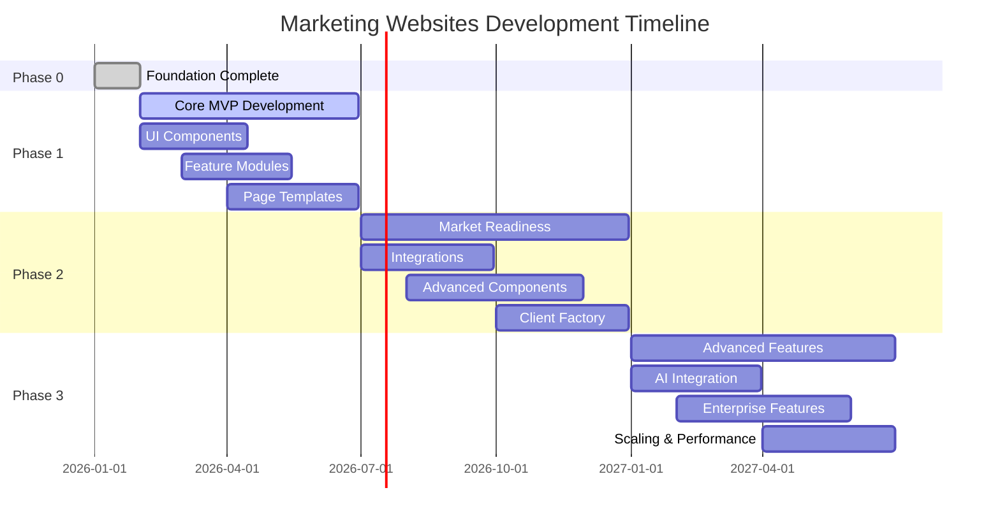

# Roadmap

Strategic roadmap for the marketing-websites platform development. This document outlines our development phases, priorities, and long-term vision.

## Vision

**Configuration-as-Code Architecture (CaCA):** Enable rapid deployment of client marketing websites through a single validated `site.config.ts` file. No code changes required to launch new clients.

**Multi-Industry Template System:** Provide industry-specific templates that solve real business problems while maintaining a unified, scalable architecture.

---

## Organic Evolution (26 weeks)

Primary execution plan: Strangler Fig — new system grows around existing. **Source:** Consolidated from evolution-roadmap and NEW.md (archived 2026-02-20).

### Philosophy

1. Improve the current system immediately (no speculative work)
2. Create a migration path (no dead ends)
3. Build toward the target architecture (no throwaway work)

**Outcome:** Capability-driven, multi-tenant platform. **Risk:** Low-to-medium.

### Checkpoints

| Week | Checkpoint                | Success Criteria                                |
| ---- | ------------------------- | ----------------------------------------------- |
| 0    | Pre-Phase                 | 0-1 (CI), 0-3 (tenant), 0-2 (BookingRepository) |
| 4    | Foundation locked         | Zero lint errors; registries hardened           |
| 10   | Data contracts seeded     | Booking uses canonical types                    |
| 16   | Capability core active    | Features self-declare capabilities              |
| 22   | Universal renderer proven | New client launched on universal                |
| 26   | Platform converged        | Legacy + modern coexist                         |

### Phase Summary

| Phase     | Weeks | Tasks                  |
| --------- | ----- | ---------------------- |
| Pre-Phase | 0     | 0-1, 0-3, 0-2          |
| Phase 1   | 1–4   | evol-1, evol-2, evol-3 |
| Phase 2   | 5–10  | evol-4, evol-5, evol-6 |
| Phase 3   | 11–16 | evol-7, evol-8         |
| Phase 4   | 17–22 | evol-9, evol-10        |
| Phase 5   | 23–26 | evol-11, evol-12       |

**Tasks:** [tasks/TASKS.md](tasks/TASKS.md) · **Target architecture:** [THEGOAL.md](THEGOAL.md)

**Current state:** Phase 1 partially complete (TODO.md Waves 2–3: CVA, tokens, booking registry done). evol-1 (Architecture Police) net-new; evol-2 extends CVA; evol-3 extends registry.

**Security (parallel):** security-1..7, infrastructure-1..6, compliance-1..2 — does not block Phase 1–2.

### Risk Mitigation

| Risk                      | Mitigation                                           |
| ------------------------- | ---------------------------------------------------- |
| Evolution takes too long  | Each phase has independent value; can stop anytime   |
| Team resists change       | Each change improves current workflow                |
| Architecture drifts       | Phase 1 invariants (evol-1) prevent drift            |
| Migration never completes | Legacy bridge (evol-11) means "complete" is optional |

---

## Development Phases

### Phase 0: Foundation ✅ Complete

**Status:** Done  
**Focus:** Housekeeping, tooling, CI, bug fixes

**Completed:**

- ✅ Repository structure cleanup
- ✅ Build pipeline stabilization
- ✅ Quality gates implementation
- ✅ Documentation standards establishment
- ✅ Core package scaffolding

### Phase 1: Core MVP 🔄 In Progress

**Status:** Active Development  
**Focus:** Essential components and features

**Current Priorities:**

- 🔄 UI component library completion (@repo/ui)
- 🔄 Feature module extraction (@repo/features)
- 🔄 Page template system (@repo/page-templates)
- 🔄 Client implementation patterns

**Target Completion:** Q2 2026

### Phase 2: Market Readiness ⏳ Planned

**Status:** Not Started  
**Focus:** Production-ready features and integrations

**Planned Features:**

- ⏳ Multi-industry template library
- ⏳ Advanced marketing components
- ⏳ Third-party integrations (HubSpot, Supabase, Analytics)
- ⏳ Enhanced analytics and tracking
- ⏳ Client factory automation

**Target Start:** Q3 2026

### Phase 3: Advanced Features 📋 Future

**Status:** Planning  
**Focus:** AI-powered features and enterprise capabilities

**Future Enhancements:**

- 📋 AI-powered content generation
- 📋 Advanced personalization engine
- 📋 Multi-channel marketing automation
- 📋 Enterprise features and scaling
- 📋 Advanced analytics and insights

**Target Start:** Q4 2026

---

## Current Status Overview

### Package Implementation Status

| Package                        | Progress | Status         | Notes                             |
| ------------------------------ | -------- | -------------- | --------------------------------- |
| **@repo/infra**                | 100%     | ✅ Complete    | Security, middleware, logging     |
| **@repo/types**                | 100%     | ✅ Complete    | SiteConfig, schemas               |
| **@repo/utils**                | 100%     | ✅ Complete    | Utility functions                 |
| **@repo/ui**                   | 64%      | 🟡 In Progress | 9 of 14 primitives complete       |
| **@repo/features**             | 56%      | 🟡 In Progress | 5 of 9 features complete          |
| **@repo/page-templates**       | 0%       | 🔴 Scaffolded  | 7 templates need implementation   |
| **@repo/marketing-components** | 20%      | 🟡 Partial     | Basic structure, needs completion |

### Client Implementation Status

| Client               | Status    | Port | Notes                       |
| -------------------- | --------- | ---- | --------------------------- |
| **starter-template** | ✅ Active | 3101 | Golden path template        |
| **luxe-salon**       | ✅ Active | 3102 | Salon industry example      |
| **bistro-central**   | ✅ Active | 3103 | Restaurant industry example |
| **chen-law**         | ✅ Active | 3104 | Law firm industry example   |
| **sunrise-dental**   | ✅ Active | 3105 | Dental industry example     |
| **urban-outfitters** | ✅ Active | 3106 | Retail industry example     |

---

## Technical Priorities

### Immediate (Phase 1)

1. **Complete UI Component Library**
   - Finish remaining 5 UI primitives
   - Resolve Toast component type errors
   - Add comprehensive accessibility testing

2. **Feature Module Standardization**
   - Complete booking feature (fix failing tests)
   - Implement remaining features (blog, services, search)
   - Standardize Server Actions patterns

3. **Page Template Hardening**
   - Expand section registry coverage and composition quality
   - Add template-level validation and stronger test coverage
   - Improve performance via selective/dynamic section loading

### Near-term (Phase 2)

1. **Integration Platform**
   - Complete HubSpot CRM integration
   - Implement Supabase database and auth
   - Add analytics and tracking providers

2. **Advanced Components**
   - Marketing-specific components (Hero, Services, Team)
   - Interactive components (Forms, Scheduling, Chat)
   - E-commerce capabilities

3. **Client Factory**
   - Automated client generation tools
   - Template customization workflows
   - Deployment automation

### Long-term (Phase 3)

1. **AI Integration**
   - Content generation assistance
   - Personalization algorithms
   - Automated SEO optimization

2. **Enterprise Features**
   - Multi-tenant scaling
   - Advanced security features
   - Performance optimization

---

## Quality and Performance Targets

### Code Quality

- **Test Coverage:** 80% overall (Phase 2 target)
- **TypeScript:** Strict mode compliance
- **Accessibility:** WCAG 2.2 AA compliance
- **Documentation:** 100% API documentation coverage

### Performance

- **Core Web Vitals:** LCP < 2.5s, INP < 200ms, CLS < 0.1
- **Bundle Size:** JS < 250KB gzipped, total < 1MB
- **Build Time:** < 2 minutes for full monorepo
- **Dev Server:** < 5 seconds startup time

### Reliability

- **Uptime:** 99.9% availability target
- **Error Rate:** < 0.1% of requests
- **Build Success:** 100% CI/CD success rate
- **Security:** Zero critical vulnerabilities

---

## Resource Allocation

### Team Focus Areas

**Phase 1 (Current):**

- 60% Component and feature development
- 25% Testing and quality assurance
- 15% Documentation and tooling

**Phase 2 (Planned):**

- 40% Integration development
- 30% Template and client work
- 20% Performance and optimization
- 10% Documentation and examples

**Phase 3 (Future):**

- 50% AI and advanced features
- 30% Enterprise capabilities
- 20% Performance and scaling

### Technology Investments

**Infrastructure:**

- CI/CD pipeline optimization
- Performance monitoring and alerting
- Security scanning and compliance

**Development Tools:**

- Enhanced testing frameworks
- Documentation generation
- Code quality automation

---

## Risk Assessment and Mitigation

### Technical Risks

1. **Complexity Management**
   - **Risk:** Architecture complexity increases with features
   - **Mitigation:** Strict dependency rules, clear documentation

2. **Performance Degradation**
   - **Risk:** Bundle size and performance impact as features grow
   - **Mitigation:** Performance budgets, regular audits

3. **Integration Challenges**
   - **Risk:** Third-party service integration complexity
   - **Mitigation:** Adapter patterns, comprehensive testing

### Business Risks

1. **Market Timing**
   - **Risk:** Missing market window for template-based solutions
   - **Mitigation:** Agile development, rapid iteration

2. **Competitive Pressure**
   - **Risk:** Competitors offering similar solutions
   - **Mitigation:** Focus on unique value propositions, quality

3. **Resource Constraints**
   - **Risk:** Limited development resources impacting timeline
   - **Mitigation:** Prioritization, automation, efficient processes

---

## Success Metrics

### Phase 1 Success Criteria

- [ ] All UI primitives completed and tested
- [ ] Core features implemented and working
- [ ] At least 3 production-ready client templates
- [ ] 80% test coverage achieved
- [ ] Performance targets met

### Phase 2 Success Criteria

- [ ] 10+ industry templates available
- [ ] Major integrations (HubSpot, Supabase) working
- [ ] Client factory automation operational
- [ ] 90% test coverage achieved
- [ ] Enterprise security features implemented

### Phase 3 Success Criteria

- [ ] AI-powered features launched
- [ ] Advanced personalization working
- [ ] Multi-channel automation operational
- [ ] Enterprise scaling proven
- [ ] Market leadership established

---

## Timeline Summary

---

## Related Documentation

- **[THEGOAL.md](THEGOAL.md)** — Target architecture
- **[tasks/TASKS.md](tasks/TASKS.md)** — Task index and evol-\* specs
- **[docs/architecture/README.md](docs/architecture/README.md)** — Architecture overview
- **[TODO.md](TODO.md)** — Wave implementation status

---

_Last updated: 2026-02-20_
