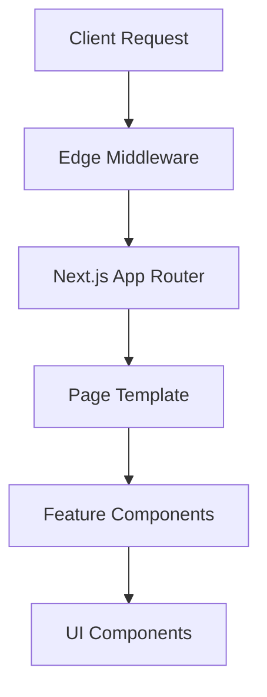

<!--
/**
 * @file docs/DOCUMENTATION_STANDARDS.md
 * @role docs
 * @summary Documentation standards, style guide, and quality requirements.
 *
 * @entrypoints
 * - Primary reference for all documentation contributors
 *
 * @exports
 * - N/A
 *
 * @depends_on
 * - CONTRIBUTING.md (development workflows)
 * - docs/architecture/README.md (system understanding)
 *
 * @used_by
 * - All documentation contributors and maintainers
 *
 * @runtime
 * - environment: docs
 * - side_effects: none
 *
 * @data_flow
 * - inputs: repository documentation practices
 * - outputs: consistent documentation quality
 *
 * @invariants
 * - Standards must align with 2026 documentation best practices
 * - Metaheader format must be consistent across files
 *
 * @gotchas
 * - Standards evolve with industry practices; review quarterly
 *
 * @issues
 * - [severity:low] Need automated validation for standards compliance
 *
 * @opportunities
 * - Add AI-assisted documentation review tools
 * - Create documentation templates for common patterns
 *
 * @verification
 * - ✅ Verified: Standards align with 2026 research findings
 * - ✅ Verified: Metaheader format matches existing files
 *
 * @status
 * - confidence: high
 * - last_audited: 2026-02-18
 */
-->

# Documentation Standards & Style Guide

**Last Updated:** 2026-02-18  
**Status:** Active Standards  
**Version:** 1.0  
**Review Cycle:** Quarterly

---

## Overview

This document defines the standards, guidelines, and quality requirements for all documentation in the marketing-websites repository. These standards ensure consistency, maintainability, and alignment with 2026 documentation best practices.

### Core Principles

1. **Version-Controlled Documentation** - All documentation lives in Git alongside code
2. **Audience-Centric Writing** - Write for specific user personas with clear paths
3. **AI-Assisted Quality** - Leverage AI tools for consistency and accuracy
4. **Interactive Learning** - Include examples, tutorials, and hands-on guidance
5. **Accessibility First** - WCAG 2.2 AA compliance for all documentation
6. **Continuous Improvement** - Regular updates based on feedback and metrics

---

## Documentation Structure

### Standard File Organization

```
docs/
├── README.md                    # Documentation overview & navigation
├── DOCUMENTATION_STANDARDS.md   # This file - style guide and standards
├── getting-started/
│   ├── onboarding.md           # Developer onboarding guide
│   ├── quick-reference.md      # Common commands & patterns
│   └── troubleshooting.md      # Common issues & solutions
├── architecture/
│   ├── README.md               # Architecture overview
│   ├── module-boundaries.md    # Dependency rules
│   ├── dependency-graph.md     # Visual dependency map
│   └── decision-records/       # ADR collection
├── guides/
│   ├── template-development.md # Template creation guide
│   ├── client-setup.md         # Client project setup
│   ├── configuration.md         # Site configuration deep dive
│   └── deployment.md           # Deployment strategies
├── components/
│   ├── ui-library.md           # Component library documentation
│   ├── design-system.md        # Design tokens & theming
│   └── storybook.md           # Interactive component docs
├── integrations/
│   ├── overview.md             # Integration architecture
│   ├── api-reference.md        # API documentation
│   └── providers/              # Individual integration docs
├── operations/
│   ├── monitoring.md           # Performance & error monitoring
│   ├── security.md             # Security practices
│   └── maintenance.md         # Documentation maintenance
└── resources/
    ├── glossary.md             # Terminology & concepts
    ├── faq.md                  # Frequently asked questions
    └── community.md            # Community resources
```

### File Naming Conventions

- **Use kebab-case** for all file names: `client-setup.md`, not `clientSetup.md`
- **Index files** named `README.md` for directories
- **Descriptive names** that clearly indicate content: `api-reference.md`, not `api.md`
- **Consistent patterns** across similar documentation types

---

## Metaheader Standards

### Required Metaheader Format

All documentation files must include a standardized metaheader comment block at the top:

```markdown
<!--
/**
 * @file [path-to-file]
 * @role [docs|code|config|test]
 * @summary [one-sentence summary of content]
 *
 * @entrypoints
 * - [How users discover this documentation]
 *
 * @exports
 * - [What this file provides, N/A if none]
 *
 * @depends_on
 * - [Files/docs this depends on]
 *
 * @used_by
 * - [Who uses this documentation]
 *
 * @runtime
 * - environment: [docs|node|browser|server]
 * - side_effects: [none|yes]
 *
 * @data_flow
 * - inputs: [what this consumes]
 * - outputs: [what this produces]
 *
 * @invariants
 * - [critical truths that must remain true]
 *
 * @gotchas
 * - [common pitfalls or edge cases]
 *
 * @issues
 * - [known problems with severity levels]
 *
 * @opportunities
 * - [potential improvements or extensions]
 *
 * @verification
 * - [how claims are verified]
 *
 * @status
 * - confidence: [high|medium|low]
 * - last_audited: [YYYY-MM-DD]
 */
-->
```

### Metaheader Field Guidelines

| Field | Required | Format | Guidelines |
|-------|----------|--------|------------|
| `@file` | ✅ | Relative path | Exact file path from repository root |
| `@role` | ✅ | docs|code|config|test | Primary file purpose |
| `@summary` | ✅ | One sentence | Clear, concise description |
| `@entrypoints` | ✅ | List | How users find this content |
| `@exports` | ✅ | List/N/A | What this file provides |
| `@depends_on` | ✅ | List | Dependencies and prerequisites |
| `@used_by` | ✅ | List | Primary consumers |
| `@runtime` | ✅ | Environment | Where this runs |
| `@data_flow` | ✅ | Inputs/outputs | Data transformation |
| `@invariants` | ✅ | List | Critical truths |
| `@gotchas` | ✅ | List | Common issues |
| `@issues` | ✅ | List | Known problems |
| `@opportunities` | ✅ | List | Improvements |
| `@verification` | ✅ | List | How verified |
| `@status` | ✅ | Confidence+date | Quality status |

---

## Writing Standards

### Voice and Tone

- **Professional but approachable** - Clear, direct language
- **Active voice** preferred over passive voice
- **Present tense** for current functionality
- **Second person** ("you") for instructional content
- **Consistent terminology** across all documentation

### Clarity and Simplicity

- **Grade level 8-10** reading level (use Hemingway Editor)
- **Short sentences** (max 20 words)
- **One concept per paragraph**
- **Simple words** over technical jargon
- **Define terms** on first use

### Structure and Formatting

#### Headings

- **H1** for document title (only one per file)
- **H2** for major sections
- **H3** for subsections
- **H4+** for detailed breakdowns
- **Blank lines** before and after headings
- **Descriptive headings** that summarize content

#### Lists

- **Blank lines** before and after lists
- **Consistent formatting** (bullets or numbers)
- **Parallel structure** for list items
- **Maximum 7 items** per list (split if longer)

#### Code Blocks

- **Language specification** for syntax highlighting
- **Real, tested examples** not pseudocode
- **Context provided** for code snippets
- **Comments** for complex logic

```typescript
// Example: Site configuration validation
export function validateSiteConfig(config: unknown): SiteConfig {
  if (!config || typeof config !== 'object') {
    throw new Error('Site config must be an object');
  }
  return siteConfigSchema.parse(config);
}
```

#### Links and References

- **Descriptive link text** not URLs
- **Internal links** use relative paths
- **External links** include context
- **Check links** regularly for validity

---

## Content Standards

### Audience Segmentation

#### Primary Audiences

1. **Template Users** - Non-technical users setting up client websites
2. **Developers** - Technical contributors extending the platform
3. **System Administrators** - Operations team managing deployments
4. **Architects** - Technical leaders making design decisions

#### Content Paths

- **Template Users**: Quick start → Setup guides → Troubleshooting
- **Developers**: Architecture → API docs → Contributing guide
- **Administrators**: Deployment → Monitoring → Security
- **Architects**: Architecture overview → Decision records → Roadmap

### Content Types

#### Conceptual Documentation

- **What and why** explanations
- **Architecture overviews**
- **Design principles**
- **Best practices**

#### Procedural Documentation

- **Step-by-step guides**
- **Tutorials**
- **Configuration instructions**
- **Troubleshooting procedures**

#### Reference Documentation

- **API specifications**
- **Configuration options**
- **Command references**
- **Glossaries**

#### Tutorial Documentation

- **Hands-on learning**
- **Example projects**
- **Interactive exercises**
- **Video demonstrations**

### Quality Requirements

#### Accuracy

- **Technical accuracy** verified by testing
- **Up-to-date information** with regular reviews
- **Version-specific notes** where applicable
- **Cross-references** validated

#### Completeness

- **Comprehensive coverage** of topics
- **Prerequisite information** included
- **Related topics** referenced
- **Next steps** clearly defined

#### Accessibility

- **WCAG 2.2 AA compliance** mandatory
- **Alt text** for all images
- **Semantic HTML** structure
- **Keyboard navigation** support
- **Screen reader** compatibility

---

## Visual Documentation Standards

### Diagrams and Visualizations

#### Types of Diagrams

- **Architecture diagrams** - System structure and relationships
- **Flow diagrams** - Process flows and data flows
- **Sequence diagrams** - Interaction patterns
- **Component trees** - Hierarchical relationships

#### Diagram Standards

- **Consistent styling** across all diagrams
- **Text-based diagrams** (Mermaid) for version control
- **High contrast** for accessibility
- **Descriptive captions** and alt text
- **Source files** included in repository



### Screenshots and Images

#### Image Guidelines

- **High quality** screenshots (2x resolution)
- **Consistent sizing** and aspect ratios
- **Relevant content** only (crop appropriately)
- **Text alternatives** for accessibility
- **Light/dark theme** versions when applicable

#### File Organization

```
docs/
├── assets/
│   ├── images/
│   │   ├── architecture/
│   │   ├── components/
│   │   └── workflows/
│   ├── diagrams/
│   └── screenshots/
```

---

## Interactive Documentation

### Code Examples

#### Live Examples

- **Runnable code blocks** where possible
- **Interactive playgrounds** for complex concepts
- **Copy-to-clipboard** functionality
- **Error handling** demonstrations

#### Example Standards

- **Complete, working examples**
- **Context and prerequisites** clearly stated
- **Expected outputs** shown
- **Error cases** demonstrated

### Tutorials and Guides

#### Tutorial Structure

1. **Overview** - What will be built
2. **Prerequisites** - What's needed to start
3. **Step-by-step instructions** - Detailed guidance
4. **Verification** - How to confirm success
5. **Next steps** - Where to go from here

#### Guide Quality

- **Tested instructions** that work as written
- **Estimated time** for completion
- **Difficulty level** clearly indicated
- **Troubleshooting section** for common issues

---

## AI-Assisted Documentation

### AI Tools Integration

#### Content Creation

- **AI-assisted drafting** for initial content
- **Grammar and style checking** with AI tools
- **Consistency verification** across documents
- **Translation support** for multilingual content

#### Quality Assurance

- **Automated reviews** for standards compliance
- **Accuracy checking** against code changes
- **Link validation** and reference checking
- **Readability analysis** and improvement suggestions

### AI Governance

#### Usage Guidelines

- **Human oversight** required for all AI-generated content
- **Verification** of technical accuracy mandatory
- **Attribution** of AI-assisted content where appropriate
- **Privacy considerations** for proprietary information

#### Quality Controls

- **Review process** for AI-generated content
- **Accuracy validation** before publication
- **Regular audits** of AI assistance tools
- **Feedback loops** for improvement

---

## Maintenance and Updates

### Review Processes

#### Regular Reviews

- **Quarterly comprehensive reviews** of all documentation
- **Monthly accuracy checks** for critical documentation
- **Weekly link validation** and reference checking
- **Continuous monitoring** for documentation usage

#### Update Triggers

- **Code changes** that affect documented behavior
- **Feature additions** requiring new documentation
- **Bug fixes** that update documented limitations
- **Community feedback** indicating documentation issues

### Version Control

#### Documentation Changes

- **Same PR as code changes** when related
- **Separate PRs** for documentation-only changes
- **Semantic versioning** for documentation breaking changes
- **Change logs** for significant updates

#### Branch Strategy

- **Main branch** always has current documentation
- **Feature branches** include documentation updates
- **Release branches** freeze documentation changes
- **Hotfix branches** update critical documentation only

---

## Quality Metrics

### Measurement Criteria

#### Quality Metrics

- **Accuracy rate** (95%+ target)
- **Completeness score** (90%+ target)
- **User satisfaction** (4.5/5+ target)
- **Search success rate** (80%+ target)

#### Engagement Metrics

- **Page views** and time on page
- **Search queries** and success rates
- **Community contributions** (issues, PRs)
- **Support ticket reduction** from documentation

#### Maintenance Metrics

- **Update frequency** (within 24h of code changes)
- **Review completion** (95% within SLA)
- **Link validity** (98%+ links working)
- **Automated coverage** (80%+ auto-generated)

### Improvement Process

#### Continuous Improvement

1. **Collect metrics** on documentation usage and effectiveness
2. **Analyze feedback** from users and contributors
3. **Identify gaps** and areas for improvement
4. **Implement changes** based on data-driven insights
5. **Measure impact** of improvements
6. **Iterate** based on results

#### Community Feedback

- **Issue templates** for documentation feedback
- **Discussion forums** for documentation questions
- **Surveys** for user satisfaction
- **Analytics** for usage patterns

---

## Tools and Automation

### Documentation Tools

#### Authoring Tools

- **Markdown editors** with live preview
- **Diagram tools** (Mermaid, PlantUML)
- **Screenshot tools** with annotation
- **Grammar and style checkers**

#### Validation Tools

- **Link checkers** for broken references
- **Markdown linters** for format validation
- **Spell checkers** for typos
- **Accessibility checkers** for compliance

### Automation

#### CI/CD Integration

- **Automated testing** of code examples
- **Link validation** in CI pipelines
- **Format checking** for standards compliance
- **Deployment automation** for documentation sites

#### Monitoring

- **Analytics integration** for usage tracking
- **Error monitoring** for documentation issues
- **Performance monitoring** for documentation sites
- **Uptime monitoring** for documentation availability

---

## Templates and Examples

### Document Templates

#### Standard Template

```markdown
<!--
/**
 * @file docs/[path]/[file].md
 * @role docs
 * @summary [One-sentence summary]
 *
 * @entrypoints
 * - [How users find this]
 *
 * @exports
 * - [What this provides]
 *
 * @depends_on
 * - [Dependencies]
 *
 * @used_by
 * - [Consumers]
 *
 * @runtime
 * - environment: docs
 * - side_effects: none
 *
 * @data_flow
 * - inputs: [inputs]
 * - outputs: [outputs]
 *
 * @invariants
 * - [Critical truths]
 *
 * @gotchas
 * - [Common issues]
 *
 * @issues
 * - [Known problems]
 *
 * @opportunities
 * - [Improvements]
 *
 * @verification
 * - [How verified]
 *
 * @status
 * - confidence: high
 * - last_audited: [YYYY-MM-DD]
 */
-->

# [Title]

**Last Updated:** [YYYY-MM-DD]  
**Status:** [Active|Draft|Deprecated]  
**Version:** [version]

## Overview

[Brief description of what this document covers]

---

[Content continues with standard structure]
```

#### Guide Template

```markdown
## Prerequisites

What users need before starting:

- [Requirement 1]
- [Requirement 2]

## Step 1: [Action Title]

[Detailed instructions with code examples]

### Verification

[How to confirm the step succeeded]

## Troubleshooting

[Common issues and solutions]

## Next Steps

[What to do after completing this guide]
```

---

## Contributing Guidelines

### Documentation Contributions

#### Before Contributing

1. **Read this standards document** thoroughly
2. **Review existing documentation** for similar content
3. **Identify the appropriate location** for new content
4. **Plan the structure** before writing

#### Contribution Process

1. **Create issue** to discuss major documentation changes
2. **Follow templates** for consistency
3. **Include metaheaders** in all files
4. **Test code examples** before submitting
5. **Request review** from documentation maintainers

#### Quality Checklist

- [ ] Metaheader complete and accurate
- [ ] Content follows style guide
- [ ] Code examples tested and working
- [ ] Links validated and working
- [ ] Accessibility compliance verified
- [ ] Spelling and grammar checked
- [ ] Technical accuracy verified
- [ ] Appropriate audience targeting

### Review Process

#### Review Criteria

- **Standards compliance** with this guide
- **Technical accuracy** of all content
- **Clarity and completeness** for target audience
- **Integration** with existing documentation
- **Accessibility** and usability standards

#### Review Types

- **Self-review** by author before submission
- **Peer review** by documentation team
- **Technical review** by subject matter experts
- **Accessibility review** for compliance

---

## Related Documentation

- **[CONTRIBUTING.md](../CONTRIBUTING.md)** - General contribution guidelines
- **[Architecture Overview](architecture/README.md)** - System architecture
- **[TASKS.md](../TASKS.md)** - Implementation details and task specifications
- **[Testing Strategy](testing-strategy.md)** - Quality assurance

---

## Resources

### Style and Writing

- **[Microsoft Writing Style Guide](https://learn.microsoft.com/en-us/style-guide/)**
- **[Google Developer Documentation Style Guide](https://developers.google.com/tech-writing)**
- **[Hemingway Editor](https://hemingwayapp.com/)** for readability

### Accessibility

- **[WCAG 2.2 Guidelines](https://www.w3.org/TR/WCAG22/)**
- **[WebAIM Accessibility Checklist](https://webaim.org/resources/checklist/)**
- **[A11y Project](https://www.a11yproject.com/)**

### Tools

- **[Mermaid Diagram Syntax](https://mermaid.js.org/)**
- **[Markdown Lint Rules](https://github.com/DavidAnson/markdownlint)**
- **[Grammarly](https://www.grammarly.com/)** for grammar checking

---

_This standards document evolves with industry best practices. Last reviewed: 2026-02-18_
