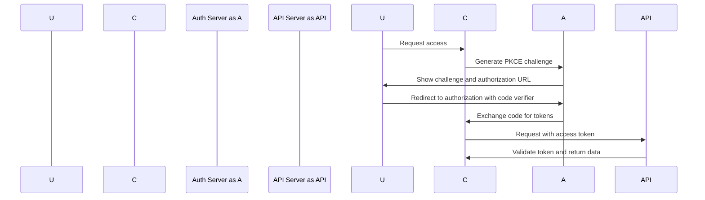

# API Documentation

**Created:** 2026-2026-02-21  
**Role:** Reference Documentation  
**Audience:** Developers, Integration Partners  
**Last Updated:** 2026-02-21  
**Review Interval:** 30 days  
**Classification:** Public

---

## Overview

This document provides comprehensive API documentation for the marketing-websites platform, including all public APIs, authentication requirements, and integration patterns.

---

## Authentication & Authorization

### OAuth 2.1 with PKCE

**Status:** ✅ Implemented  
**Standard:** OAuth 2.1 with PKCE (Proof Key for Code Exchange)  
**Purpose:** Secure authentication for user access and API access

#### **Authentication Flow**



#### **Implementation Example**

```typescript
// Authentication endpoint
export async function POST(request: NextRequest) {
  const { code, code_verifier } = await request.json();

  // Exchange code for tokens
  const tokens = await PKCEManager.exchangeCodeForToken(
    code,
    code_verifier,
    process.env.CLIENT_ID!,
    process.env.CLIENT_SECRET!,
    process.env.TOKEN_URL!
  );

  // Set secure HTTP-only cookie
  cookies().set('session-token', tokens.access_token, {
    httpOnly: true,
    secure: true,
    sameSite: 'strict',
    maxAge: 3600,
  });

  return NextResponse.json({ success: true });
}
```

#### **Token Validation**

```typescript
// Middleware for token validation
export async function validateToken(request: NextRequest): Promise<any> {
  const token = request.cookies.get('session-token');

  if (!token) {
    return NextResponse.json({ error: 'Unauthorized' }, { status: 401 });
  }

  try {
    const payload = await jose.jwtVerify(token, getJWTSecret());
    return payload;
  } catch (error) {
    return NextResponse.json({ error: 'Invalid token' }, { status: 401 });
  }
}
```

---

## Core APIs

### Authentication Endpoints

#### **POST /api/auth/login**

**Description:** User authentication with OAuth 2.1 PKCE flow  
**Authentication:** Required  
**Rate Limit:** 5 requests per minute

**Request Body:**

```typescript
{
  email: string;
  password: string;
  remember?: boolean;
}
```

**Response:**

```typescript
{
  success: boolean;
  user: {
    id: string;
    email: string;
    name: string;
    tenantId: string;
  };
  tokens: {
    access_token: string;
    refresh_token?: string;
  };
}
```

#### **POST /api/auth/refresh**

**Description:** Refresh access tokens  
**Authentication:** Required  
**Rate Limit:** 10 requests per minute

**Request Body:**

```typescript
{
  refresh_token: string;
}
```

**Response:**

```typescript
{
  success: boolean;
  tokens: {
    access_token: string;
    refresh_token: string;
  }
}
```

#### **POST /api/auth/logout**

**Description:** User logout and session termination  
**Authentication:** Required  
**Rate Limit:** 20 requests per minute

**Response:**

```typescript
{
  success: boolean;
  message: 'Logged out successfully';
}
```

---

### User Management Endpoints

#### **GET /api/users/me**

**Description:** Get current user profile  
**Authentication:** Required  
**Rate Limit:** 100 requests per minute

**Response:**

```typescript
{
  id: string;
  email: string;
  name: string;
  avatar?: string;
  tenantId: string;
  preferences: {
    theme: 'light' | 'dark' | 'auto';
    language: string;
    notifications: boolean;
  };
}
```

#### **PUT /api/users/me**

**Description:** Update user profile  
**Authentication:** Required  
**Rate Limit:** 50 requests per minute

**Request Body:**

```typescript
{
  name?: string;
  avatar?: string;
  preferences: {
    theme?: 'light' | 'dark' | 'auto';
    language?: string;
    notifications?: boolean;
  };
}
```

**Response:**

```typescript
{
  success: boolean;
  user: {
    id: string;
    email: string;
    name: string;
    avatar?: string;
    tenantId: string;
    preferences: {
      theme: 'light' | 'dark' | 'auto';
      language: string;
      notifications: boolean;
    };
  };
}
```

---

## Feature APIs

### Booking System

#### **GET /api/bookings**

**Description:** Get bookings for current tenant  
**Authentication:** Required  
**Tenant Context:** Required  
**Rate Limit:** 100 requests per minute

**Query Parameters:**

```typescript
{
  page?: number;
  limit?: number;
  status?: 'pending' | 'confirmed' | 'cancelled';
  startDate?: string;
  endDate?: string;
}
```

**Response:**

```typescript
{
  bookings: Booking[];
  pagination: {
    page: number;
    limit: number;
    total: number;
    totalPages: number;
  };
}
```

#### **POST /api/bookings**

**Description:** Create new booking  
**Authentication:** Required  
**Tenant Context:** Required  
**Rate Limit:** 50 requests per minute

**Request Body:**

```typescript
{
  serviceId: string;
  dateTime: string;
  customerInfo: {
    name: string;
    email: string;
    phone: string;
  };
  notes?: string;
}
```

**Response:**

```typescript
{
  success: boolean;
  booking: {
    id: string;
    serviceId: string;
    dateTime: string;
    status: 'pending';
    customerInfo: {
      name: string;
      email: string;
      phone: string;
    };
    notes?: string;
  };
}
```

#### **PUT /api/bookings/:id**

**Description:** Update booking  
**Authentication:** Required  
**Tenant Context:** Required  
**Rate Limit:** 50 requests per minute

**Request Body:**

```typescript
{
  status?: 'pending' | 'confirmed' | 'cancelled';
  notes?: string;
}
```

#### **DELETE /api/bookings/:id**

**Description:** Cancel booking  
**Authentication:** Required  
**Tenant Context:** Required  
**Rate Limit:** 20 requests per minute

**Response:**

```typescript
{
  success: boolean;
  message: string;
}
```

### Contact System

#### **GET /api/contact**

**Description:** Get contact submissions  
**Authentication:** Required  
**Tenant Context:** Required  
**Rate Limit:** 50 requests per minute

**Query Parameters:**

```typescript
{
  page?: number;
  limit?: number;
  status?: 'pending' | 'processed' | 'failed';
}
```

**Response:**

```typescript
{
  contacts: Contact[];
  pagination: {
    page: number;
    limit: number;
    total: number;
    totalPages: number;
  };
}
```

#### **POST /api/contact**

**Description:** Submit contact form  
**Authentication:** Required  
**Tenant Context:** Required  
**Rate Limit:** 25 requests per minute

**Request Body:**

```typescript
{
  name: string;
  email: string;
  phone?: string;
  message: string;
  serviceInterest?: string;
}
```

**Response:**

```typescript
{
  success: boolean;
  contact: {
    id: string;
    name: string;
    email: string;
    phone?: string;
    message: string;
    serviceInterest?: string;
    status: 'pending';
    submittedAt: string;
  };
}
```

---

## Integration APIs

### HubSpot Integration

#### **GET /api/integrations/hubspot/contacts**

**Description:** Sync contacts from HubSpot  
**Authentication:** Required  
**Tenant Context:** Required  
**Rate Limit:** 100 requests per minute

**Query Parameters:**

```typescript
{
  since?: string;
  limit?: number;
  vid?: string;
}
```

**Response:**

```typescript
{
  contacts: HubSpotContact[];
  hasMore: boolean;
  vid?: string;
}
```

#### **POST /api/integrations/hubspot/webhooks**

**Description:** Handle HubSpot webhooks  
**Authentication:** Required  
**Tenant Context:** Required  
**Rate Limit:** 1000 requests per minute

**Request Body:**

```typescript
{
  objectTypeId: string;
  objectId: string;
  occurredAt: string;
  subscriptions: HubSpotSubscription[];
  properties: Record<string, any>;
}
```

**Response:**

```typescript
{
  success: boolean;
  message: string;
  processed: number;
  failed: number;
}
```

### Google Analytics Integration

#### **POST /api/analytics/events**

**Description:** Track analytics events  
**Authentication:** Required  
**Tenant Context:** Required  
**Rate Limit:** 1000 requests per minute

**Request Body:**

```typescript
{
  events: AnalyticsEvent[];
  user: {
    id: string;
    tenantId: string;
    sessionId: string;
  };
}
```

**Response:**

```typescript
{
  success: boolean;
  processed: number;
  failed: number;
}
```

### ConvertKit Integration

#### **GET /api/integrations/convertkit/subscribers**

**Description:** Get ConvertKit subscribers  
**Authentication:** Required  
**Tenant Context:** Required  
**Rate Limit:** 200 requests per minute

**Query Parameters:**

```typescript
{
  page?: number;
  limit?: number;
  status?: 'active' | 'unsubscribed' | 'cancelled';
}
```

**Response:**

```typescript
{
  subscribers: ConvertKitSubscriber[];
  pagination: {
    page: number;
    limit: number;
    total: number;
    totalPages: number;
  };
}
```

---

## Error Handling

### Standard Error Response Format

All API endpoints return consistent error responses:

```typescript
{
  error: string;
  details?: any;
  correlationId: string;
  timestamp: string;
}
```

### HTTP Status Codes

- **200 OK:** Request successful
- **201 Created:** Resource created successfully
- **400 Bad Request:** Invalid input data
- **401 Unauthorized:** Authentication required
- **403 Forbidden:** Insufficient permissions
- **404 Not Found:** Resource not found
- **429 Too Many Requests:** Rate limit exceeded
- **500 Internal Server Error:** Server error

### Error Examples

#### **Validation Error (400)**

```typescript
{
  error: "Validation failed",
  details: {
    field: "email",
    message: "Invalid email format",
    code: "INVALID_EMAIL"
  },
  correlationId: "abc123",
  timestamp: "2026-02-21T10:30:00.000Z"
}
```

#### **Authentication Error (401)**

```typescript
{
  error: "Authentication required",
  correlationId: "def456",
  timestamp: "2026-02-21T10:30:00.000Z"
}
```

#### **Rate Limit Error (429)**

```typescript
{
  error: "Rate limit exceeded",
  details: {
    limit: 100,
    windowMs: 900000,
    retryAfter: 60000
  },
  correlationId: "ghi789",
  timestamp: "2026-02-21T10:30:00.000Z"
}
```

---

## Rate Limiting

### Global Rate Limits

| Endpoint            | Limit    | Window | Scope      |
| ------------------- | -------- | ------ | ---------- |
| **Authentication**  | 5/min    | 1 min  | IP address |
| **User Management** | 100/min  | 1 min  | IP address |
| **Data Operations** | 1000/min | 1 min  | IP address |
| **Integrations**    | 1000/min | 1 min  | IP address |

### Tenant-Specific Rate Limits

Rate limits are enforced per tenant to ensure fair resource usage across all clients.

### Rate Limit Headers

Rate limit responses include helpful headers:

```http
  X-RateLimit-Limit: 100
  X-RateLimit-Remaining: 899
  X-RateLimit-Reset: 2026-02-21T11:00:00.000Z
  Retry-After: 60000
```

---

## Data Types

### Common Types

```typescript
// User entity
export interface User {
  id: string;
  email: string;
  name: string;
  tenantId: string;
  createdAt: Date;
  updatedAt: Date;
}

// Booking entity
export interface Booking {
  id: string;
  serviceId: string;
  dateTime: string;
  status: BookingStatus;
  customerInfo: CustomerInfo;
  notes?: string;
  tenantId: string;
  createdAt: Date;
  updatedAt: Date;
}

// Contact entity
export interface Contact {
  id: string;
  name: string;
  email: string;
  phone?: string;
  message: string;
  serviceInterest?: string;
  status: ContactStatus;
  submittedAt: Date;
  tenantId: string;
}
```

### Status Types

```typescript
export type BookingStatus = 'pending' | 'confirmed' | 'cancelled';
export type ContactStatus = 'pending' | 'processed' | 'failed';
export type UserRole = 'admin' | 'user' | 'guest';
```

### Configuration Types

```typescript
export interface SiteConfig {
  brand: BrandConfig;
  features: FeatureConfig;
  integrations: IntegrationConfig;
  tenantId: string;
}
```

---

## Testing APIs

### Testing Authentication

```typescript
// Test authentication flow
describe('Authentication API', () => {
  it('should authenticate with valid credentials', async () => {
    const response = await request('/api/auth/login', {
      method: 'POST',
      body: JSON.stringify({
        email: 'test@example.com',
        password: 'password123',
      }),
    });

    expect(response.status).toBe(200);
    expect(response.data.success).toBe(true);
    expect(response.data.user.email).toBe('test@example.com');
  });
});
```

### Testing Rate Limiting

```typescript
// Test rate limiting
describe('Rate Limiting', () => {
  it('should enforce rate limits', async () => {
      const promises = Array(10).fill(null).map(() =>
        fetch('/api/users', { method: 'GET' })
      );

      const results = await Promise.allSettled(promises);

      // First 5 should succeed
      for (let i = 0; i < 5; i++) {
        expect(results[i].status).toBe(200);
      }

      // Next 5 should be rate limited
      for (let i = 5; i < 10; i++) {
        expect(results[i].status).toBe(429);
      }
    });
  });
});
```

### Testing Error Handling

```typescript
// Test error handling
describe('Error Handling', () => {
  it('should return 404 for non-existent resource', async () => {
    const response = await fetch('/api/non-existent');
    expect(response.status).toBe(404);
    expect(response.error).toBe('Resource not found');
  });

  it('should return 401 for missing token', async () => {
    const response = await fetch('/api/users/me', {
      headers: { Authorization: 'Bearer invalid-token' },
    });
    expect(response.status).toBe(401);
    expect(response.error).toBe('Invalid token');
  });
});
```

---

## Integration Examples

### React Component Integration

```typescript
// API client hook
function useApiClient() {
  const { data: user, error, loading } = useSWR(
    '/api/users/me',
    fetcher: async (url: string) => {
      const token = getAuthToken();
      return fetch(url, {
        headers: {
          'Authorization': `Bearer ${token}`
        }
      }).then(res => res => res.json());
    }
  );

  return {
    data,
    error,
    loading
  };
}

// Usage in component
export function UserProfile() {
  const { data: user, error, loading } = useApiClient();

  if (loading) return <div>Loading...</div>;
  if (error) return <div>Error: {error.message}</div>;
  if (!user) return <div>Please log in</div>;

  return (
    <div>
      <h1>{user.name}</h1>
      <p>{user.email}</p>
    </div>
  );
}
```

### Server Action Integration

```typescript
// Server action with authentication
import { secureAction } from '@repo/infra';
import { validateTenantAccess } from '@repo/infra';

export const createBooking = secureAction(async (formData: BookingFormData) => {
  const tenantId = getTenantContext();
  validateTenantAccess(tenantId, 'booking.create');

  const booking = await bookingRepository.create({
    ...formData,
    tenantId,
    status: 'pending',
  });

  return booking;
});
```

---

## Performance Considerations

### Response Optimization

- **JSON Size:** Keep API responses lean
- **Compression:** Enable gzip compression for large responses
- **Caching:** Implement appropriate caching headers
- **Pagination:** Use cursor-based pagination for large datasets

### Database Optimization

- **Indexing:** Add database indexes for common queries
- **Query Optimization:** Use efficient SQL queries
- **Connection Pooling:** Implement connection pooling
- **Read Replicas:** Use read replicas for read-heavy workloads

### Caching Strategy

```typescript
// API response caching
const cache = new Map();

export async function getCachedData(key: string): Promise<any> {
  if (cache.has(key)) {
    return cache.get(key);
  }

  const data = await fetchDataFromDatabase(key);
  cache.set(key, data);
  return data;
}
```

---

## Security Considerations

### Input Validation

```typescript
import { z } from 'zod';

const bookingSchema = z.object({
  serviceId: z.string().min(1),
  dateTime: z.string().datetime(),
  customerInfo: z.object({
    name: z.string().min(1),
    email: z.string().email(),
    phone: z.string().optional(),
  }),
  notes: z.string().optional(),
});

// Usage
export function validateBookingData(data: unknown) {
  return bookingSchema.parse(data);
}
```

### SQL Injection Prevention

```typescript
// Safe query construction
export async function getBookingsByTenant(
  tenantId: string,
  filters: BookingFilters
): Promise<Booking[]> {
  const query = `
    SELECT * FROM bookings 
    WHERE tenant_id = $1
    ${filters.serviceId ? `AND service_id = $2` : ''}
    ${filters.status ? `AND status = $3` : ''}
    ORDER BY created_at DESC
    LIMIT $4 OFFSET $5
  `;

  return await database.query(query, [tenantId, filters.serviceId, filters.status, 10, 0]);
}
```

### CORS Configuration

```typescript
// CORS middleware
export function corsMiddleware(request: NextRequest) {
  const origin = request.headers.get('origin');
  const allowedOrigins = ['https://app.example.com', 'https://app.staging.example.com'];

  if (allowedOrigins.includes(origin)) {
    return NextResponse.next({
      headers: {
        'Access-Control-Allow-Origin': origin,
        'Access-Control-Allow-Methods': 'GET, POST, PUT, DELETE, OPTIONS',
        'Access-Control-Allow-Headers': 'Content-Type, Authorization',
      },
    });
  }

  return NextResponse.json({ error: 'CORS policy violation' }, { status: 403 });
}
```

---

## Monitoring and Logging

### Structured Logging

```typescript
import logger from '@repo/infra';

export function logAPIEvent(
  event: string,
  metadata: Record<string, any>,
  level: 'info' | 'warn' | 'error' = 'info'
) {
  logger[level](event, {
    timestamp: new Date().toISOString(),
    correlationId: metadata.correlationId || 'unknown',
    user: metadata.userId || 'anonymous',
    tenantId: metadata.tenantId || 'unknown',
    ...metadata,
  });
}
```

### Error Monitoring

```typescript
// Error tracking
export function trackError(error: Error, context: Record<string, any>) {
  const errorId = generateErrorId();

  // Log error
  logAPIEvent(
    'error',
    {
      errorId,
      message: error.message,
      stack: error.stack,
      ...context,
    },
    'error'
  );

  // Send to monitoring service
  await sendToMonitoring({
    errorId,
    message: error.message,
    stack: error.stack,
    context,
    timestamp: new Date().toISOString(),
  });
}
```

---

## Related Documentation

### **API Reference**

- [**Authentication Guide**](../security/implementation-guides.md#oauth-21-with-pkce) - Authentication implementation
- [**Rate Limiting**](../security/implementation-guides.md#rate-limiting) - Rate limiting patterns
- **Input Validation**](../security/implementation-guides.md#input-validation) - Input validation patterns

### **Integration Guides**

- [**HubSpot Integration**](../integrations/hubspot/README.md) - HubSpot API usage
- [**Google Analytics**](../integrations/analytics/README.md) - Analytics implementation
- [**ConvertKit Integration**](../integrations/convertkit/README.md) - ConvertKit API usage

### **Testing Documentation**

- [**Security Testing Strategy**](../testing-strategy.md) - Security testing approach
- [**API Testing**](../testing-strategy.md#api-testing) - API testing patterns
- [**E2E Testing**](../testing-strategy.md#e2e-testing) - End-to-end testing

---

**Document Last Updated:** 2026-02-21  
**Next Review:** 2026-03-21  
**Maintainers:** Development Team  
**Classification:** Public  
**Questions:** Create GitHub issue with `api` label
