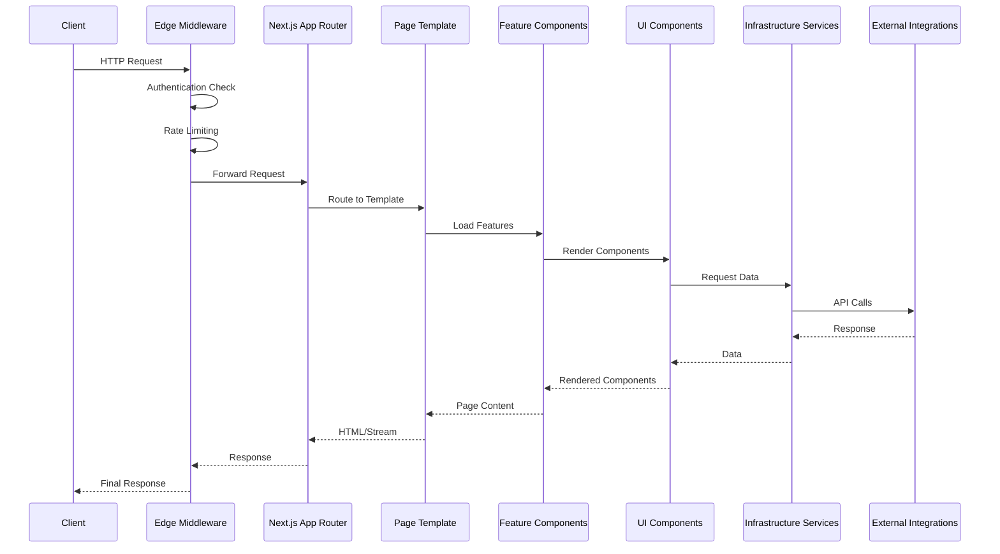
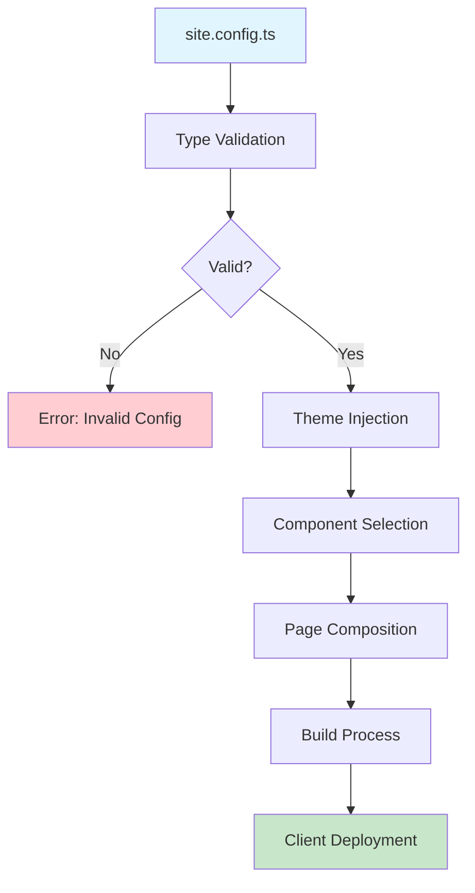
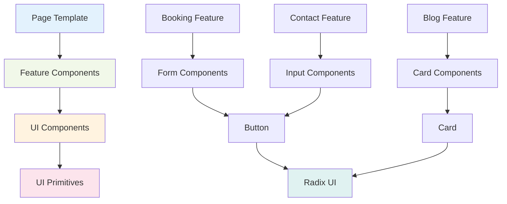
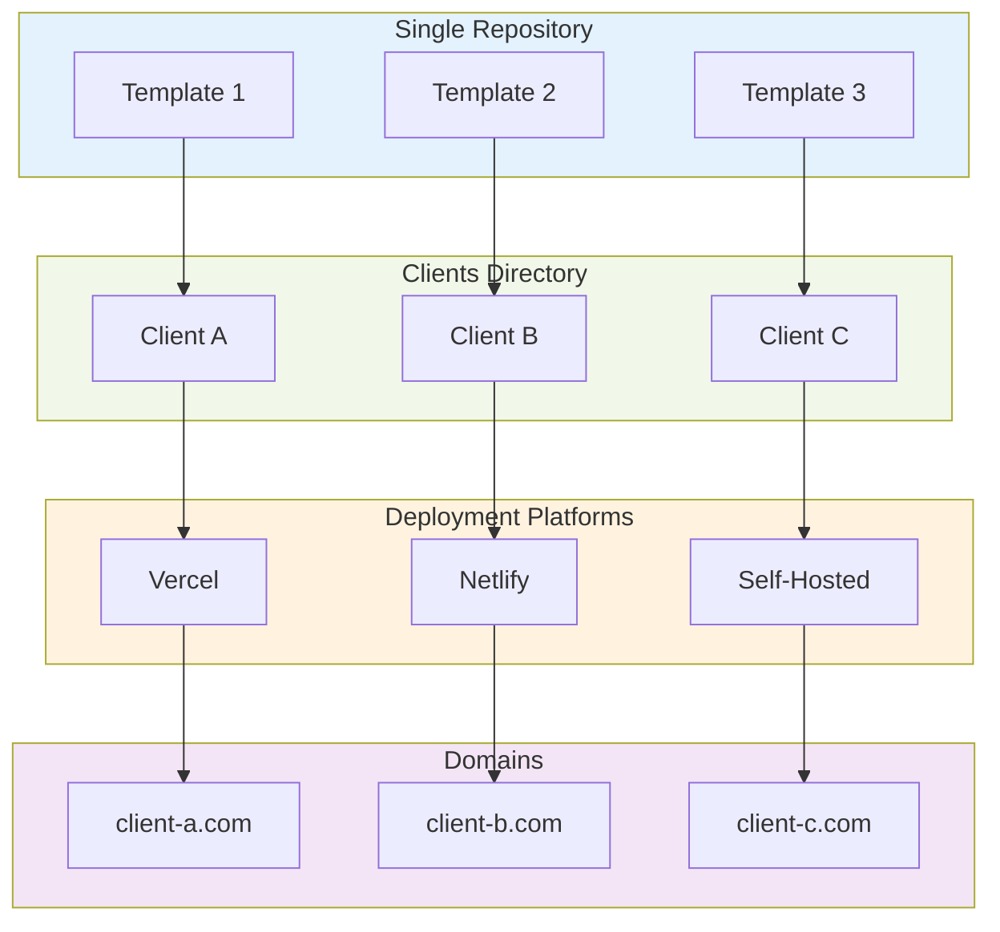
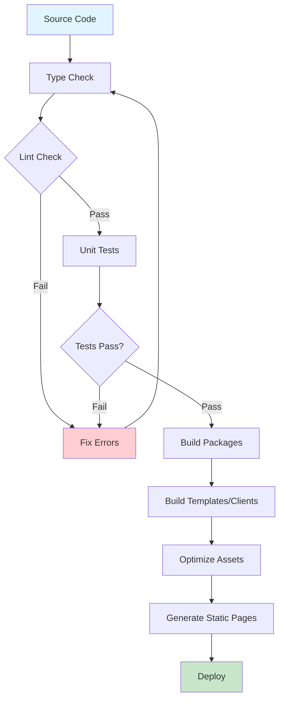

<!--
/**
 * @file docs/architecture/README.md
 * @role docs
 * @summary Core architecture overview and system design documentation.
 *
 * @entrypoints
 * - Primary architecture documentation for developers and contributors
 *
 * @exports
 * - N/A
 *
 * @depends_on
 * - docs/architecture/module-boundaries.md
 * - docs/architecture/dependency-graph.md
 * - TASKS.md (architecture context)
 *
 * @used_by
 * - Developers, contributors, system architects
 *
 * @runtime
 * - environment: docs
 * - side_effects: none
 *
 * @data_flow
 * - inputs: repository structure, package configurations
 * - outputs: architectural understanding and guidance
 *
 * @invariants
 * - Architecture claims must match actual repository structure
 * - Layer definitions must align with module boundaries
 *
 * @gotchas
 * - Architecture evolves with project phases; keep updated
 *
 * @issues
 * - [severity:medium] Visual diagrams need creation (doc-5)
 *
 * @opportunities
 * - Add interactive dependency visualization
 * - Create architecture decision records (ADRs)
 *
 * @verification
 * - ✅ Verified: Layer structure matches TASKS.md
 * - ✅ Verified: Package boundaries align with module-boundaries.md
 *
 * @status
 * - confidence: high
 * - last_audited: 2026-02-18
 */
-->

# Architecture Overview

**Last Updated:** 2026-02-18  
**Status:** Active Documentation  
**Related:** [Module Boundaries](module-boundaries.md), [TASKS.md](../../TASKS.md)

---

## Overview

The marketing-websites platform is a **multi-industry template system** built on a **layered monorepo architecture**. The system enables rapid deployment of client websites through reusable templates, shared components, and configuration-as-code patterns.

### Vision: Configuration-as-Code Architecture (CaCA)

Every aspect of a client website — theming, page composition, feature selection, SEO schema — is driven by a single validated `site.config.ts`. No code changes required to launch a new client. **Config is the product. Code is the escape hatch.**

---

## System Architecture

### Layer Model

```text
┌─────────────────────────────────────────────────────────────────────────────┐
│  LAYER 7: Client Experience Layer      (White-labeled client portals)      │ ← Future
│  LAYER 6: AI & Intelligence Layer      (Agentic workflows, predictive)    │ ← Future
│  LAYER 5: Orchestration Layer          (Campaign management, MRM, CDP)    │ ← Future
│  LAYER 4: Content & Asset Layer        (DAM, Headless CMS, Visual Edit)   │ ← Future
│  LAYER 3: Experience Layer             (Composed sites, apps, PWA)        │ ← CURRENT
│  LAYER 2: Component Library            (Atomic design system)             │ ← CURRENT
│  LAYER 1: Data & Analytics Layer       (Real-time CDP, attribution)       │ ← Future
│  LAYER 0: Infrastructure Layer         (Multi-tenant SaaS, edge, security)│ ← @repo/infra exists
└─────────────────────────────────────────────────────────────────────────────┘
```

### Current Implementation Status

| Layer  | Package                      | Status                       | Scope                                                 |
| ------ | ---------------------------- | ---------------------------- | ----------------------------------------------------- |
| **--** | Housekeeping (Wave 0)        | 🟢 Complete                  | Config fixes, tooling, CI, bug fixes done             |
| **L2** | `@repo/ui`                   | 🟡 9 of 14                   | +5 UI primitives (Dialog, ThemeInjector)              |
| **L2** | `@repo/marketing-components` | 🔴 Package does not exist    | Create per 1.7, then 2.1–2.10 (10 component families) |
| **L2** | `@repo/features`             | 🟡 5 of 9                    | booking, contact, blog, services, search              |
| **L2** | `@repo/types`                | 🟢 In packages               | Moved from templates/shared; extended                 |
| **L3** | `@repo/page-templates`       | 🔴 Scaffolded only (no src/) | 0 of 7 templates; add 3.1 then 3.2–3.8                |
| **L3** | `clients/`                   | 🔴 Not Started               | Only README; add 5.1 (starter) then 5.2–5.6           |
| **L0** | `@repo/infra`                | 🟢 Exists                    | Security, middleware, logging, 7 env schemas          |
| **L0** | `@repo/integrations`         | 🟡 Partial                   | 3 exist, 6 more planned                               |

---

## Repository Structure

### High-Level Organization

```text
marketing-websites/
├── templates/               # Industry-specific website templates
│   ├── hair-salon/         # Beauty/wellness industry template
│   ├── [industry]/         # Future industry templates
│   └── shared/             # Shared template utilities (removed)
├── clients/                # Client implementations
│   ├── [client-name]/      # Production client websites
│   └── README.md           # Client setup guide
├── packages/               # Shared libraries and utilities
│   ├── ui/                 # React UI component library
│   ├── utils/              # Shared utility functions
│   ├── features/           # Business logic components
│   ├── types/              # TypeScript type definitions
│   ├── infra/              # Infrastructure and security
│   ├── integrations/       # Third-party service integrations
│   └── config/             # Shared configurations
├── apps/                   # Internal applications (future)
├── docs/                   # Documentation
├── scripts/                # Utility and automation scripts
└── infrastructure/         # Deployment and infrastructure code
```

### Package Architecture

#### Core Packages (Layer 0-2)

**@repo/infra** - Infrastructure Foundation
- Security middleware and validation
- Environment schema validation
- Logging and error tracking
- Request context management

**@repo/ui** - Component Library
- Atomic React components
- Design system implementation
- Theme injection and styling
- Accessibility primitives

**@repo/features** - Business Logic
- Domain-specific feature components
- Booking and scheduling logic
- Contact forms and workflows
- Content management features

**@repo/types** - Type Definitions
- Shared TypeScript interfaces
- Site configuration schemas
- Integration type contracts
- Domain model definitions

#### Template System (Layer 3)

**Templates** - Industry Solutions
- Pre-built website templates
- Industry-specific components
- Demo content and imagery
- Configuration examples

**Clients** - Production Deployments
- Client-specific configurations
- Custom content and branding
- Deployment configurations
- Environment-specific settings

---

## Design Principles

### 1. Configuration-Driven Development

- **Single Source of Truth:** `site.config.ts` drives all client behavior
- **No Code Changes for Launch:** New clients through configuration only
- **Type Safety:** All configuration validated at build time
- **Hot Reload:** Configuration changes reflect immediately

### 2. Layered Architecture

- **Clear Boundaries:** Each layer has defined responsibilities
- **Dependency Direction:** Lower layers can't depend on higher layers
- **Interface Segregation:** Packages expose minimal, focused APIs
- **Independent Deployment:** Each client deploys independently

### 3. Template-Based Composition

- **Industry Focus:** Templates solve specific industry problems
- **Reusable Components:** Shared across templates and clients
- **Progressive Enhancement:** Start simple, add complexity as needed
- **Multi-Tenancy:** Single codebase serves multiple clients

### 4. Modern Web Standards

- **React 19:** Latest features and optimizations
- **Next.js 15:** App Router and Server Components
- **TypeScript:** Strict type safety
- **Tailwind CSS:** Utility-first styling
- **pnpm:** Efficient package management

---

## Data Flow Architecture

### Request Flow



### Configuration Flow



### Data Integration Flow


### Component Hierarchy



---

## Technology Stack

### Core Technologies

| Technology | Version | Purpose | Layer |
| ----------- | -------- | ------- | ----- |
| **Node.js** | >=22.0.0 | Runtime environment | Infrastructure |
| **Next.js** | 15.2.9 | React framework | Experience |
| **React** | 19.0.0 | UI library | Component |
| **TypeScript** | 5.7.2 | Type safety | All layers |
| **Tailwind CSS** | 3.4.17 | Styling | Component |
| **pnpm** | 10.29.2 | Package management | Infrastructure |

### Development Tools

| Tool | Version | Purpose |
| ---- | ------- | ------- |
| **Turbo** | 2.2.3 | Monorepo build system |
| **ESLint** | 9 | Code linting |
| **Prettier** | 3.2.5 | Code formatting |
| **Vitest** | - | Unit testing |
| **Playwright** | - | End-to-end testing |

### Infrastructure & Integrations

| Service | Purpose | Integration |
| ------- | ------- | ---------- |
| **Supabase** | Database & Auth | @repo/infra |
| **Sentry** | Error tracking | @repo/infra |
| **HubSpot** | CRM integration | @repo/integrations |
| **Google Analytics** | Analytics | @repo/integrations |

---

## Security Architecture

### Multi-Layer Security

1. **Infrastructure Layer**
   - Environment variable validation
   - Request sanitization and validation
   - Rate limiting and DDoS protection
   - Security headers and CSP

2. **Application Layer**
   - Type-safe configuration validation
   - Server-side rendering protection
   - CSRF and XSS prevention
   - Authentication and authorization

3. **Data Layer**
   - Row-level security (RLS)
   - Encrypted data storage
   - Secure API communication
   - Privacy compliance (GDPR/CCPA)

### Privacy-First Design

- **Consent Management:** Cookie consent before any tracking
- **Data Minimization:** Collect only necessary data
- **User Control:** Easy data deletion and export
- **Compliance:** GDPR, CCPA, and emerging regulations

---

## Performance Architecture

### Core Web Vitals Optimization

- **LCP (< 2.5s):** Optimized image loading, code splitting
- **INP (< 200ms):** Efficient interactions, React 19 optimizations
- **CLS (< 0.1):** Stable layout, proper dimension attributes

### Bundle Optimization

- **Code Splitting:** Route-based and component-based
- **Tree Shaking:** Remove unused code
- **Lazy Loading:** Components and images
- **Edge Computing:** Global CDN distribution

### Monitoring & Analytics

- **Real User Monitoring:** Performance metrics collection
- **Error Tracking:** Comprehensive error reporting
- **Bundle Analysis:** Size monitoring and optimization
- **A/B Testing:** Performance impact measurement

---

## Deployment Architecture

### Multi-Client Deployment



### Build Pipeline



### Infrastructure Components

- **Build Pipeline:** Automated testing and building
- **Deployment Pipeline:** Staging → Production
- **Monitoring:** Health checks and alerts
- **Rollback:** Quick rollback capabilities

### Environment Strategy

- **Development:** Local development with hot reload
- **Staging:** Preview deployments for testing
- **Production:** Optimized builds with monitoring
- **Feature Flags:** Gradual feature rollout

---

## Evolution Roadmap

### Current Phase (Phase 1: Core MVP)
- ✅ Basic template system
- ✅ Core component library
- 🔄 Feature extraction and standardization
- ⏳ Page template system

### Near Future (Phase 2: Market Readiness)
- ⏳ Multi-industry templates
- ⏳ Advanced marketing components
- ⏳ Client factory automation
- ⏳ Enhanced analytics integration

### Long-term Vision (Phase 3+)
- 📋 AI-powered content generation
- 📋 Advanced personalization
- 📋 Multi-channel marketing automation
- 📋 Enterprise features and scaling

---

## Related Documentation

- **[Module Boundaries](module-boundaries.md)** - Detailed dependency rules
- **[Dependency Graph](dependency-graph.md)** - Visual dependency mapping
- **[Migration Guide](../migration/)** - Structural change documentation
- **[TASKS.md](../../TASKS.md)** - Implementation details and task specifications
- **[Testing Strategy](../testing-strategy.md)** - Quality assurance

---

## Contributing to Architecture

Architecture changes require careful consideration:

1. **Propose Changes:** Create ADR (Architecture Decision Record)
2. **Review Process:** Technical review and impact assessment
3. **Implementation:** Gradual rollout with testing
4. **Documentation:** Update all relevant documentation
5. **Communication:** Announce changes to team

See [CONTRIBUTING.md](../../CONTRIBUTING.md) for detailed contribution guidelines.

---

_This architecture document evolves with the project. Last updated: 2026-02-18_
