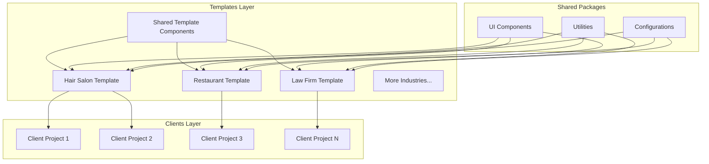
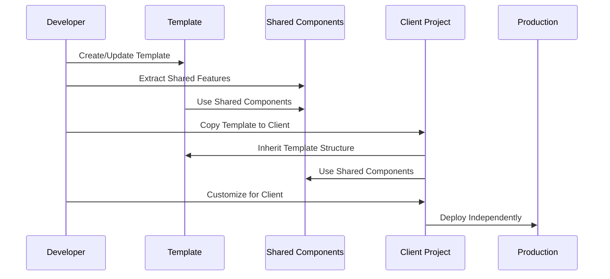
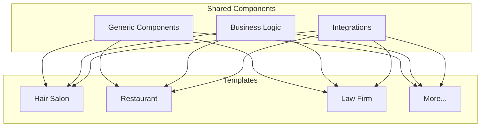
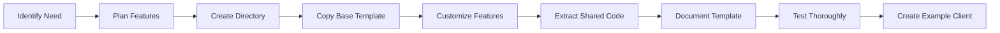
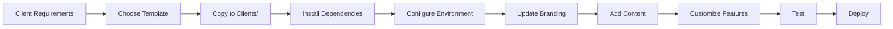
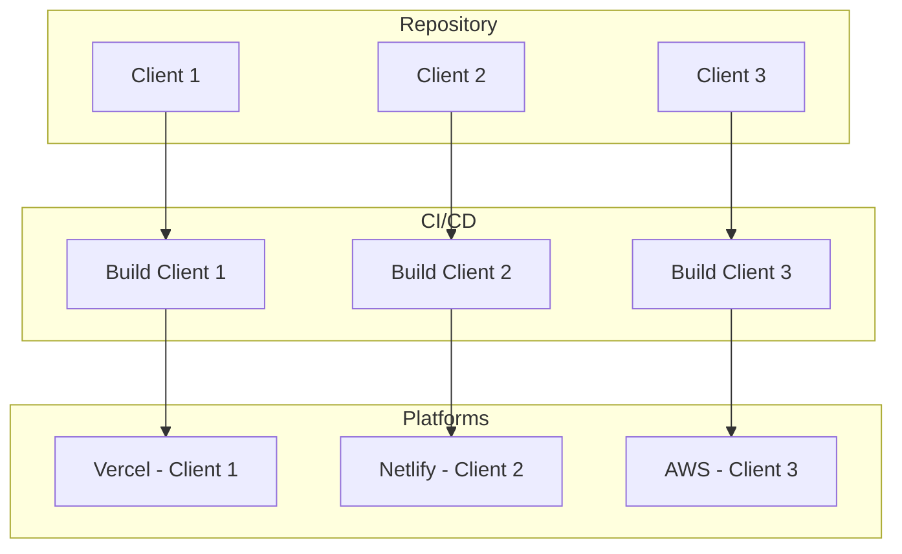

# Multi-Industry Template-Based Architecture

**Status:** Active  
**Version:** 2.0  
**Date:** 2026-02-10

## Overview

The repository has been restructured to support marketing website templates across all industries and enable multi-client project management in a single monorepo. This architecture enables:

- **Multiple industry templates** (service businesses, hospitality, professional services, retail, etc.)
- **Multiple client projects** deployed independently
- **Shared components** and utilities across templates
- **Scalable development** workflow
- **Cross-industry patterns** and best practices

## High-Level Architecture



## Directory Structure

```
marketing-website-templates/
├── templates/              # Industry-specific templates
│   ├── hair-salon/        # Service business template (hair salon)
│   │   ├── app/           # Next.js app directory
│   │   ├── components/    # Template components
│   │   ├── features/      # Business features
│   │   ├── lib/           # Utilities
│   │   └── package.json   # Template dependencies
│   ├── restaurant/        # Hospitality template (future)
│   ├── law-firm/          # Professional services template (future)
│   └── shared/            # Shared template code
│       ├── components/    # Shared UI components
│       ├── features/      # Shared features
│       └── lib/           # Shared utilities
│
├── clients/               # Client implementations
│   ├── example-client/    # Example/reference client
│   ├── client-1/          # Production client 1
│   ├── client-2/          # Production client 2
│   └── client-n/          # Production client N
│
├── packages/              # Shared utilities (existing)
│   ├── ui/               # Core UI library
│   ├── utils/            # Utility functions
│   └── config/           # Shared configs
│
├── apps/                  # Internal apps (optional)
│
└── docs/                  # Documentation
    ├── templates/         # Template documentation
    ├── clients/           # Client guides
    └── architecture/      # Architecture docs
```

## Component Layers

### Layer 1: Core Packages

Foundation utilities used everywhere:

- `@repo/ui` - Core UI components
- `@repo/utils` - Utility functions
- `@repo/config` - Shared configurations

### Layer 2: Shared Template Components

Common features for templates:

- Booking systems
- Contact forms
- Analytics integration
- CRM connectors
- Search functionality

### Layer 3: Industry Templates

Complete marketing website templates:

- Service business templates (hair salon, dental, fitness, etc.)
- Hospitality templates (restaurant, hotel, etc.)
- Professional services templates (law firm, consulting, etc.)
- Retail templates (e-commerce, local shop, etc.)

### Layer 4: Client Projects

Production websites for specific clients:

- Based on a template
- Customized branding
- Client-specific content
- Independent deployment

## Data Flow



## Template Architecture

### Template Structure

Each template follows this structure:

```
template-name/
├── package.json           # @templates/template-name
├── next.config.js         # Next.js configuration
├── tailwind.config.js     # Tailwind (for customization)
├── tsconfig.json          # TypeScript config
├── middleware.ts          # Security & routing
├── app/                   # Next.js App Router
│   ├── layout.tsx        # Root layout
│   ├── page.tsx          # Home page
│   └── [routes]/         # Feature routes
├── components/            # Template-specific components
├── features/              # Business logic modules
│   ├── booking/          # Booking system
│   ├── blog/             # Blog functionality
│   ├── contact/          # Contact forms
│   └── analytics/        # Analytics
├── lib/                   # Utilities & helpers
│   ├── actions/          # Server actions
│   ├── schemas/          # Validation schemas
│   └── utils/            # Helper functions
├── public/                # Static assets
└── content/               # Content files (MDX)
```

### Template Design Principles

1. **Generic by Default** - No hardcoded client data
2. **Configurable** - Use environment variables
3. **Customizable** - Easy to override styles/components
4. **Well-Documented** - Clear setup instructions
5. **Feature Flags** - Enable/disable features
6. **Type-Safe** - Full TypeScript support

## Client Project Architecture

### Client Structure

```
client-name/
├── package.json           # @clients/client-name
├── .env.local            # Client secrets (gitignored)
├── .env.example          # Template for variables
├── [inherited from template]
└── public/
    ├── logo.svg          # Client logo
    └── images/           # Client images
```

### Client Customization Points

1. **Branding**

   - Colors in `tailwind.config.js`
   - Fonts in `app/layout.tsx`
   - Logo in `public/logo.svg`

2. **Content**

   - Pages in `app/`
   - Blog posts in `content/blog/`
   - Images in `public/images/`

3. **Configuration**

   - Environment variables in `.env.local`
   - Business info (name, address, phone)
   - Feature flags

4. **Features**
   - Enable/disable via env vars
   - Custom features in client directory
   - Override template components as needed

## Shared Components Architecture

### Shared Components Strategy



### What Goes in Shared?

**✅ Include in Shared:**

- Booking/reservation form components (generic)
- Contact form components
- Analytics integration
- CRM connectors (HubSpot, Salesforce)
- Authentication helpers
- Security utilities (CSP, rate limiting)
- Common UI patterns (navigation, footer, hero sections)
- Search functionality
- Blog/content infrastructure
- E-commerce foundations
- Review/testimonial systems

**❌ Keep in Templates:**

- Industry-specific branding
- Template-specific page layouts
- Service/product offerings structure
- Industry-specific routes
- Unique industry business logic
- Industry-specific content types

**❌ Keep in Clients:**

- Client branding and assets
- Client content
- Client-specific features
- Custom pages
- Client configuration

## Development Workflow

### Creating a New Template



### Creating a New Client



## Deployment Architecture

### Independent Client Deployment

Each client can be deployed independently:



### Deployment Options

1. **Vercel** - Recommended for Next.js
2. **Netlify** - Alternative platform
3. **AWS Amplify** - Enterprise option
4. **Docker** - Self-hosted
5. **Traditional Hosting** - VPS/Dedicated

## Scaling Strategy

### Horizontal Scaling

```
Current: 1 template (hair salon)
Phase 1: 3 templates (hair, nail, tanning)
Phase 2: 5+ templates (spa, fitness, wellness)
Phase 3: 10+ clients per template
```

### Vertical Scaling

```
Current: Basic features
Phase 1: Enhanced booking, payment integration
Phase 2: Mobile apps, customer portals
Phase 3: Multi-location support, franchises
```

## Benefits

### For Development Team

1. **Code Reuse** - Write once, use many times
2. **Consistency** - All projects follow same patterns
3. **Efficiency** - Faster client setup
4. **Maintainability** - Updates benefit all projects
5. **Scalability** - Easy to add new clients

### For Clients

1. **Lower Cost** - Template-based, not custom build
2. **Faster Launch** - Quick setup and customization
3. **Proven Code** - Battle-tested features
4. **Updates** - Benefit from template improvements
5. **Support** - Consistent architecture

### For Business

1. **Multiple Revenue Streams** - Different templates
2. **Efficient Operations** - Standardized processes
3. **Scalable Model** - Add clients easily
4. **Quality Control** - Consistent quality
5. **Growth Potential** - Multiple market segments

## Migration Path

See [MIGRATION_GUIDE.md](../MIGRATION_GUIDE.md) for detailed migration instructions from the previous monolithic structure.

## Future Enhancements

### Phase 1 (Near-term)

- [ ] Complete nail salon template
- [ ] Complete tanning salon template
- [ ] Extract more shared components
- [ ] Add template versioning
- [ ] Improve documentation

### Phase 2 (Medium-term)

- [ ] Spa/wellness template
- [ ] Fitness center template
- [ ] E-commerce integration
- [ ] Multi-location support
- [ ] Mobile app templates

### Phase 3 (Long-term)

- [ ] White-label SaaS platform
- [ ] Customer self-service portal
- [ ] Template marketplace
- [ ] Plugin system
- [ ] International support

## Documentation

- **[Template Guides](../templates/)** - Template-specific documentation
- **[Client Guides](../clients/)** - Client implementation guides
- **[Migration Guide](../MIGRATION_GUIDE.md)** - Moving to new architecture
- **[Architecture Overview](./README.md)** - System architecture

## Support

For questions about the architecture:

1. Review architecture documentation
2. Check template-specific docs
3. Review client implementation guides
4. Contact the development team

---

**Architecture Version:** 2.0  
**Last Updated:** 2026-02-10  
**Status:** Active
