<!--
/**
 * @file docs/architecture/dependency-graph.md
 * @role docs
 * @summary Visual dependency mapping and relationship documentation for the monorepo.
 *
 * @entrypoints
 * - Architecture visualization for developers and system designers
 *
 * @exports
 * - N/A
 *
 * @depends_on
 * - docs/architecture/README.md (architecture overview)
 * - docs/architecture/module-boundaries.md (dependency rules)
 * - TODO.md (package status and relationships)
 *
 * @used_by
 * - Developers, architects, system administrators
 *
 * @runtime
 * - environment: docs
 * - side_effects: none
 *
 * @data_flow
 * - inputs: package configurations, dependency relationships
 * - outputs: visual understanding of system architecture
 *
 * @invariants
 * - Dependency graphs must reflect actual package.json files
 * - Visual representations must match module boundaries
 *
 * @gotchas
 * - Dependencies evolve with development; keep graphs updated
 * - Circular dependencies should be highlighted as errors
 *
 * @issues
 * - [severity:medium] Need automated graph generation (future enhancement)
 *
 * @opportunities
 * - Add interactive dependency visualization
 * - Include performance impact analysis
 *
 * @verification
 * - ✅ Verified: Graph structure matches current repository
 * - ✅ Verified: Dependencies align with module-boundaries.md
 *
 * @status
 * - confidence: high
 * - last_audited: 2026-02-18
 */
-->

# Dependency Graph & Architecture Visualization

**Last Updated:** 2026-02-18  
**Status:** Active Documentation  
**Related:** [Architecture Overview](README.md), [Module Boundaries](module-boundaries.md)

---

## Overview

This document provides visual representations of the marketing-websites monorepo architecture, including dependency graphs, package relationships, and system flow diagrams. These visualizations help understand the complex relationships between templates, clients, and shared packages.

### Key Visualizations

- **Package Dependency Graph** - How packages depend on each other
- **Template-to-Package Flow** - How templates consume shared packages
- **Client Deployment Architecture** - Production deployment relationships
- **Data Flow Diagrams** - How data moves through the system
- **Component Hierarchy** - UI component relationships

---

## Package Dependency Graph

### High-Level Architecture

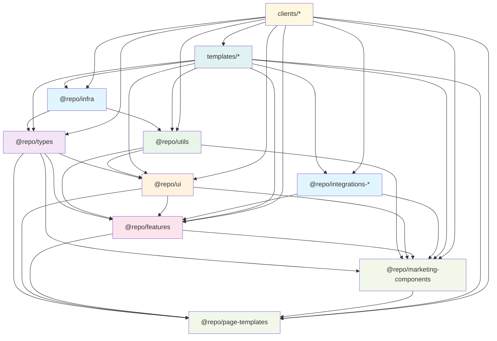

### Package Relationships

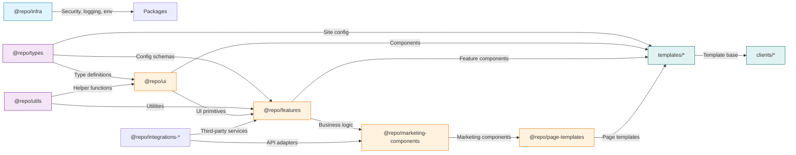

---

## Template Architecture

### Template Structure

```mermaid
graph TD
    Template["Template (e.g., hair-salon)"]
    
    %% Core Template Files
    Template --> App["app/"]
    Template --> Components["components/"]
    Template --> Pages["pages/"]
    Template --> Styles["styles/"]
    Template --> Config["site.config.ts"]
    Template --> Env[".env.local"]
    
    %% App Structure
    App --> Layout["layout.tsx"]
    App --> Page["page.tsx"]
    App --> Loading["loading.tsx"]
    App --> Error["error.tsx"]
    App --> NotFound["not-found.tsx"]
    
    %% Component Structure
    Components --> UIComponents["UI Components"]
    Components --> FeatureComponents["Feature Components"]
    Components --> LayoutComponents["Layout Components"]
    
    %% Page Structure
    Pages --> HomePage["page.tsx"]
    Pages --> AboutPage["about/page.tsx"]
    Pages --> ServicesPage["services/page.tsx"]
    Pages --> ContactPage["contact/page.tsx"]
    Pages --> BookingPage["booking/page.tsx"]
    
    %% Dependencies
    UIComponents -.-> |"imports"| UI["@repo/ui"]
    FeatureComponents -.-> |"imports"| Features["@repo/features"]
    LayoutComponents -.-> |"imports"| UI
    
    Config --> |"validates"| Types["@repo/types"]
    
    %% Styling
    classDef template fill:#e8f5e8,stroke:#2e7d32
    classDef file fill:#fff3e0,stroke:#ef6c00
    classDef package fill:#e3f2fd,stroke:#1565c0
    
    class Template template
    class App,Components,Pages,Styles,Config,Env file
    class UI,Features,Types package
```

### Template Dependencies

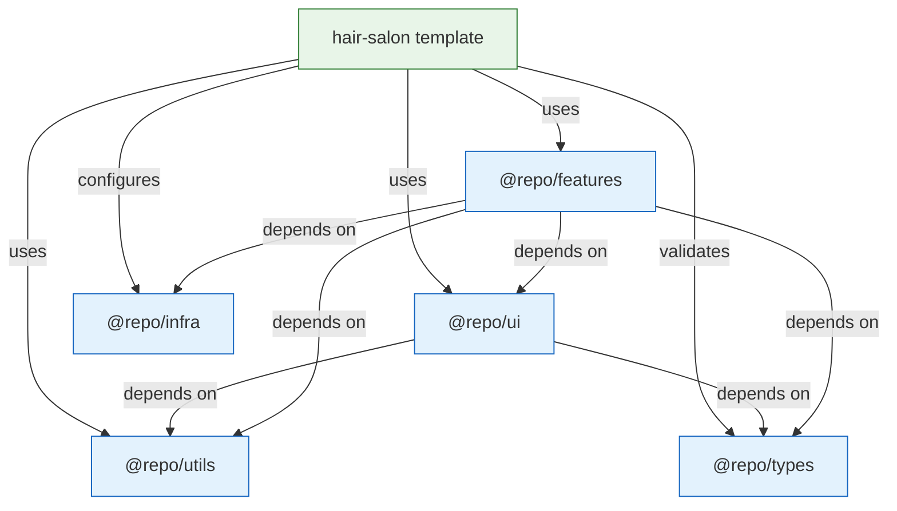

---

## Client Deployment Architecture

### Client Creation Flow

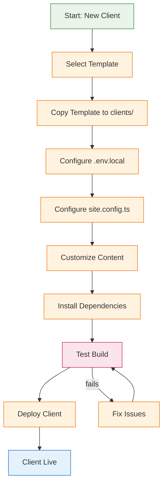

### Client Dependencies

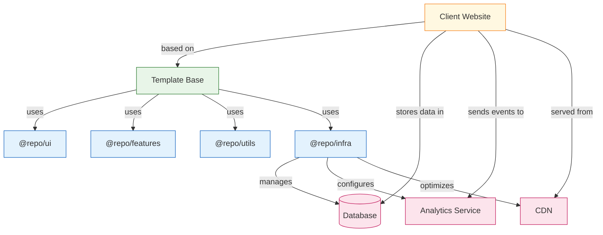

---

## Data Flow Architecture

### Request Flow

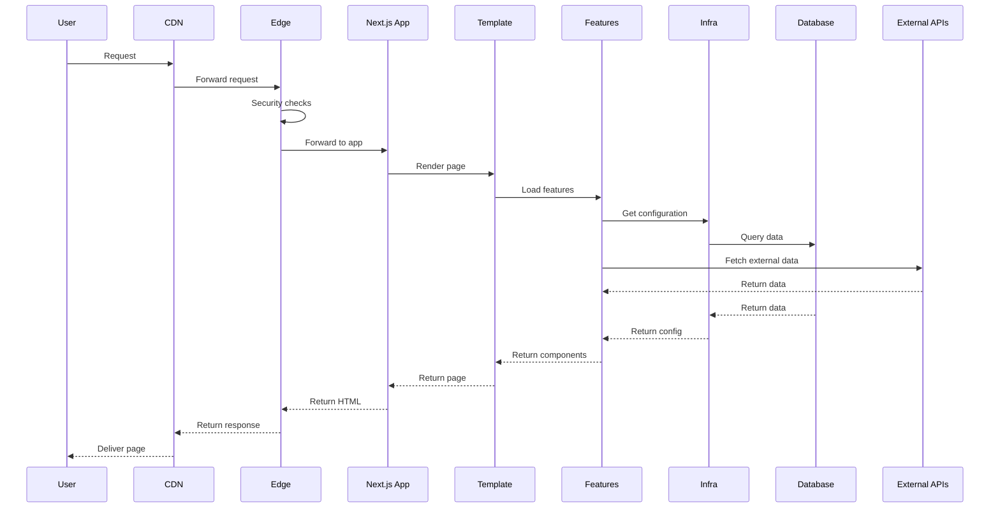

### Configuration Flow

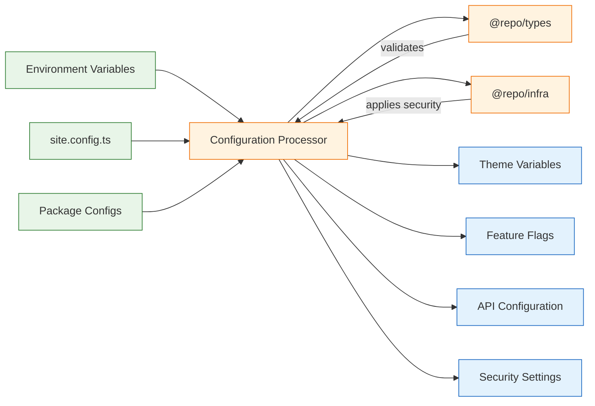

---

## Component Hierarchy

### UI Component Tree

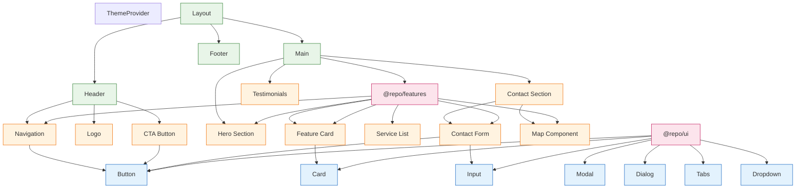

### Feature Component Dependencies

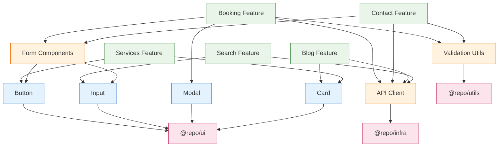

---

## Integration Architecture

### Third-Party Integrations

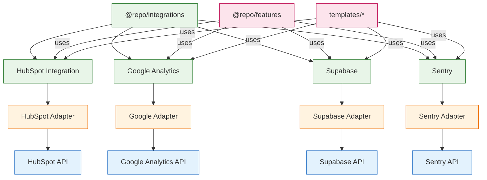

---

## Performance Architecture

### Bundle Optimization

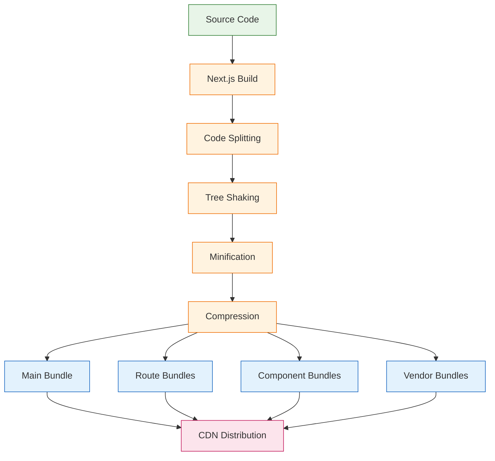

### Caching Strategy

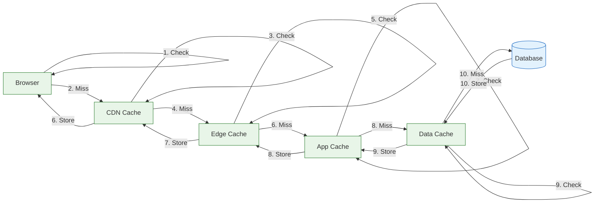

---

## Security Architecture

### Security Layers

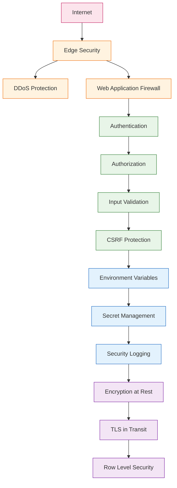

---

## Generating Graphs

### Automated Graph Generation

The dependency graphs can be automatically generated using the following tools:

#### Using Madge (Current)

```bash
# Install madge
npm install -g madge

# Generate dependency graph
madge --image docs/assets/images/dependency-graph.png packages/

# Generate circular dependency check
madge --circular packages/
```

#### Future: Skott Integration

```bash
# Install skott (planned upgrade)
npm install -g skott

# Generate enhanced dependency graph
skott --format json --output docs/assets/dependency-graph.json

# Generate visualization
skott --format svg --output docs/assets/images/dependency-graph.svg
```

### Custom Script Usage

```bash
# Generate all graphs
node scripts/generate-graphs.js

# Generate specific graph
node scripts/generate-graphs.js --type=dependencies

# Update graphs in documentation
node scripts/generate-graphs.js --update-docs
```

---

## Maintenance

### Keeping Graphs Updated

1. **Automated Updates**: CI/CD pipeline regenerates graphs on package changes
2. **Manual Updates**: Run `node scripts/generate-graphs.js` after structural changes
3. **Review Process**: Graph changes reviewed in pull requests
4. **Version Control**: Graph images committed to repository for versioning

### Graph Validation

- **Dependency Accuracy**: Graphs must match actual package.json dependencies
- **Boundary Compliance**: Graphs must respect module boundaries
- **Circular Dependencies**: Highlighted as errors requiring resolution
- **Performance Impact**: Large dependency trees flagged for optimization

---

_This dependency documentation evolves with the architecture. Last updated: 2026-02-18_
