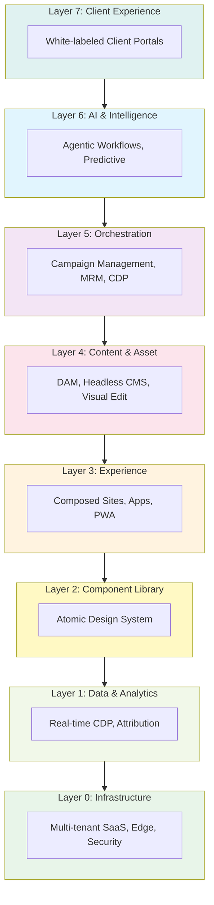
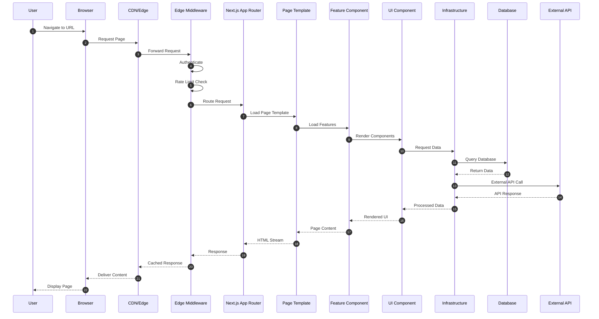
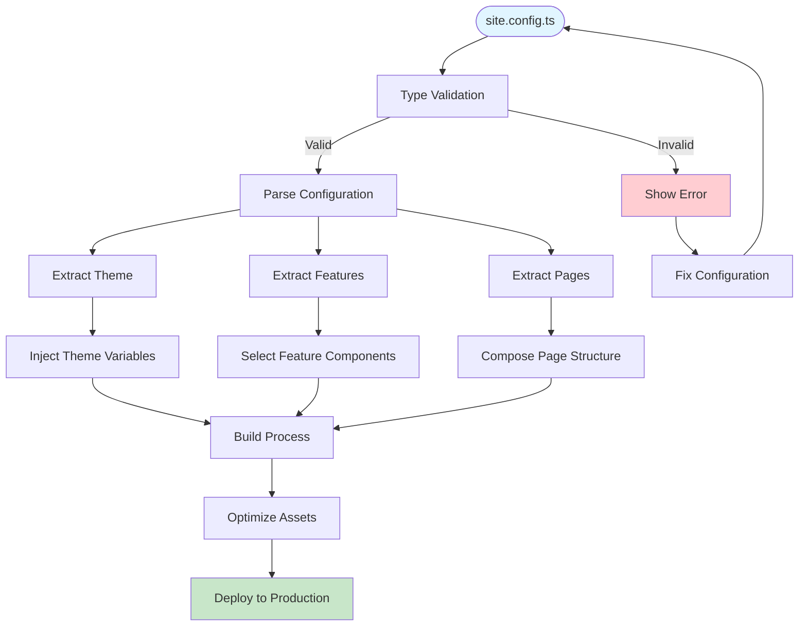
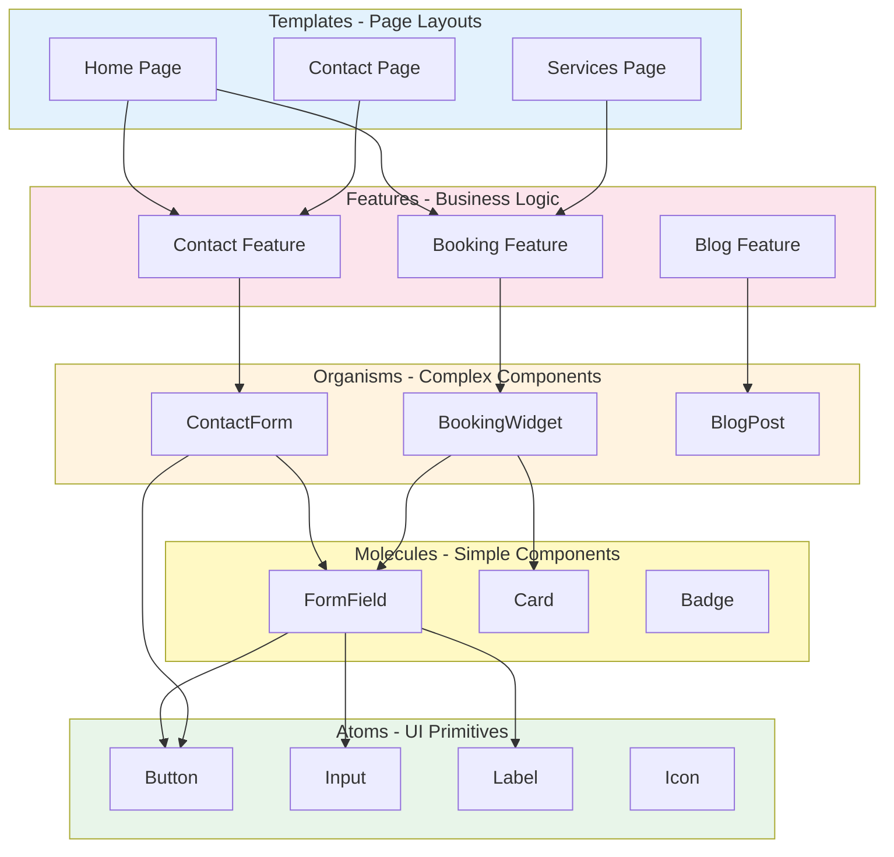
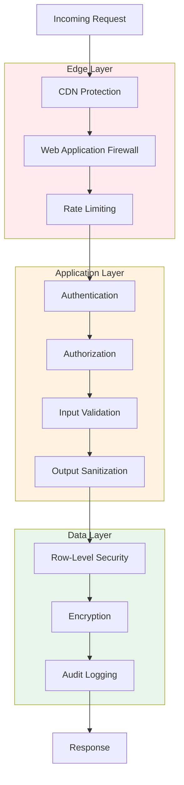
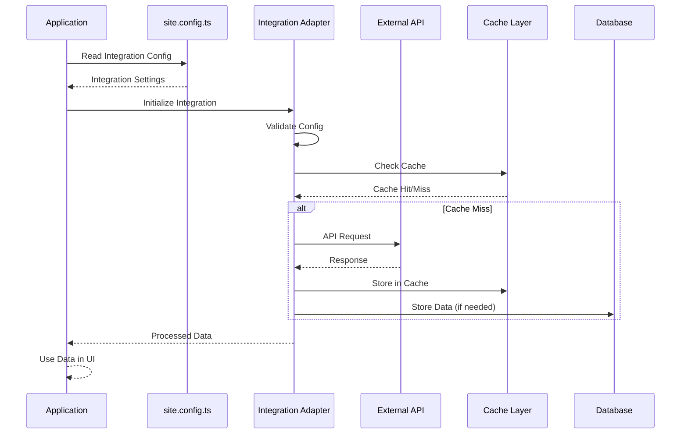

<!--
/**
 * @file docs/architecture/visual-guide.md
 * @role docs
 * @summary Visual guides and diagrams for understanding the platform architecture.
 *
 * @entrypoints
 * - Referenced from architecture overview
 * - Visual learning resource
 *
 * @exports
 * - N/A
 *
 * @depends_on
 * - docs/architecture/README.md (architecture overview)
 * - docs/architecture/module-boundaries.md (dependency rules)
 *
 * @used_by
 * - Developers learning the architecture
 * - Architects making design decisions
 *
 * @runtime
 * - environment: docs
 * - side_effects: none
 *
 * @data_flow
 * - inputs: architecture concepts
 * - outputs: visual understanding
 *
 * @invariants
 * - Diagrams must accurately represent the system
 * - Visual guides must be kept up-to-date
 *
 * @gotchas
 * - Diagrams are simplified representations
 * - Actual implementation may have additional details
 *
 * @issues
 * - N/A
 *
 * @opportunities
 * - Add interactive diagrams
 * - Create video walkthroughs
 *
 * @verification
 * - ✅ Diagrams verified against codebase structure
 *
 * @status
 * - confidence: high
 * - last_audited: 2026-02-18
 */
-->

# Visual Architecture Guide

**Last Updated:** 2026-02-18  
**Status:** Active Guide  
**Related:** [Architecture Overview](README.md), [Module Boundaries](module-boundaries.md)

---

This guide provides visual representations of key architectural concepts, flows, and relationships in the marketing-websites platform.

## Layer Architecture

### Seven-Layer Model



**Current Implementation Status:**

- ✅ Layer 0: Infrastructure (@repo/infra)
- ✅ Layer 2: Component Library (@repo/ui)
- ✅ Layer 3: Experience (Templates/Clients)
- 🔄 Layer 1, 4, 5, 6, 7: Future phases

## Package Relationships

### Package Dependency Graph

```mermaid
graph LR
    subgraph Templates[Templates]
        T1[Hair Salon]
        T2[Restaurant]
        T3[Law Firm]
    end

    subgraph Clients[Clients]
        C1[Client A]
        C2[Client B]
    end

    subgraph Packages[Shared Packages]
        UI[@repo/ui]
        FEAT[@repo/features]
        INFRA[@repo/infra]
        TYPES[@repo/types]
        INTEG[@repo/integrations]
        UTILS[@repo/utils]
    end

    T1 --> UI
    T1 --> FEAT
    T1 --> INFRA
    T1 --> TYPES
    T1 --> INTEG

    T2 --> UI
    T2 --> FEAT
    T2 --> INFRA

    C1 --> T1
    C2 --> T2

    FEAT --> UI
    FEAT --> TYPES
    FEAT --> INFRA

    INTEG --> INFRA

    style Templates fill:#e3f2fd
    style Clients fill:#c8e6c9
    style Packages fill:#fff3e0
```

## Request Lifecycle

### Complete Request Flow



## Configuration Flow

### Site Configuration Processing



## Component Composition

### Atomic Design Hierarchy



## Deployment Architecture

### Multi-Client Deployment Model

```mermaid
graph TB
    subgraph Repo[Git Repository]
        Code[Source Code]
        Config[Configurations]
    end

    subgraph Build[Build Pipeline]
        CI[CI/CD]
        Test[Tests]
        Build[Build Process]
    end

    subgraph Deploy[Deployment]
        Vercel[Vercel]
        Netlify[Netlify]
        Docker[Docker]
        SelfHost[Self-Hosted]
    end

    subgraph Clients[Client Websites]
        C1[client-a.com]
        C2[client-b.com]
        C3[client-c.com]
        C4[client-d.com]
    end

    Code --> CI
    Config --> CI
    CI --> Test
    Test --> Build
    Build --> Vercel
    Build --> Netlify
    Build --> Docker
    Build --> SelfHost

    Vercel --> C1
    Netlify --> C2
    Docker --> C3
    SelfHost --> C4

    style Repo fill:#e3f2fd
    style Build fill:#fff3e0
    style Deploy fill:#f1f8e9
    style Clients fill:#c8e6c9
```

## Security Layers

### Multi-Layer Security Model



## Integration Flow

### Third-Party Service Integration



---

## Related Documentation

- [Architecture Overview](README.md) - Complete architecture documentation
- [Module Boundaries](module-boundaries.md) - Dependency rules and constraints
- [Dependency Graph](dependency-graph.md) - Detailed dependency visualization

---

**Note:** These diagrams are simplified representations. For detailed implementation, refer to the source code and specific documentation.
