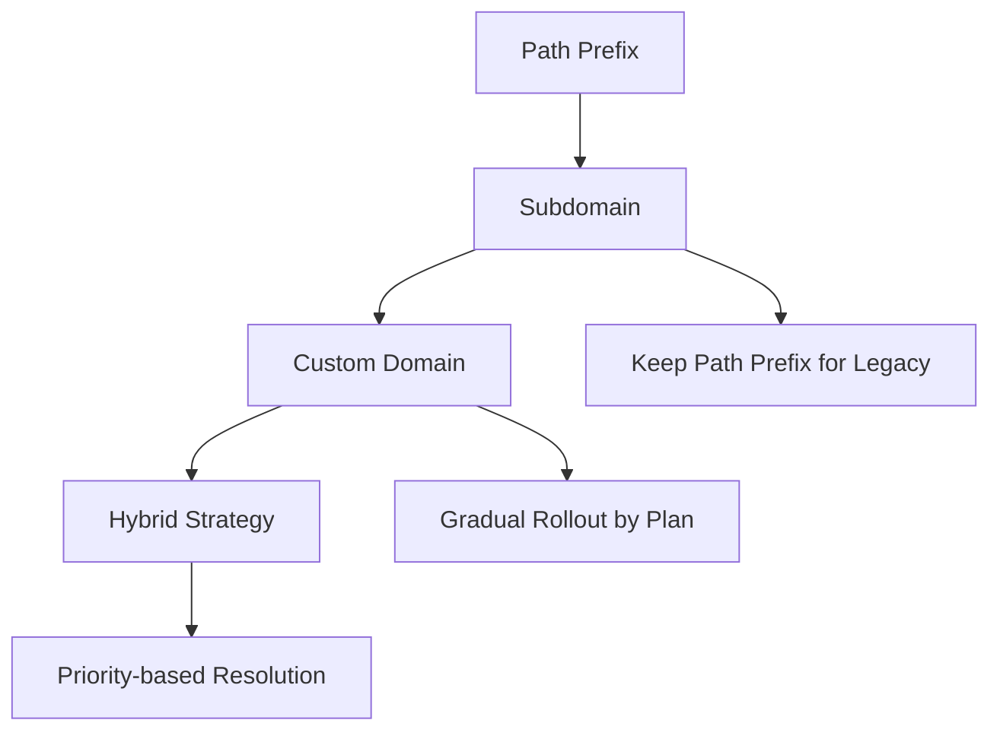

# routing-strategy-comparison.md

> **2026 Standards Compliance** | Next.js 16 · Vercel Edge · Multi-tenant Architecture

## 2026 Standards Compliance

- **Edge Computing**: Global routing with sub-100ms resolution times
- **Zero-Trust Architecture**: Per-request tenant validation, no trusted internal state
- **Multi-Tenant Isolation**: Complete tenant separation via routing
- **Core Web Vitals**: Routing overhead < 5ms (INP budget)
- **SEO Optimization**: Proper canonical URLs and sitemap generation
- **Accessibility**: WCAG 2.2 AA compliant navigation and routing

---

## Overview

Multi-tenant routing strategies determine how users access their specific tenant instance. This comprehensive comparison analyzes three primary approaches—subdomain routing, custom domain routing, and path prefix routing—evaluating each against performance, SEO, security, and operational considerations. The guide provides implementation patterns for Next.js 16 with edge optimization and includes decision matrices to help choose the optimal strategy for your SaaS application.

## Routing Strategy Comparison Matrix

| Strategy          | Performance | SEO Impact | Setup Complexity | White-label Support | Cache Efficiency |
| ----------------- | ----------- | ---------- | ---------------- | ------------------- | ---------------- |
| **Subdomain**     | ⭐⭐⭐⭐⭐  | ⭐⭐⭐⭐   | ⭐⭐⭐           | ⭐⭐                | ⭐⭐⭐⭐⭐       |
| **Custom Domain** | ⭐⭐⭐⭐    | ⭐⭐⭐⭐⭐ | ⭐⭐             | ⭐⭐⭐⭐⭐          | ⭐⭐⭐⭐         |
| **Path Prefix**   | ⭐⭐⭐      | ⭐⭐       | ⭐⭐⭐⭐⭐       | ⭐                  | ⭐⭐⭐           |

---

## Strategy 1: Subdomain Routing

### Implementation Pattern

```typescript
// middleware.ts
import { NextRequest, NextResponse } from 'next/server';
import { resolveTenantBySlug } from '@repo/tenant-resolution';

const ROOT_DOMAIN = process.env.NEXT_PUBLIC_ROOT_DOMAIN!;

export async function middleware(request: NextRequest): Promise<NextResponse> {
  const hostname = request.headers.get('host') || '';

  // Extract subdomain
  const subdomain = hostname.replace(`.${ROOT_DOMAIN}`, '');

  // Skip for www and root domain
  if (!subdomain || subdomain === 'www') {
    return NextResponse.next();
  }

  // Resolve tenant
  const tenant = await resolveTenantBySlug(subdomain);

  if (!tenant) {
    return NextResponse.rewrite(new URL('/not-found', request.url));
  }

  // Inject tenant context
  const response = NextResponse.next();
  response.headers.set('x-tenant-id', tenant.id);
  response.headers.set('x-tenant-slug', tenant.slug);
  response.headers.set('x-resolution-strategy', 'subdomain');

  return response;
}

export const config = {
  matcher: ['/((?!_next/static|_next/image|favicon.ico).*)', '/api/:path*'],
};
```

### DNS Configuration

```bash
# Wildcard DNS record
*.yoursaas.com  CNAME  cname.vercel-dns.com
yoursaas.com    A      76.76.21.21

# SSL Certificate (automatically managed by Vercel)
# Wildcard certificate: *.yoursaas.com
```

### Performance Characteristics

- **Resolution Time**: 2-5ms (KV cache lookup)
- **Cache Hit Rate**: 95%+ (tenant slug rarely changes)
- **Edge Optimization**: Excellent (KV cache at edge)
- **SEO Impact**: Strong (subdomains treated as separate sites)

### Pros & Cons

**Pros:**

- Clean, professional URLs (`acme.yoursaas.com`)
- Excellent cache performance
- Strong SEO separation
- Simple implementation
- No URL path pollution

**Cons:**

- Requires wildcard DNS setup
- Limited to one subdomain level
- Not ideal for white-label branding
- Subdomain enumeration possible

---

## Strategy 2: Custom Domain Routing

### Implementation Pattern

```typescript
// middleware.ts
import { NextRequest, NextResponse } from 'next/server';
import { resolveTenantByCustomDomain } from '@repo/tenant-resolution';

const ROOT_DOMAIN = process.env.NEXT_PUBLIC_ROOT_DOMAIN!;

export async function middleware(request: NextRequest): Promise<NextResponse> {
  const hostname = request.headers.get('host') || '';

  // Custom domain = any hostname NOT ending in yoursaas.com
  if (!hostname.endsWith(`.${ROOT_DOMAIN}`) && hostname !== ROOT_DOMAIN) {
    const tenant = await resolveTenantByCustomDomain(hostname);

    if (!tenant) {
      return NextResponse.rewrite(new URL('/not-found', request.url));
    }

    const response = NextResponse.next();
    response.headers.set('x-tenant-id', tenant.id);
    response.headers.set('x-tenant-slug', tenant.slug);
    response.headers.set('x-resolution-strategy', 'custom-domain');
    response.headers.set('x-custom-domain', hostname);

    return response;
  }

  // Fallback to subdomain routing
  return handleSubdomainRouting(request);
}

async function handleSubdomainRouting(request: NextRequest): Promise<NextResponse> {
  const hostname = request.headers.get('host') || '';
  const subdomain = hostname.replace(`.${ROOT_DOMAIN}`, '');

  if (!subdomain || subdomain === 'www') {
    return NextResponse.next();
  }

  const tenant = await resolveTenantBySlug(subdomain);

  if (!tenant) {
    return NextResponse.rewrite(new URL('/not-found', request.url));
  }

  const response = NextResponse.next();
  response.headers.set('x-tenant-id', tenant.id);
  response.headers.set('x-tenant-slug', tenant.slug);
  response.headers.set('x-resolution-strategy', 'subdomain');

  return response;
}
```

### Domain Management Service

```typescript
// packages/domain-management/src/service.ts
export class DomainManagementService {
  static async addCustomDomain(
    tenantId: string,
    domain: string
  ): Promise<{ success: boolean; verificationToken?: string }> {
    // 1. Generate verification token
    const token = crypto.randomUUID();
    const verificationValue = `vercel-site-verification=${token}`;

    // 2. Store verification request
    await supabase.from('domain_verifications').insert({
      tenant_id: tenantId,
      domain,
      token,
      expires_at: new Date(Date.now() + 24 * 60 * 60 * 1000),
    });

    // 3. Add domain to Vercel (will be pending verification)
    try {
      await fetch('https://api.vercel.com/v9/projects', {
        method: 'POST',
        headers: {
          Authorization: `Bearer ${process.env.VERCEL_TOKEN!}`,
          'Content-Type': 'application/json',
        },
        body: JSON.stringify({
          name: domain,
          framework: 'nextjs',
          gitRepository: {
            url: process.env.GIT_REPO_URL!,
          },
        }),
      });
    } catch (error) {
      console.error('Failed to add domain to Vercel:', error);
    }

    return {
      success: true,
      verificationToken: verificationValue,
    };
  }

  static async verifyCustomDomain(domain: string): Promise<{ verified: boolean }> {
    // 1. Check DNS TXT record
    const txtRecord = await this.resolveTxtRecord(domain);
    if (!txtRecord) {
      return { verified: false };
    }

    // 2. Extract token
    const tokenMatch = txtRecord.match(/vercel-site-verification=([a-f0-9-]+)/);
    if (!tokenMatch) {
      return { verified: false };
    }

    // 3. Verify token
    const { data, error } = await supabase
      .from('domain_verifications')
      .select('tenant_id')
      .eq('domain', domain)
      .eq('token', tokenMatch[1])
      .eq('expires_at', 'gt', new Date().toISOString())
      .single();

    if (error || !data) {
      return { verified: false };
    }

    // 4. Update tenant custom domain
    await supabase
      .from('tenants')
      .update({
        custom_domain: domain,
        custom_domain_verified: true,
      })
      .eq('id', data.tenant_id);

    // 5. Clean up verification record
    await supabase.from('domain_verifications').delete().eq('domain', domain);

    return { verified: true };
  }

  private static async resolveTxtRecord(domain: string): Promise<string | null> {
    try {
      const { stdout } = await exec(`dig +short TXT ${domain}`);
      const lines = stdout.split('\n');
      const txtLine = lines.find((line) => line.includes(domain) && line.includes('TXT'));
      return txtLine?.split('"')[1] || null;
    } catch {
      return null;
    }
  }
}
```

### Performance Characteristics

- **Resolution Time**: 5-10ms (KV cache + occasional DNS lookup)
- **Cache Hit Rate**: 85%+ (domains change occasionally)
- **Edge Optimization**: Good (KV cache, but DNS propagation delay)
- **SEO Impact**: Excellent (full domain ownership)

### Pros & Cons

**Pros:**

- Perfect white-label branding
- Full domain ownership
- Excellent SEO benefits
- Professional appearance
- No subdomain limitations

**Cons:**

- Complex setup process
- DNS propagation delays
- Requires domain verification
- Higher operational overhead
- SSL certificate management

---

## Strategy 3: Path Prefix Routing

### Implementation Pattern

```typescript
// middleware.ts
import { NextRequest, NextResponse } from 'next/server';
import { resolveTenantBySlug } from '@repo/tenant-resolution';

export async function middleware(request: NextRequest): Promise<NextResponse> {
  const pathname = request.nextUrl.pathname;

  // Check for tenant path prefix: /t/{tenant}/...
  if (pathname.startsWith('/t/')) {
    const pathParts = pathname.split('/');
    if (pathParts.length > 2) {
      const tenantSlug = pathParts[2];

      // Validate slug format
      const SLUG_REGEX = /^[a-z0-9][a-z0-9-]{1,61}[a-z0-9]$/;
      if (!SLUG_REGEX.test(tenantSlug)) {
        return NextResponse.rewrite(new URL('/not-found', request.url));
      }

      const tenant = await resolveTenantBySlug(tenantSlug);

      if (!tenant) {
        return NextResponse.rewrite(new URL('/not-found', request.url));
      }

      // Rewrite to remove the /t/{slug} prefix
      const newPath = '/' + pathParts.slice(3).join('/');
      const url = new URL(newPath, request.url);

      const response = NextResponse.rewrite(url);
      response.headers.set('x-tenant-id', tenant.id);
      response.headers.set('x-tenant-slug', tenant.slug);
      response.headers.set('x-resolution-strategy', 'path-prefix');

      return response;
    }
  }

  // Handle root domain (marketing site)
  return NextResponse.next();
}

export const config = {
  matcher: ['/((?!_next/static|_next/image|favicon.ico).*)', '/api/:path*'],
};
```

### URL Structure Examples

```
# Tenant URLs
https://yoursaas.com/t/acme/dashboard
https://yoursaas.com/t/acme/settings/billing
https://yoursaas.com/t/acme/reports/analytics

# Marketing URLs (no tenant)
https://yoursaas.com/
https://yoursaas.com/pricing
https://yoursaas.com/about
```

### Performance Characteristics

- **Resolution Time**: 8-15ms (path parsing + DB lookup)
- **Cache Hit Rate**: 70%+ (path-based caching less efficient)
- **Edge Optimization**: Fair (no KV cache benefit)
- **SEO Impact**: Moderate (shared domain authority)

### Pros & Cons

**Pros:**

- No DNS configuration required
- Instant deployment
- Simple implementation
- Works with any domain
- Good for MVP/early stage

**Cons:**

- Exposes internal tenant structure
- Poor white-label support
- SEO challenges (shared domain)
- URL pollution
- Cache inefficiency

---

## Hybrid Strategy Implementation

### Priority-Based Resolution

```typescript
// middleware.ts
export async function middleware(request: NextRequest): Promise<NextResponse> {
  const hostname = request.headers.get('host') || '';
  const pathname = request.nextUrl.pathname;
  const ROOT_DOMAIN = process.env.NEXT_PUBLIC_ROOT_DOMAIN!;

  // Priority 1: Custom domain (Enterprise/Pro feature)
  if (!hostname.endsWith(`.${ROOT_DOMAIN}`) && hostname !== ROOT_DOMAIN) {
    return resolveCustomDomain(request, hostname);
  }

  // Priority 2: Subdomain (Standard SaaS)
  const subdomain = hostname.replace(`.${ROOT_DOMAIN}`, '');
  if (subdomain && subdomain !== 'www') {
    return resolveSubdomain(request, subdomain);
  }

  // Priority 3: Path prefix (Legacy support)
  if (pathname.startsWith('/t/')) {
    return resolvePathPrefix(request, pathname);
  }

  // Priority 4: Header/Cookie fallback (API routes)
  return resolveHeaderFallback(request);
}

async function resolveTenant(hostname: string) {
  const rootDomain = process.env.NEXT_PUBLIC_ROOT_DOMAIN!;

  // Priority 1: Custom domain (Enterprise/Pro feature)
  if (!hostname.endsWith(`.${rootDomain}`)) {
    return resolveTenantByCustomDomain(hostname); // KV + DB lookup
  }

  // Priority 2: Subdomain (all plans)
  const subdomain = hostname.replace(`.${rootDomain}`, '');
  return resolveTenantBySlug(subdomain); // KV cache, ~2ms
}
```

### Tenant Context Provider

```typescript
// packages/tenant-context/src/provider.tsx
'use client';

import { createContext, useContext, useEffect, useState } from 'react';

interface TenantContext {
  tenant: TenantContext | null;
  strategy: string;
  isLoading: boolean;
}

const TenantContextProvider = createContext<TenantContext>({
  tenant: null,
  strategy: 'none',
  isLoading: true,
});

export function TenantProvider({ children }: { children: React.ReactNode }) {
  const [context, setContext] = useState<TenantContext>({
    tenant: null,
    strategy: 'none',
    isLoading: true,
  });

  useEffect(() => {
    // Fetch tenant context from headers or API
    async function loadTenantContext() {
      try {
        const response = await fetch('/api/tenant/context');
        const data = await response.json();

        setContext({
          tenant: data.tenant,
          strategy: data.strategy,
          isLoading: false,
        });
      } catch (error) {
        console.error('Failed to load tenant context:', error);
        setContext({
          tenant: null,
          strategy: 'none',
          isLoading: false,
        });
      }
    }

    loadTenantContext();
  }, []);

  return (
    <TenantContextProvider.Provider value={context}>
      {children}
    </TenantContextProvider.Provider>
  );
}

export function useTenantContext() {
  return useContext(TenantContextProvider);
}
```

---

## SEO Considerations

### Canonical URL Generation

```typescript
// packages/seo/src/canonical-urls.ts
export function getCanonicalUrl(tenant: TenantContext, request: NextRequest): string {
  const strategy = request.headers.get('x-resolution-strategy');
  const hostname = request.headers.get('host');
  const pathname = request.nextUrl.pathname;

  switch (strategy) {
    case 'custom-domain':
      return `https://${hostname}${pathname}`;

    case 'subdomain':
      return `https://${tenant.slug}.${process.env.NEXT_PUBLIC_ROOT_DOMAIN}${pathname}`;

    case 'path-prefix':
      return `https://${process.env.NEXT_PUBLIC_ROOT_DOMAIN}/t/${tenant.slug}${pathname}`;

    default:
      return `https://${process.env.NEXT_PUBLIC_ROOT_DOMAIN}${pathname}`;
  }
}

export function generateSitemapEntry(tenant: TenantContext, strategy: string): string {
  const baseUrl = getTenantBaseUrl(tenant, strategy);

  return `
    <url>
      <loc>${baseUrl}</loc>
      <lastmod>${new Date().toISOString()}</lastmod>
      <changefreq>weekly</changefreq>
      <priority>1.0</priority>
    </url>
  `;
}

function getTenantBaseUrl(tenant: TenantContext, strategy: string): string {
  switch (strategy) {
    case 'custom-domain':
      return `https://${tenant.customDomain}`;
    case 'subdomain':
      return `https://${tenant.slug}.${process.env.NEXT_PUBLIC_ROOT_DOMAIN}`;
    case 'path-prefix':
      return `https://${process.env.NEXT_PUBLIC_ROOT_DOMAIN}/t/${tenant.slug}`;
    default:
      return `https://${process.env.NEXT_PUBLIC_ROOT_DOMAIN}`;
  }
}
```

### Sitemap Generation

```typescript
// app/sitemap.ts
import { MetadataRoute } from 'next';
import { getAllTenants } from '@repo/db/tenants';

export default async function sitemap(): Promise<MetadataRoute.Sitemap> {
  const tenants = await getAllTenants();
  const baseUrl = process.env.NEXT_PUBLIC_BASE_URL!;

  // Marketing pages
  const marketingPages = [
    { url: baseUrl, lastModified: new Date(), changeFrequency: 'monthly', priority: 1.0 },
    {
      url: `${baseUrl}/pricing`,
      lastModified: new Date(),
      changeFrequency: 'monthly',
      priority: 0.8,
    },
    { url: `${baseUrl}/about`, lastModified: new Date(), changeFrequency: 'yearly', priority: 0.5 },
  ];

  // Tenant pages
  const tenantPages = tenants.flatMap((tenant) => {
    const tenantBaseUrl = getTenantBaseUrl(
      tenant,
      tenant.custom_domain ? 'custom-domain' : 'subdomain'
    );

    return [
      { url: tenantBaseUrl, lastModified: new Date(), changeFrequency: 'weekly', priority: 0.9 },
      {
        url: `${tenantBaseUrl}/dashboard`,
        lastModified: new Date(),
        changeFrequency: 'daily',
        priority: 0.8,
      },
      {
        url: `${tenantBaseUrl}/settings`,
        lastModified: new Date(),
        changeFrequency: 'monthly',
        priority: 0.7,
      },
    ];
  });

  return [...marketingPages, ...tenantPages];
}
```

---

## Performance Optimization

### Edge Caching Strategy

```typescript
// packages/cache/src/tenant-resolution-cache.ts
export class TenantResolutionCache {
  private static readonly CACHE_KEYS = {
    SUBDOMAIN: (slug: string) => `tenant:slug:${slug}`,
    CUSTOM_DOMAIN: (domain: string) => `tenant:domain:${domain}`,
    PATH_PREFIX: (slug: string) => `tenant:path:${slug}`,
  };

  private static readonly CACHE_TTL = {
    SUBDOMAIN: 600, // 10 minutes (subdomains rarely change)
    CUSTOM_DOMAIN: 300, // 5 minutes (domains change occasionally)
    PATH_PREFIX: 60, // 1 minute (path-based routing less efficient)
  };

  static async getCachedTenant(key: string, strategy: string): Promise<TenantContext | null> {
    const cacheKey = this.getCacheKey(key, strategy);
    const cached = await kv.get<TenantContext>(cacheKey);

    return cached;
  }

  static async setCachedTenant(
    key: string,
    strategy: string,
    tenant: TenantContext
  ): Promise<void> {
    const cacheKey = this.getCacheKey(key, strategy);
    const ttl = this.CACHE_TTL[strategy.toUpperCase() as keyof typeof this.CACHE_TTL];

    await kv.set(cacheKey, tenant, { ex: ttl });
  }

  private static getCacheKey(key: string, strategy: string): string {
    switch (strategy) {
      case 'subdomain':
        return this.CACHE_KEYS.SUBDOMAIN(key);
      case 'custom-domain':
        return this.CACHE_KEYS.CUSTOM_DOMAIN(key);
      case 'path-prefix':
        return this.CACHE_KEYS.PATH_PREFIX(key);
      default:
        return `tenant:unknown:${key}`;
    }
  }
}
```

### Performance Monitoring

```typescript
// packages/analytics/src/routing-performance.ts
export async function trackRoutingPerformance(
  strategy: string,
  tenantId: string | null,
  resolutionTime: number,
  hostname: string,
  pathname: string
): Promise<void> {
  await fetch('https://api.tinybird.co/v0/events', {
    method: 'POST',
    headers: {
      Authorization: `Bearer ${process.env.TINYBIRD_TOKEN!}`,
      'Content-Type': 'application/json',
    },
    body: JSON.stringify({
      name: 'routing_performance',
      data: {
        timestamp: new Date().toISOString(),
        strategy,
        tenant_id: tenantId,
        resolution_time_ms: resolutionTime,
        hostname,
        pathname,
        user_agent: headers().get('user-agent'),
      },
    }),
  });
}

// Usage in middleware
const resolutionStart = Date.now();
const tenant = await resolveTenantBySlug(subdomain);
const resolutionTime = Date.now() - resolutionStart;

await trackRoutingPerformance('subdomain', tenant?.id || null, resolutionTime, hostname, pathname);
```

---

## Security Considerations

### Tenant Enumeration Prevention

```typescript
// packages/security/src/tenant-enumeration.ts
export class TenantEnumerationProtection {
  private static readonly RATE_LIMITS = {
    SUBDOMAIN: 10, // 10 requests per minute
    CUSTOM_DOMAIN: 5, // 5 requests per minute
    PATH_PREFIX: 20, // 20 requests per minute
  };

  static async checkRateLimit(
    identifier: string,
    strategy: string
  ): Promise<{ allowed: boolean; remaining: number }> {
    const key = `rate_limit:${strategy}:${identifier}`;
    const limit = this.RATE_LIMITS[strategy.toUpperCase() as keyof typeof this.RATE_LIMITS];

    const current = await kv.incr(key);
    await kv.expire(key, 60); // 1 minute window

    const allowed = current <= limit;
    const remaining = Math.max(0, limit - current);

    return { allowed, remaining };
  }

  static async logSuspiciousActivity(
    identifier: string,
    strategy: string,
    reason: string
  ): Promise<void> {
    await fetch('https://api.tinybird.co/v0/events', {
      method: 'POST',
      headers: {
        Authorization: `Bearer ${process.env.TINYBIRD_TOKEN!}`,
        'Content-Type': 'application/json',
      },
      body: JSON.stringify({
        name: 'suspicious_routing_activity',
        data: {
          timestamp: new Date().toISOString(),
          identifier,
          strategy,
          reason,
          ip: headers().get('x-forwarded-for'),
          user_agent: headers().get('user-agent'),
        },
      }),
    });
  }
}
```

### Input Validation

```typescript
// packages/security/src/input-validation.ts
export class RoutingInputValidation {
  private static readonly SLUG_REGEX = /^[a-z0-9][a-z0-9-]{1,61}[a-z0-9]$/;
  private static readonly DOMAIN_REGEX = /^[a-z0-9.-]+\.[a-z]{2,}$/i;
  private static readonly MAX_PATH_LENGTH = 2048;

  static validateSlug(slug: string): { valid: boolean; error?: string } {
    if (!slug) {
      return { valid: false, error: 'Slug is required' };
    }

    if (slug.length < 3 || slug.length > 63) {
      return { valid: false, error: 'Slug must be 3-63 characters' };
    }

    if (!this.SLUG_REGEX.test(slug)) {
      return { valid: false, error: 'Invalid slug format' };
    }

    return { valid: true };
  }

  static validateDomain(domain: string): { valid: boolean; error?: string } {
    if (!domain) {
      return { valid: false, error: 'Domain is required' };
    }

    if (domain.length > 253) {
      return { valid: false, error: 'Domain too long' };
    }

    if (!this.DOMAIN_REGEX.test(domain)) {
      return { valid: false, error: 'Invalid domain format' };
    }

    return { valid: true };
  }

  static validatePath(path: string): { valid: boolean; error?: string } {
    if (!path) {
      return { valid: false, error: 'Path is required' };
    }

    if (path.length > this.MAX_PATH_LENGTH) {
      return { valid: false, error: 'Path too long' };
    }

    // Check for path traversal attempts
    if (path.includes('..') || path.includes('//')) {
      return { valid: false, error: 'Invalid path characters' };
    }

    return { valid: true };
  }
}
```

---

## Migration Strategies

### From Path Prefix to Subdomain

```typescript
// scripts/migrate-to-subdomain.ts
export async function migrateToSubdomain(): Promise<{ migrated: number; errors: string[] }> {
  const supabase = createServiceClient();
  const errors: string[] = [];
  let migrated = 0;

  // Get all tenants with path prefix routing
  const { data: tenants } = await supabase
    .from('tenants')
    .select('id, slug, custom_domain')
    .eq('routing_strategy', 'path_prefix');

  for (const tenant of tenants || []) {
    try {
      // Update routing strategy
      await supabase.from('tenants').update({ routing_strategy: 'subdomain' }).eq('id', tenant.id);

      // Clear old cache entries
      await Promise.all([
        kv.del(`tenant:path:${tenant.slug}`),
        kv.del(`tenant:slug:${tenant.slug}`),
      ]);

      migrated++;
    } catch (error) {
      errors.push(`Failed to migrate tenant ${tenant.id}: ${error}`);
    }
  }

  return { migrated, errors };
}
```

### Adding Custom Domain Support

```typescript
// scripts/enable-custom-domains.ts
export async function enableCustomDomains(): Promise<{ enabled: number; errors: string[] }> {
  const supabase = createServiceClient();
  const errors: string[] = [];
  let enabled = 0;

  // Get all pro/enterprise tenants
  const { data: tenants } = await supabase
    .from('tenants')
    .select('id, slug, plan')
    .in('plan', ['pro', 'enterprise'])
    .eq('custom_domain_enabled', false);

  for (const tenant of tenants || []) {
    try {
      // Enable custom domain feature
      await supabase.from('tenants').update({ custom_domain_enabled: true }).eq('id', tenant.id);

      // Send notification to tenant
      await sendEmail({
        to: tenant.owner_email,
        template: 'custom-domain-enabled',
        data: {
          tenantName: tenant.name,
          setupUrl: `https://app.yoursaas.com/settings/domains`,
        },
      });

      enabled++;
    } catch (error) {
      errors.push(`Failed to enable custom domains for tenant ${tenant.id}: ${error}`);
    }
  }

  return { enabled, errors };
}
```

---

## Testing Strategy

### Unit Tests

```typescript
// packages/routing/tests/strategy-comparison.test.ts
import { resolveTenant } from '../src/resolver';

describe('Routing Strategy Comparison', () => {
  describe('Subdomain Routing', () => {
    it('resolves valid subdomain', async () => {
      const result = await resolveTenant('acme.yoursaas.com');
      expect(result.strategy).toBe('subdomain');
      expect(result.tenant?.slug).toBe('acme');
    });

    it('rejects invalid subdomain', async () => {
      const result = await resolveTenant('invalid.yoursaas.com');
      expect(result.tenant).toBeNull();
    });
  });

  describe('Custom Domain Routing', () => {
    it('resolves verified custom domain', async () => {
      const result = await resolveTenant('shop.acme.com');
      expect(result.strategy).toBe('custom-domain');
      expect(result.tenant?.customDomain).toBe('shop.acme.com');
    });

    it('rejects unverified custom domain', async () => {
      const result = await resolveTenant('unverified.example.com');
      expect(result.tenant).toBeNull();
    });
  });

  describe('Path Prefix Routing', () => {
    it('resolves valid path prefix', async () => {
      const result = await resolveTenant('/t/acme/dashboard');
      expect(result.strategy).toBe('path-prefix');
      expect(result.tenant?.slug).toBe('acme');
    });

    it('rejects invalid path prefix', async () => {
      const result = await resolveTenant('/t/invalid/dashboard');
      expect(result.tenant).toBeNull();
    });
  });
});
```

### Performance Tests

```typescript
// packages/routing/tests/performance.test.ts
describe('Routing Performance', () => {
  it('subdomain routing resolves within 5ms', async () => {
    const start = Date.now();
    await resolveTenant('acme.yoursaas.com');
    const duration = Date.now() - start;

    expect(duration).toBeLessThan(5);
  });

  it('custom domain routing resolves within 10ms', async () => {
    const start = Date.now();
    await resolveTenant('shop.acme.com');
    const duration = Date.now() - start;

    expect(duration).toBeLessThan(10);
  });

  it('path prefix routing resolves within 15ms', async () => {
    const start = Date.now();
    await resolveTenant('/t/acme/dashboard');
    const duration = Date.now() - start;

    expect(duration).toBeLessThan(15);
  });
});
```

---

## Decision Matrix

### When to Use Each Strategy

| Use Case                 | Recommended Strategy      | Rationale                                    |
| ------------------------ | ------------------------- | -------------------------------------------- |
| **B2B SaaS Platform**    | Subdomain + Custom Domain | Professional appearance, white-label support |
| **Consumer App**         | Subdomain                 | Clean URLs, excellent performance            |
| **Internal Tool**        | Path Prefix               | No DNS setup, quick deployment               |
| **White-label Product**  | Custom Domain Only        | Complete brand control                       |
| **MVP/Prototype**        | Path Prefix               | Fastest implementation                       |
| **Multi-brand Platform** | Custom Domain + Subdomain | Maximum flexibility                          |

### Migration Path



---

## References

- [Next.js Middleware Documentation](https://nextjs.org/docs/app/building-your-application/routing/middleware) — Edge middleware patterns
- [Vercel Domains API](https://vercel.com/docs/rest-api/endpoints/domains) — Custom domain management
- [Multi-tenant Architecture Patterns – Microsoft](https://learn.microsoft.com/en-us/azure/architecture/guide/multitenant/overview) — SaaS architecture patterns
- [Core Web Vitals](https://web.dev/vitals/) — Performance optimization guidelines
- [SEO Best Practices](https://developers.google.com/search/docs) — Search engine optimization
- [Edge Computing Patterns](https://vercel.com/docs/concepts/edge-functions) — Edge optimization strategies

---