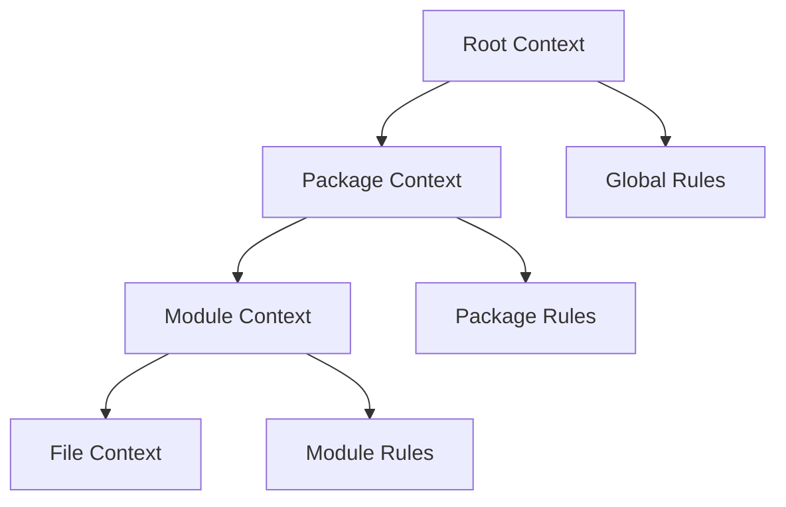

# ai-context-management.md

# AI Context Management and Hierarchy Strategies

## Overview

AI context management is the practice of organizing and structuring information that AI agents need to work effectively with codebases. As monorepos and complex projects grow, managing context becomes critical for maintaining agent performance and reducing token waste.

## Context Hierarchy Principles

### 1. Hierarchical Context Loading

Context files should be organized hierarchically, with agents loading the most relevant context first:



### 2. Context Scoping

- **Root level**: Repository-wide rules, global patterns, shared configurations
- **Package level**: Package-specific conventions, dependencies, build rules
- **Module level**: Module-specific patterns, local conventions
- **File level**: File-specific instructions, temporary context

### 3. Context Priority

1. **Immediate context** (current directory/file)
2. **Parent contexts** (moving up the directory tree)
3. **Global contexts** (root level, user home)
4. **External contexts** (MCP servers, documentation)

## Context File Types

### AGENTS.md

The standard format for AI agent instructions across multiple tools.

**Purpose**: Cross-agent compatibility, structured guidance
**Location**: Repository root, package roots
**Format**: Markdown with structured sections

```markdown
# AGENTS.md

## Project Overview

[Brief description and tech stack]

## Commands

[Build, test, lint commands]

## Do/Don't

[Specific practices and avoidances]

## Project Structure

[Key file locations]

## Examples

[Good/bad patterns]
```

### CLAUDE.md

Claude-specific context file with hierarchical loading.

**Purpose**: Claude Code optimization, custom workflows
**Location**: Any directory level, automatically discovered
**Format**: Free-form Markdown

**Loading Order**:

1. Current directory
2. Parent directories (up to root)
3. Child directories (on-demand)
4. User home directory (`~/.claude/CLAUDE.md`)

### .claude/settings.json

Claude tool configuration and permissions.

**Purpose**: Tool access control, MCP server configuration
**Location**: Project root or user home
**Format**: JSON

```json
{
  "allowedTools": ["bash", "edit", "read_file"],
  "mcpServers": {
    "postgres": {
      "command": "node",
      "args": ["path/to/postgres-server.js"]
    }
  }
}
```

### .mcp.json

MCP server configuration for team sharing.

**Purpose**: Shared MCP server setup
**Location**: Repository root
**Format**: JSON

```json
{
  "mcpServers": {
    "postgres": {
      "command": "node",
      "args": ["path/to/postgres-server.js"]
    },
    "filesystem": {
      "command": "node",
      "args": ["path/to/filesystem-server.js"]
    }
  }
}
```

## Monorepo Context Strategies

### Nx Workspace Integration

Nx provides specialized AI agent skills for monorepo management.

**Setup**:

```bash
npx nx configure-ai-agents
```

**Skills Included**:

- `nx-workspace`: Project graph exploration and understanding
- `monitor-ci`: CI/CD integration with Nx Cloud
- `nx-generate`: Predictable code generation
- `nx-run-tasks`: Efficient task execution
- `nx-plugins`: Plugin discovery and management

### Package-Level Context

Each package should have its own context file for package-specific rules.

**Example Structure**:

```
packages/
  ui/
    AGENTS.md          # UI-specific rules
    package.json
  auth/
    AGENTS.md          # Auth-specific rules
    package.json
  api/
    AGENTS.md          # API-specific rules
    package.json
```

### Cross-Package Context

Global rules that apply across all packages.

**Root AGENTS.md**:

```markdown
## Global Rules

- Use TypeScript strict mode
- Follow conventional commits
- All packages must have tests

## Package-Specific Rules

See individual package AGENTS.md files for specific conventions
```

## Context Management Best Practices

### 1. Keep Context Focused

- Avoid information overload
- Use progressive disclosure
- Reference external documentation instead of duplicating

### 2. Use Examples Over Abstractions

```markdown
# Bad

Use proper TypeScript patterns

# Good

# Copy patterns from packages/ui/src/components/Button.tsx

# Use interface Props = { children: React.ReactNode }

# Always export with export default Button
```

### 3. Version-Specific Instructions

```markdown
# Use React 18 patterns (not React 17)

# Use Next.js 14 App Router (not Pages Router)

# Use Tailwind CSS v4 @theme directive
```

### 4. Command Templates

Provide exact commands for common operations:

```markdown
## Commands

# Type check single file

npm run tsc --noEmit path/to/file.ts

# Test single package

pnpm turbo run test --filter @repo/ui

# Build affected packages

pnpm turbo run build --affected
```

### 5. Safety Boundaries

Clearly define what agents can do without permission:

```markdown
## Allowed Without Permission

- Read files
- Run TypeScript compiler
- Run tests
- Format code

## Requires Permission

- Install packages
- Push to git
- Delete files
- Run full builds
```

## MCP Integration Patterns

### MCP Server Selection

Choose MCP servers based on project needs:

```markdown
### MCP Servers

- @modelcontextprotocol/server-postgres: Database queries
- @modelcontextprotocol/server-filesystem: File operations
- @modelcontextprotocol/server-brave-search: Web research
- @modelcontextprotocol/server-github: GitHub integration
```

### MCP Usage Guidelines

```markdown
### MCP Usage

- Use postgres MCP for schema queries
- Use filesystem MCP for cross-repo file operations
- Use brave-search MCP for documentation research
- Always check MCP availability before use
```

## Context Optimization Techniques

### 1. Lazy Loading

Load context only when needed:

- Package-specific context when working in that package
- Tool-specific context when using specific tools
- Documentation context when referencing docs

### 2. Context Caching

Cache frequently accessed context:

- Project structure information
- Common command patterns
- Build configurations

### 3. Context Deduplication

Avoid repeating information across context files:

- Reference global rules instead of duplicating
- Use links to external documentation
- Share common patterns across packages

### 4. Context Validation

Regularly validate context effectiveness:

- Monitor agent performance
- Check for outdated information
- Remove unused context sections

## Advanced Patterns

### 1. Context Templates

Create reusable context templates:

```markdown
### Template: React Component

# Copy patterns from: packages/ui/src/components/Button.tsx

# Use React.forwardRef for ref forwarding

# Include displayName for debugging

# Export type Props alongside component
```

### 2. Context Composition

Combine multiple context sources:

```markdown
### Context Sources

1. Global rules from root AGENTS.md
2. Package rules from package AGENTS.md
3. Tool-specific rules from CLAUDE.md
4. MCP server capabilities from .mcp.json
```

### 3. Context Versioning

Track context changes over time:

```markdown
### Context Version

- v2.1: Added React 19 patterns
- v2.0: Migrated to Tailwind CSS v4
- v1.5: Added Nx integration rules
```

### 4. Context Testing

Test context effectiveness:

```markdown
### Context Validation

- Test agent can create new component following patterns
- Test agent can run tests correctly
- Test agent respects safety boundaries
- Test agent uses appropriate commands
```

## Implementation Checklist

### Setup Phase

- [ ] Create root AGENTS.md with global rules
- [ ] Set up package-specific AGENTS.md files
- [ ] Configure CLAUDE.md for Claude-specific optimization
- [ ] Set up .mcp.json for shared MCP servers
- [ ] Configure tool permissions in settings.json

### Validation Phase

- [ ] Test agent can navigate project structure
- [ ] Test agent can run common commands
- [ ] Test agent respects package boundaries
- [ ] Test agent uses appropriate patterns
- [ ] Test safety permissions work correctly

### Maintenance Phase

- [ ] Regularly review context for outdated information
- [ ] Update commands when build system changes
- [ ] Add new patterns as they emerge
- [ ] Remove unused context sections
- [ ] Monitor agent performance metrics

## Common Anti-Patterns

### 1. Context Overload

```markdown
# Bad: Too much information

## Complete History of This Project

[pages of project history]

# Good: Focused guidance

## Project Overview

React + TypeScript monorepo with pnpm workspaces
```

### 2. Vague Instructions

```markdown
# Bad: Vague guidance

Write good code

# Good: Specific patterns

Copy patterns from packages/ui/src/components/Button.tsx
Use interface Props = { children: React.ReactNode }
```

### 3. Outdated Information

- Regular review schedule required
- Remove references to deleted files
- Update commands that have changed

### 4. Inconsistent Context

- Ensure consistency across AGENTS.md files
- Align with actual project structure
- Keep commands in sync with package.json

## Tools and Resources

### Official Documentation

- [AGENTS.md Specification](https://agents.md/)
- [Claude Code Best Practices](https://www.anthropic.com/engineering/claude-code-best-practices)
- [Nx AI Agent Skills](https://nx.dev/blog/nx-ai-agent-skills)
- [Model Context Protocol](https://modelcontextprotocol.io/)

### MCP Servers

- [@modelcontextprotocol/server-postgres](https://github.com/modelcontextprotocol/servers/tree/main/src/postgres)
- [@modelcontextprotocol/server-filesystem](https://github.com/modelcontextprotocol/servers/tree/main/src/filesystem)
- [@modelcontextprotocol/server-brave-search](https://github.com/modelcontextprotocol/servers/tree/main/src/brave-search)

### Community Resources

- [AI Agent Context Files Collection](https://gist.github.com/0xdevalias/f40bc5a6f84c4c5ad862e314894b2fa6)
- [Agent Skills Registry](https://agentskills.io/)
- [Monorepo Tools AI Integration](https://monorepo.tools/ai)

## References

- Anthropic. "Claude Code: Best practices for agentic coding." https://www.anthropic.com/engineering/claude-code-best-practices
- Nrwl. "Teach Your AI Agent How to Work in a Monorepo." https://nx.dev/blog/nx-ai-agent-skills
- AGENTS.md. "AGENTS.md — a simple, open format for guiding coding agents." https://agents.md/
- Model Context Protocol. "MCP Specification." https://modelcontextprotocol.io/
- OpenAI. "OpenAI Codex Integration Guide." https://openai.com/codex
