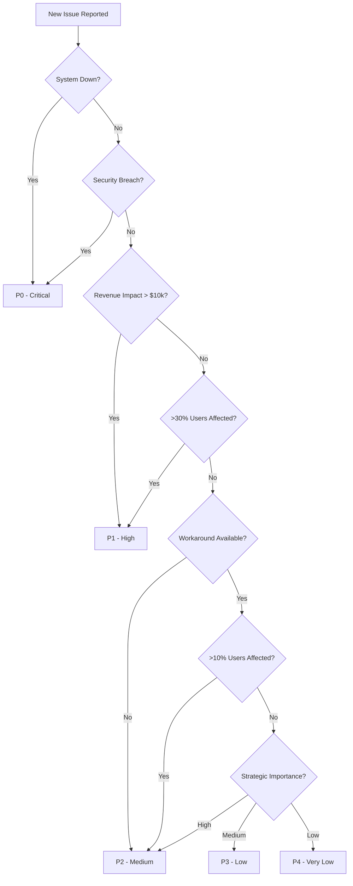

# prioritization-framework.md

## Overview

The P0-P1-P2-P3-P4 prioritization framework is a hierarchical system for classifying tasks and issues based on urgency and impact. This framework enables teams to make consistent decisions about resource allocation, ensuring critical issues receive immediate attention while maintaining a structured approach to managing workloads.

## Priority Levels Defined

### P0 Level Priority - Critical Emergency

**Definition**: Issues that require immediate action and could cause major disruptions if not addressed immediately.

**Characteristics**:

- Production systems down or severely degraded
- Security vulnerabilities being actively exploited
- Data loss or corruption
- Complete feature failure for all users
- Legal or compliance violations

**Response Requirements**:

- All hands on deck
- Work extended hours if necessary
- All other development paused
- Immediate escalation to leadership
- Real-time status updates

**Examples**:

```yaml
p0_examples:
  security:
    - 'Active security breach in production'
    - 'Customer data exposure vulnerability'
    - 'Payment processing failure'

  infrastructure:
    - 'Complete database outage'
    - 'CDN failure affecting all users'
    - 'Authentication service down'

  business:
    - 'Payment processing completely broken'
    - 'Core feature unusable for all customers'
    - 'Legal compliance violation'
```

### P1 Level Priority - High Impact

**Definition**: Important issues that significantly impact user experience but have workarounds or affect subsets of users.

**Characteristics**:

- Major feature degradation
- Significant performance issues
- Security vulnerabilities (not actively exploited)
- Feature failure for specific user segments
- High customer impact

**Response Requirements**:

- Dedicated team assignment
- Next available resource allocation
- Daily status updates
- 24-48 hour resolution target

**Examples**:

```yaml
p1_examples:
  functionality:
    - 'Checkout process failing for 30% of users'
    - 'Mobile app crashes on specific devices'
    - 'Search functionality returning no results'

  performance:
    - 'Page load times >10 seconds'
    - 'API response times >5 seconds'
    - 'Memory leaks causing crashes'

  security:
    - 'Potential security vulnerability identified'
    - 'Authentication issues for subset of users'
    - 'Data exposure in non-production environment'
```

### P2 Level Priority - Medium Impact

**Definition**: Issues that affect user experience but have clear workarounds or impact smaller user groups.

**Characteristics**:

- Minor feature degradation
- Performance issues with workarounds
- UI/UX problems
- Feature requests from key customers
- Documentation issues

**Response Requirements**:

- Normal sprint allocation
- Weekly status updates
- 1-2 week resolution target
- Can be scheduled

**Examples**:

```yaml
p2_examples:
  functionality:
    - 'Feature works but has confusing UI'
    - 'Minor bugs with easy workarounds'
    - 'Performance degradation in specific scenarios'

  user_experience:
    - 'Broken links in documentation'
    - 'Inconsistent styling across pages'
    - 'Missing error messages'

  customer_requests:
    - 'Feature requests from enterprise customers'
    - 'Integration requests for key partners'
```

### P3 Level Priority - Low Impact

**Definition**: Minor issues that don't significantly impact user experience or have easy workarounds.

**Characteristics**:

- Cosmetic issues
- Minor performance improvements
- Nice-to-have features
- General user feedback
- Code quality improvements

**Response Requirements**:

- Backlog allocation
- Bi-weekly status updates
- 2-4 week resolution target
- Can be deferred

**Examples**:

```yaml
p3_examples:
  cosmetic:
    - 'Pixel alignment issues'
    - 'Minor color inconsistencies'
    - 'Typos in help text'

  improvements:
    - 'Performance optimizations'
    - 'Code refactoring'
    - 'Test coverage improvements'

  features:
    - 'Nice-to-have features'
    - 'User convenience improvements'
```

### P4 Level Priority - Very Low Impact

**Definition**: Issues that have minimal impact and can be addressed when resources are available.

**Characteristics**:

- Future feature ideas
- Long-term improvements
- Research tasks
- Low-value enhancements
- Documentation updates

**Response Requirements**:

- Future consideration
- Monthly status reviews
- No specific timeline
- Can be cancelled

**Examples**:

```yaml
p4_examples:
  future_features:
    - 'Ideas for future product directions'
    - 'Research on new technologies'
    - 'Market exploration tasks'

  maintenance:
    - 'Documentation updates'
    - 'Code cleanup'
    - 'Dependency updates'
```

## Implementation Framework

### Priority Assignment Process

```typescript
interface PriorityAssessment {
  issue: Issue;
  criteria: AssessmentCriteria;
  priority: PriorityLevel;
  justification: string;
  approver: string;
}

interface AssessmentCriteria {
  impact: {
    users_affected: number;
    revenue_impact: number;
    customer_satisfaction_impact: number;
  };

  urgency: {
    time_sensitivity: 'immediate' | 'high' | 'medium' | 'low';
    workaround_available: boolean;
    degradation_level: 'complete' | 'major' | 'minor' | 'cosmetic';
  };

  business: {
    strategic_importance: 'critical' | 'high' | 'medium' | 'low';
    compliance_impact: 'high' | 'medium' | 'low';
    competitive_impact: 'high' | 'medium' | 'low';
  };
}

class PriorityAssessmentService {
  assessPriority(criteria: AssessmentCriteria): PriorityLevel {
    // P0: Complete system failure or security breach
    if (this.isP0Condition(criteria)) {
      return 'P0';
    }

    // P1: High impact with limited workarounds
    if (this.isP1Condition(criteria)) {
      return 'P1';
    }

    // P2: Medium impact with workarounds
    if (this.isP2Condition(criteria)) {
      return 'P2';
    }

    // P3: Low impact
    if (this.isP3Condition(criteria)) {
      return 'P3';
    }

    // P4: Very low impact
    return 'P4';
  }

  private isP0Condition(criteria: AssessmentCriteria): boolean {
    return (
      criteria.impact.users_affected > 0.9 || // >90% users affected
      criteria.impact.revenue_impact > 10000 || // >$10k revenue impact
      criteria.business.compliance_impact === 'high' ||
      criteria.urgency.degradation_level === 'complete'
    );
  }

  private isP1Condition(criteria: AssessmentCriteria): boolean {
    return (
      criteria.impact.users_affected > 0.3 || // >30% users affected
      criteria.impact.revenue_impact > 1000 || // >$1k revenue impact
      criteria.business.strategic_importance === 'critical' ||
      (criteria.urgency.degradation_level === 'major' && !criteria.urgency.workaround_available)
    );
  }

  private isP2Condition(criteria: AssessmentCriteria): boolean {
    return (
      criteria.impact.users_affected > 0.1 || // >10% users affected
      criteria.impact.revenue_impact > 100 || // >$100 revenue impact
      criteria.business.strategic_importance === 'high' ||
      criteria.urgency.degradation_level === 'major'
    );
  }

  private isP3Condition(criteria: AssessmentCriteria): boolean {
    return (
      criteria.impact.users_affected > 0.01 || // >1% users affected
      criteria.impact.revenue_impact > 10 || // >$10 revenue impact
      criteria.business.strategic_importance === 'medium' ||
      criteria.urgency.degradation_level === 'minor'
    );
  }

  // Default to P4 if no other conditions met
  private isP4Condition(criteria: AssessmentCriteria): boolean {
    return true;
  }
}
```

### Workflow Integration

```yaml
priority_workflows:
  p0_workflow:
    trigger: 'Issue created with P0 priority'
    actions:
      - 'Immediate notification to all engineering staff'
      - 'Create dedicated Slack channel'
      - 'Escalate to CTO/VP Engineering'
      - 'Pause all non-critical work'
      - 'Start incident response process'

    escalation:
      - '15 min: No response -> Engineering manager'
      - '30 min: No progress -> VP Engineering'
      - '1 hour: No resolution -> CTO'

  p1_workflow:
    trigger: 'Issue created with P1 priority'
    actions:
      - 'Assign to next available team'
      - 'Daily status updates'
      - 'Weekly stakeholder review'

    escalation:
      - '24 hours: No progress -> Engineering manager'
      - '48 hours: No resolution -> VP Engineering'

  p2_workflow:
    trigger: 'Issue created with P2 priority'
    actions:
      - 'Add to next sprint backlog'
      - 'Weekly status updates'
      - 'Sprint planning review'

    escalation:
      - '1 week: No progress -> Product manager'
      - '2 weeks: No resolution -> Engineering manager'

  p3_workflow:
    trigger: 'Issue created with P3 priority'
    actions:
      - 'Add to product backlog'
      - 'Bi-weekly backlog grooming'
      - 'Monthly progress review'

  p4_workflow:
    trigger: 'Issue created with P4 priority'
    actions:
      - 'Add to future considerations list'
      - 'Quarterly roadmap review'
      - 'Annual priority assessment'
```

### Team Responsibilities

```typescript
interface PriorityRoles {
  incident_commander: {
    p0: 'Engineering manager or senior engineer';
    p1: 'Team lead or senior engineer';
    p2: 'Team lead';
    p3: 'Product owner';
    p4: 'Product manager';
  };

  communication_lead: {
    p0: 'Product manager + Engineering manager';
    p1: 'Product manager';
    p2: 'Product owner';
    p3: 'Team lead';
    p4: 'Product manager';
  };

  technical_lead: {
    p0: 'Senior engineer or architect';
    p1: 'Senior engineer';
    p2: 'Engineer';
    p3: 'Engineer';
    p4: 'Available engineer';
  };
}
```

## Decision Trees and Guidelines

### Priority Decision Tree



### Assessment Checklist

```markdown
## Priority Assessment Checklist

### P0 Criteria (Check all that apply)

- [ ] Production system completely down
- [ ] Security vulnerability being actively exploited
- [ ] Data loss or corruption occurring
- [ ] Complete feature failure for all users
- [ ] Legal or compliance violation in progress
- [ ] Revenue impact > $10,000 per hour

### P1 Criteria (Check all that apply)

- [ ] Major feature degradation
- [ ] Significant performance issues (>5x slower)
- [ ] Security vulnerability identified (not exploited)
- [ ] Feature failure for specific user segments (>30%)
- [ ] High customer impact with limited workarounds
- [ ] Revenue impact > $1,000 per day

### P2 Criteria (Check all that apply)

- [ ] Minor feature degradation
- [ ] Performance issues with workarounds
- [ ] UI/UX problems affecting usability
- [ ] Feature requests from key customers
- [ ] Documentation issues affecting usage
- [ ] Revenue impact > $100 per day

### P3 Criteria (Check all that apply)

- [ ] Cosmetic issues
- [ ] Minor performance improvements
- [ ] Nice-to-have features
- [ ] General user feedback
- [ ] Code quality improvements
- [ ] Revenue impact < $100 per day

### P4 Criteria (Check all that apply)

- [ ] Future feature ideas
- [ ] Long-term improvements
- [ ] Research tasks
- [ ] Low-value enhancements
- [ ] Documentation updates
- [ ] Minimal revenue impact
```

## Metrics and Monitoring

### Priority Distribution Metrics

```typescript
interface PriorityMetrics {
  distribution: {
    p0_count: number;
    p1_count: number;
    p2_count: number;
    p3_count: number;
    p4_count: number;
  };

  performance: {
    p0_resolution_time: number; // hours
    p1_resolution_time: number; // days
    p2_resolution_time: number; // weeks
    p3_resolution_time: number; // weeks
    p4_resolution_time: number; // months
  };

  trends: {
    priority_creep: boolean; // Are issues being upgraded?
    priority_downgrade: boolean; // Are issues being downgraded?
    balance_score: number; // 0-100, ideal is 70-80
  };
}

class PriorityMetricsService {
  calculateBalanceScore(metrics: PriorityMetrics): number {
    const total = Object.values(metrics.distribution).reduce((a, b) => a + b, 0);

    if (total === 0) return 100;

    // Ideal distribution: P0: 0%, P1: 5%, P2: 15%, P3: 30%, P4: 50%
    const ideal = {
      p0: 0,
      p1: 0.05,
      p2: 0.15,
      p3: 0.3,
      p4: 0.5,
    };

    let score = 0;
    for (const [priority, idealRatio] of Object.entries(ideal)) {
      const actualRatio = metrics.distribution[priority] / total;
      const deviation = Math.abs(actualRatio - idealRatio);
      score -= deviation * 20; // 20 points per 5% deviation
    }

    return Math.max(0, Math.min(100, score + 100));
  }
}
```

### Health Indicators

```yaml
health_indicators:
  healthy:
    p0_count: 0
    p1_count: '< 5% of total issues'
    p2_count: '10-20% of total issues'
    p3_count: '25-35% of total issues'
    p4_count: '45-65% of total issues'

  warning:
    p0_count: '> 0'
    p1_count: '> 10% of total issues'
    p2_count: '> 25% of total issues'
    priority_creep: 'Issues being upgraded frequently'

  critical:
    p0_count: '> 2'
    p1_count: '> 20% of total issues'
    resolution_times: 'Consistently exceeding targets'
    team_capacity: 'Team consistently overloaded'
```

## Best Practices

### Priority Assignment Guidelines

1. **Be Objective and Consistent**
   - Use defined criteria for all assessments
   - Document justification for priority assignments
   - Review priority assignments regularly

2. **Consider Business Impact**
   - Focus on customer impact first
   - Consider revenue and strategic importance
   - Factor in compliance and legal requirements

3. **Account for Workarounds**
   - Assess if workarounds exist
   - Evaluate workaround complexity
   - Consider workaround impact on users

### Team Communication

```markdown
## Priority Communication Templates

### P0 Incident Communication

**Subject**: 🚨 CRITICAL: [Issue Title] - All Hands On Deck

**Body**:

- **Priority**: P0 - Critical
- **Impact**: [Describe impact on users/business]
- **Status**: [Current status]
- **Actions**: [Immediate actions required]
- **Timeline**: [Expected resolution time]
- **Communication**: [Update schedule]

### P1 Issue Communication

**Subject**: 🔥 HIGH: [Issue Title] - Dedicated Team Assigned

**Body**:

- **Priority**: P1 - High
- **Impact**: [Describe impact on users/business]
- **Team**: [Assigned team members]
- **ETA**: [Expected resolution time]
- **Updates**: [Daily update schedule]

### P2 Issue Communication

**Subject**: ⚠️ MEDIUM: [Issue Title] - Added to Sprint

**Body**:

- **Priority**: P2 - Medium
- **Impact**: [Describe impact on users/business]
- **Sprint**: [Target sprint]
- **Workaround**: [Available workarounds]
- **Updates**: [Weekly update schedule]
```

### Continuous Improvement

```typescript
interface PriorityImprovement {
  retrospective: {
    priority_accuracy: number; // How accurate were priority assignments?
    resolution_efficiency: number; // How well did we meet targets?
    team_satisfaction: number; // How does team feel about workload?
  };

  actions: {
    process_improvements: string[];
    training_needs: string[];
    tool_updates: string[];
    communication_updates: string[];
  };

  next_review: Date;
}
```

## Integration with Development Processes

### Sprint Planning Integration

```yaml
sprint_planning:
  capacity_allocation:
    p0_issues: '100% of team capacity (immediate)'
    p1_issues: '50% of team capacity'
    p2_issues: '30% of team capacity'
    p3_issues: '15% of team capacity'
    p4_issues: '5% of team capacity'

  planning_process: 1. "Review all P0 and P1 issues first"
    2. "Allocate capacity for P2 issues"
    3. "Fill remaining capacity with P3 issues"
    4. "Consider P4 issues if capacity allows"

  stakeholder_communication:
    - 'Communicate priority decisions to stakeholders'
    - 'Explain trade-offs and capacity constraints'
    - 'Set realistic expectations for timelines'
```

### Release Management

```typescript
interface ReleasePriority {
  blocking_issues: PriorityLevel[]; // Issues that block release
  release_criteria: {
    max_p0_issues: 0;
    max_p1_issues: 0;
    max_p2_issues: 2;
    max_p3_issues: 5;
  };

  release_decision: {
    go_no_go_criteria: string;
    risk_assessment: string;
    stakeholder_approval: string;
  };
}
```

## References

- [P0, P1, P2, P3, and P4 Priority Levels Explained - Fibery](https://fibery.com/blog/product-management/p0-p1-p2-p3-p4/)
- [Product Prioritization Frameworks: The Complete Guide for 2026 - Monday.com](https://monday.com/blog/rnd/product-prioritization-frameworks/)
- [Levels of Priority: Best P0 to P4 System Applied in Product](https://plakyguide.com/levels-of-priority-frameworks/business/)
- [Product Prioritization in Hardware Development - Penchant for Product](https://penchantforproduct.com/product-prioritization-in-hardware-development/)
- [Product Prioritization Frameworks: 12 Common Models - Aha.io](https://www.aha.io/roadmapping/guide/release-management/prioritization-framework)
