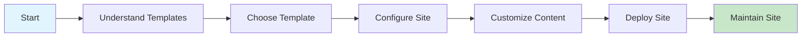
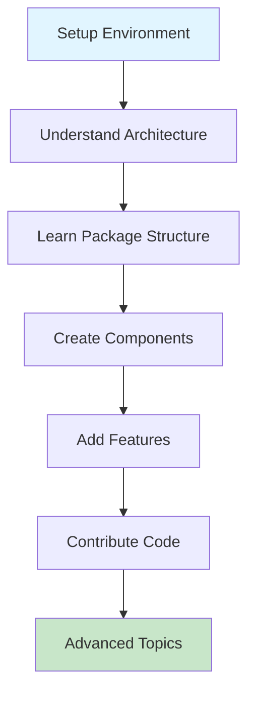
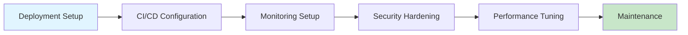
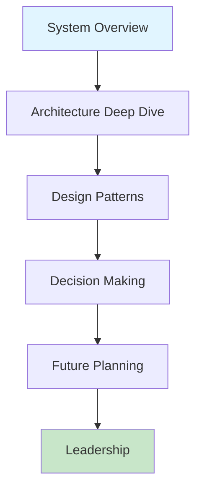

<!--
/**
 * @file docs/resources/learning-paths.md
 * @role docs
 * @summary Role-based learning paths for different user types.
 *
 * @entrypoints
 * - Referenced from documentation hub
 * - Onboarding resource
 *
 * @exports
 * - N/A
 *
 * @depends_on
 * - docs/getting-started/onboarding.md (developer path)
 * - docs/README.md (documentation hub)
 *
 * @used_by
 * - New users finding their learning path
 * - Onboarding coordinators
 *
 * @runtime
 * - environment: docs
 * - side_effects: none
 *
 * @data_flow
 * - inputs: user role and goals
 * - outputs: structured learning sequence
 *
 * @invariants
 * - Paths must be progressive (beginner to advanced)
 * - Prerequisites must be clearly marked
 *
 * @gotchas
 * - Users may need to follow multiple paths
 * - Paths can be customized based on needs
 *
 * @issues
 * - N/A
 *
 * @opportunities
 * - Add progress tracking
 * - Create interactive path selector
 *
 * @verification
 * - ✅ Paths verified against available documentation
 *
 * @status
 * - confidence: high
 * - last_audited: 2026-02-18
 */
-->

# Learning Paths

**Last Updated:** 2026-02-18  
**Status:** Active Guide  
**Related:** [Onboarding Guide](getting-started/onboarding.md), [Documentation Hub](README.md)

---

Structured learning paths for different user types. Choose the path that matches your role and goals. Each path is designed to take you from beginner to productive contributor.

## Choose Your Path

- **[Template User Path](#template-user-path)** - Non-technical users setting up client websites
- **[Developer Path](#developer-path)** - Technical contributors extending the platform
- **[Administrator Path](#administrator-path)** - Operations team managing deployments
- **[Architect Path](#architect-path)** - Technical leaders making design decisions

---

## Template User Path

**Audience:** Non-technical users, business owners, content managers  
**Goal:** Set up and customize client websites using templates  
**Estimated Time:** 4-8 hours  
**Difficulty:** Beginner

### Prerequisites

- Basic computer skills
- Web browser access
- GitHub account (for accessing templates)

### Path Overview

### Step-by-Step Guide

#### 1. Getting Started (30 minutes)

- [ ] Read [Repository Overview](../../README.md#overview)
- [ ] Understand what templates are
- [ ] Review available templates
- [ ] Choose a template for your use case

**Resources:**
- [README.md](../../README.md) - Project overview
- [Templates Documentation](../templates/README.md) - Available templates

#### 2. Understanding Templates (1 hour)

- [ ] Learn about template structure
- [ ] Understand configuration files
- [ ] Review customization options
- [ ] Explore example client implementations

**Resources:**
- [Template Architecture](../architecture/TEMPLATE_ARCHITECTURE.md)
- [Client Setup Guide](../clients/README.md)

#### 3. Configuration Basics (1-2 hours)

- [ ] Learn about `site.config.ts`
- [ ] Configure branding (colors, fonts, logo)
- [ ] Set up business information
- [ ] Configure contact details
- [ ] Enable/disable features

**Resources:**
- [Configuration Guide](../CONFIG.md)
- [Site Configuration Reference](../guides/configuration.md)

#### 4. Content Customization (2-3 hours)

- [ ] Update page content
- [ ] Add/remove pages
- [ ] Customize service offerings
- [ ] Add team members
- [ ] Upload images and assets

**Resources:**
- [Content Management Guide](../guides/content-management.md) (if available)
- Template-specific documentation

#### 5. Deployment (1 hour)

- [ ] Choose deployment platform
- [ ] Set up environment variables
- [ ] Deploy to production
- [ ] Verify deployment
- [ ] Set up custom domain

**Resources:**
- [Deployment Guide](../deployment/)
- [Client Setup Guide](../clients/README.md#deployment)

#### 6. Maintenance (Ongoing)

- [ ] Learn to update content
- [ ] Understand update process
- [ ] Monitor site performance
- [ ] Handle common issues

**Resources:**
- [Troubleshooting Guide](getting-started/troubleshooting.md)
- [FAQ](faq.md)

### Success Criteria

✅ You can create a new client from a template  
✅ You can configure branding and content  
✅ You can deploy a client website  
✅ You can update content independently

---

## Developer Path

**Audience:** Software developers, technical contributors  
**Goal:** Contribute code, extend features, create components  
**Estimated Time:** 8-16 hours  
**Difficulty:** Intermediate to Advanced

### Prerequisites

- Programming experience (JavaScript/TypeScript)
- Git and GitHub familiarity
- Node.js and npm/pnpm experience
- Basic React knowledge

### Path Overview

### Step-by-Step Guide

#### 1. Environment Setup (2-3 hours)

- [ ] Install prerequisites (Node.js, pnpm)
- [ ] Clone repository
- [ ] Install dependencies
- [ ] Run development server
- [ ] Verify setup

**Resources:**
- [Developer Onboarding](getting-started/onboarding.md)
- [CONTRIBUTING.md](../../CONTRIBUTING.md)

#### 2. Architecture Understanding (2-3 hours)

- [ ] Read architecture overview
- [ ] Understand layer model
- [ ] Learn module boundaries
- [ ] Study dependency rules
- [ ] Review package structure

**Resources:**
- [Architecture Overview](architecture/README.md)
- [Module Boundaries](architecture/module-boundaries.md)
- [Visual Guide](architecture/visual-guide.md)

#### 3. Package Structure (1-2 hours)

- [ ] Explore `@repo/ui` package
- [ ] Understand `@repo/features` structure
- [ ] Learn `@repo/infra` patterns
- [ ] Review `@repo/types` definitions
- [ ] Study package exports

**Resources:**
- [UI Library Documentation](components/ui-library.md)
- [Feature Documentation](../features/)
- Package-specific README files

#### 4. Component Development (2-3 hours)

- [ ] Create a simple UI component
- [ ] Add tests
- [ ] Document component
- [ ] Export from package
- [ ] Use in template

**Resources:**
- [UI Library Documentation](components/ui-library.md)
- [Component Patterns](../components/)
- [Testing Strategy](../testing-strategy.md)

#### 5. Feature Development (2-3 hours)

- [ ] Understand feature extraction
- [ ] Create a new feature
- [ ] Integrate with templates
- [ ] Add configuration options
- [ ] Document usage

**Resources:**
- [Feature Documentation](../features/)
- [Template Development Guide](../guides/template-development.md)

#### 6. Contributing Code (1-2 hours)

- [ ] Read contribution guidelines
- [ ] Understand code standards
- [ ] Learn PR process
- [ ] Review code review process
- [ ] Submit first contribution

**Resources:**
- [CONTRIBUTING.md](../../CONTRIBUTING.md)
- [Code of Conduct](../../CODE_OF_CONDUCT.md)
- [Documentation Standards](DOCUMENTATION_STANDARDS.md)

#### 7. Advanced Topics (Ongoing)

- [ ] Performance optimization
- [ ] Security best practices
- [ ] Testing strategies
- [ ] Integration development
- [ ] Architecture decisions

**Resources:**
- [Performance Guide](../performance-baseline.md)
- [Security Practices](../operations/security.md)
- [Architecture Decision Records](../adr/)

### Success Criteria

✅ You can set up a development environment  
✅ You understand the architecture  
✅ You can create and contribute components  
✅ You can add new features  
✅ You can submit quality PRs

---

## Administrator Path

**Audience:** DevOps engineers, system administrators, deployment managers  
**Goal:** Deploy, monitor, and maintain production websites  
**Estimated Time:** 6-12 hours  
**Difficulty:** Intermediate

### Prerequisites

- Server administration experience
- CI/CD familiarity
- Cloud platform knowledge (Vercel, Netlify, AWS, etc.)
- Monitoring and logging experience

### Path Overview

### Step-by-Step Guide

#### 1. Deployment Setup (2-3 hours)

- [ ] Understand deployment options
- [ ] Choose deployment platform
- [ ] Configure build settings
- [ ] Set up environment variables
- [ ] Deploy first client

**Resources:**
- [Deployment Guide](../deployment/)
- [Docker Documentation](../deployment/docker.md)
- Platform-specific guides

#### 2. CI/CD Configuration (2-3 hours)

- [ ] Understand CI/CD pipeline
- [ ] Configure GitHub Actions
- [ ] Set up automated builds
- [ ] Configure deployment automation
- [ ] Test CI/CD workflow

**Resources:**
- [CI/CD Documentation](../ci/)
- [GitHub Actions Workflows](../../.github/workflows/)

#### 3. Monitoring Setup (1-2 hours)

- [ ] Configure error tracking (Sentry)
- [ ] Set up performance monitoring
- [ ] Configure logging
- [ ] Set up alerts
- [ ] Create dashboards

**Resources:**
- [Monitoring Guide](../operations/monitoring.md)
- [Performance Baseline](../performance-baseline.md)

#### 4. Security Hardening (1-2 hours)

- [ ] Review security practices
- [ ] Configure security headers
- [ ] Set up vulnerability scanning
- [ ] Configure access controls
- [ ] Implement backup strategy

**Resources:**
- [Security Practices](../operations/security.md)
- [SECURITY.md](../../SECURITY.md)

#### 5. Performance Tuning (1-2 hours)

- [ ] Understand performance metrics
- [ ] Optimize build process
- [ ] Configure caching
- [ ] Optimize assets
- [ ] Monitor Core Web Vitals

**Resources:**
- [Performance Guide](../performance-baseline.md)
- [Architecture Performance](architecture/README.md#performance-architecture)

#### 6. Maintenance (Ongoing)

- [ ] Set up update process
- [ ] Configure dependency updates
- [ ] Plan maintenance windows
- [ ] Document procedures
- [ ] Train team members

**Resources:**
- [Maintenance Guide](../operations/maintenance.md)
- [Version Policy](../VERSION_POLICY.md)

### Success Criteria

✅ You can deploy client websites  
✅ You can configure CI/CD pipelines  
✅ You can monitor production systems  
✅ You can handle security incidents  
✅ You can optimize performance

---

## Architect Path

**Audience:** Technical leaders, system architects, senior engineers  
**Goal:** Make architectural decisions, design systems, guide technical direction  
**Estimated Time:** 12-20 hours  
**Difficulty:** Advanced

### Prerequisites

- Deep software architecture knowledge
- System design experience
- Understanding of modern web architectures
- Experience with monorepos and microservices

### Path Overview

### Step-by-Step Guide

#### 1. System Overview (2-3 hours)

- [ ] Read complete architecture documentation
- [ ] Understand seven-layer model
- [ ] Study current implementation
- [ ] Review roadmap and vision
- [ ] Understand constraints and requirements

**Resources:**
- [Architecture Overview](architecture/README.md)
- [THEGOAL.md](../../THEGOAL.md)
- [TASKS.md](../../TASKS.md) - Roadmap and task specifications

#### 2. Architecture Deep Dive (3-4 hours)

- [ ] Study module boundaries
- [ ] Understand dependency rules
- [ ] Review package architecture
- [ ] Analyze data flows
- [ ] Study security architecture

**Resources:**
- [Module Boundaries](architecture/module-boundaries.md)
- [Dependency Graph](architecture/dependency-graph.md)
- [Visual Guide](architecture/visual-guide.md)

#### 3. Design Patterns (2-3 hours)

- [ ] Understand Configuration-as-Code (CaCA)
- [ ] Study template composition patterns
- [ ] Review feature extraction patterns
- [ ] Learn integration patterns
- [ ] Understand deployment patterns

**Resources:**
- [Architecture Overview](architecture/README.md#design-principles)
- [TASKS.md](../../TASKS.md)
- Code examples in packages

#### 4. Decision Making (2-3 hours)

- [ ] Review Architecture Decision Records (ADRs)
- [ ] Understand decision process
- [ ] Study past decisions
- [ ] Learn to write ADRs
- [ ] Practice evaluating trade-offs

**Resources:**
- [Architecture Decision Records](../adr/)
- ADR template and examples

#### 5. Future Planning (2-3 hours)

- [ ] Review roadmap
- [ ] Understand future layers
- [ ] Plan migration strategies
- [ ] Design extension points
- [ ] Plan for scale

**Resources:**
- [TASKS.md](../../TASKS.md)
- [Architecture Evolution](architecture/README.md#evolution-roadmap)
- [Innovation Specs](TASKS.md) (Part 4, Innovation & Future)

#### 6. Leadership (Ongoing)

- [ ] Guide technical discussions
- [ ] Review architecture proposals
- [ ] Mentor other developers
- [ ] Communicate architecture decisions
- [ ] Evolve architecture over time

**Resources:**
- [CONTRIBUTING.md](../../CONTRIBUTING.md)
- [Code of Conduct](../../CODE_OF_CONDUCT.md)
- Team communication channels

### Success Criteria

✅ You understand the complete architecture  
✅ You can make informed architectural decisions  
✅ You can write effective ADRs  
✅ You can guide technical direction  
✅ You can mentor other architects

---

## Customizing Your Path

These paths are starting points. You can:

- **Combine paths**: Follow multiple paths if your role spans areas
- **Skip sections**: If you already have experience in an area
- **Deep dive**: Spend more time on topics of interest
- **Jump ahead**: If prerequisites are already met

## Progress Tracking

Track your progress by checking off items in each path. Consider:

- Creating a personal checklist
- Documenting your learning
- Sharing progress with your team
- Contributing improvements to these paths

## Getting Help

If you get stuck on any path:

1. Check the [FAQ](faq.md)
2. Review [Troubleshooting Guide](getting-started/troubleshooting.md)
3. Search existing [GitHub Issues](https://github.com/your-org/marketing-websites/issues)
4. Ask in [GitHub Discussions](https://github.com/your-org/marketing-websites/discussions)

---

**Contributing:** Found a better way to structure these paths? [Submit a PR](https://github.com/your-org/marketing-websites/pulls)!
