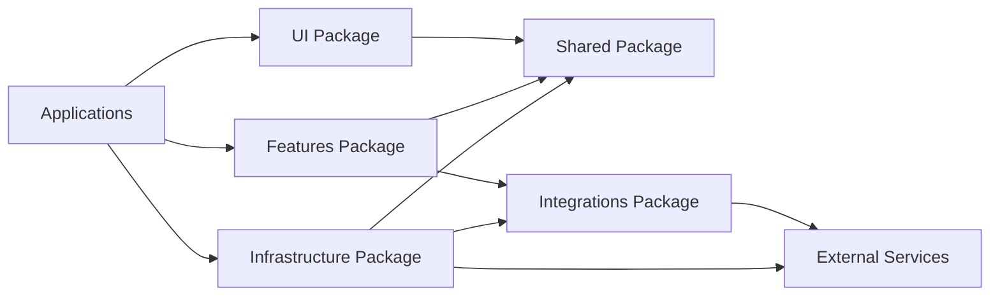

# 📦 Packages

> **Shared libraries and components for the marketing websites platform**

This directory contains all shared packages that provide reusable functionality across the marketing websites applications. Each package follows the Feature-Sliced Design (FSD) v2.1 architecture and is designed for maximum reusability and maintainability.

---

## 📁 Package Structure

```
packages/
├── ui/                       # UI components library
├── infrastructure/           # Core infrastructure and security
├── features/                 # Business logic and features
├── shared/                   # Shared utilities and types
├── integrations/             # Third-party service integrations
├── analytics/                # Real-time analytics
├── auth/                     # Authentication and authorization
├── billing/                  # Billing and payments
├── bookings/                 # Booking system
├── config-schema/            # Configuration validation
├── email/                    # Email templates and delivery
├── reports/                  # Business intelligence
├── validation/               # Data validation
└── [other packages...]       # Additional specialized packages
```

---

## 🎯 Package Categories

### **🎨 UI Components** (`packages/ui/`)

**Purpose**: Reusable UI components following FSD architecture

**Key Features**:

- Feature-Sliced Design implementation
- TypeScript strict typing
- Accessibility compliance (WCAG 2.2 AA)
- Theme-aware components
- Storybook documentation

**Exports**:

```typescript
// FSD layer exports
export { Button, Card, Input } from './src/app';
export { BookingWidget, LeadFormWidget } from './src/widgets';
export { BookingFeature, LeadFeature } from './src/features';
export { UserEntity, BookingEntity } from './src/entities';
export { formatDate, validateEmail } from './src/shared';
```

**Dependencies**: React, Tailwind CSS, Radix UI, Lucide Icons

---

### **🏗️ Infrastructure** (`packages/infrastructure/`)

**Purpose**: Core infrastructure, security, and system utilities

**Key Features**:

- OAuth 2.1 with PKCE authentication
- Multi-tenant security patterns
- Request context management
- Monitoring and logging
- Security middleware

**Exports**:

```typescript
export { AuthService, TokenValidator } from './src/auth';
export { secureAction, authMiddleware } from './src/security';
export { RequestContext, TenantContext } from './src/context';
export { Logger, Monitoring } from './src/monitoring';
```

**Dependencies**: Supabase, Jose, Sentry, OpenTelemetry

---

### **⚙️ Business Features** (`packages/features/`)

**Purpose**: Business logic and domain-specific features

**Key Features**:

- Booking system logic
- Lead management
- Analytics features
- User management
- Multi-tenant business rules

**Exports**:

```typescript
export { BookingService, BookingAPI } from './src/booking';
export { LeadService, LeadScoring } from './src/lead-management';
export { AnalyticsService, MetricsAPI } from './src/analytics';
export { UserService, UserManagement } from './src/auth';
```

**Dependencies**: Infrastructure packages, shared utilities

---

### **🔧 Shared Utilities** (`packages/shared/`)

**Purpose**: Common utilities, types, and helper functions

**Key Features**:

- TypeScript type definitions
- Utility functions
- Configuration management
- Validation schemas
- Common constants

**Exports**:

```typescript
export { formatDate, formatCurrency } from './src/lib';
export { User, Booking, Lead } from './src/types';
export { API_CONFIG, APP_CONFIG } from './src/config';
export { validateEmail, validateUUID } from './src/validation';
```

**Dependencies**: Zod, date-fns, minimal external deps

---

### **🔌 Integrations** (`packages/integrations/`)

**Purpose**: Third-party service integrations

**Key Features**:

- Stripe payment processing
- HubSpot CRM integration
- Cal.com scheduling
- Resend email service
- Analytics providers

**Exports**:

```typescript
export { StripeService, WebhookHandler } from './src/stripe';
export { HubSpotClient, ContactSync } from './src/hubspot';
export { CalComService, BookingSync } from './src/calcom';
export { EmailService, TemplateEngine } from './src/resend';
```

**Dependencies**: Service-specific SDKs, infrastructure

---

### **📊 Analytics** (`packages/analytics/`)

**Purpose**: Real-time analytics and business intelligence

**Key Features**:

- Tinybird integration
- Real-time dashboards
- Business metrics
- Performance analytics
- Multi-tenant data isolation

**Exports**:

```typescript
export { AnalyticsService, DashboardAPI } from './src/analytics';
export { MetricsCollector, ReportGenerator } from './src/metrics';
export { RealTimeAnalytics, BusinessIntelligence } from './src/bi';
```

**Dependencies**: Tinybird, infrastructure, shared

---

### **🔐 Authentication** (`packages/auth/`)

**Purpose**: Authentication and authorization system

**Key Features**:

- OAuth 2.1 implementation
- Multi-tenant auth
- Session management
- Permission system
- Security utilities

**Exports**:

```typescript
export { AuthService, AuthMiddleware } from './src/auth';
export { SessionManager, PermissionChecker } from './src/session';
export { TokenService, CryptoUtils } from './src/security';
```

**Dependencies**: Infrastructure, shared utilities

---

### **💳 Billing** (`packages/billing/`)

**Purpose**: Billing and payment processing

**Key Features**:

- Stripe integration
- Subscription management
- Invoice generation
- Payment processing
- Billing analytics

**Exports**:

```typescript
export { BillingService, SubscriptionManager } from './src/billing';
export { PaymentProcessor, InvoiceGenerator } from './src/payments';
export { BillingAnalytics, RevenueTracking } from './src/analytics';
```

**Dependencies**: Stripe, infrastructure, shared

---

### **📅 Bookings** (`packages/bookings/`)

**Purpose**: Booking and scheduling system

**Key Features**:

- Cal.com integration
- Booking management
- Scheduling logic
- Calendar integration
- Booking analytics

**Exports**:

```typescript
export { BookingService, CalendarManager } from './src/booking';
export { SchedulingEngine, AvailabilityChecker } from './src/scheduling';
export { BookingAnalytics, UtilizationMetrics } from './src/analytics';
```

**Dependencies**: Cal.com, infrastructure, shared

---

### **⚙️ Config Schema** (`packages/config-schema/`)

**Purpose**: Configuration validation and management

**Key Features**:

- Zod schema validation
- Type-safe configuration
- Environment validation
- Configuration templates
- Conflict detection

**Exports**:

```typescript
export { SiteConfigSchema, validateConfig } from './src/schema';
export { ConfigTemplate, ConfigGenerator } from './src/template';
export { ConfigValidator, ConflictDetector } from './src/validation';
```

**Dependencies**: Zod, shared utilities

---

### **📧 Email** (`packages/email/`)

**Purpose**: Email templates and delivery

**Key Features**:

- Email templates
- Delivery service
- Template engine
- Email analytics
- Multi-tenant templates

**Exports**:

```typescript
export { EmailService, TemplateEngine } from './src/email';
export { TemplateRenderer, DeliveryManager } from './src/template';
export { EmailAnalytics, DeliveryTracking } from './src/analytics';
```

**Dependencies**: Resend, infrastructure, shared

---

### **📈 Reports** (`packages/reports/`)

**Purpose**: Business intelligence and reporting

**Key Features**:

- Report generation
- Business metrics
- Data visualization
- Export capabilities
- Scheduled reports

**Exports**:

```typescript
export { ReportService, DashboardGenerator } from './src/reports';
export { MetricsCollector, DataVisualizer } from './src/analytics';
export { ExportService, Scheduler } from './src/export';
```

**Dependencies**: Analytics, infrastructure, shared

---

### **✅ Validation** (`packages/validation/`)

**Purpose**: Data validation and quality assurance

**Key Features**:

- Zod validation schemas
- Type-safe validation
- Error handling
- Validation rules
- Quality checks

**Exports**:

```typescript
export { ValidationService, SchemaValidator } from './src/validation';
export { QualityChecker, ErrorReporter } from './src/quality';
export { ValidationRules, TypeGuards } from './src/rules';
```

**Dependencies**: Zod, shared utilities

---

## 🏗️ Architecture Patterns

### **Feature-Sliced Design (FSD) v2.1**

All packages follow FSD architecture where applicable:

```
src/
├── app/             # App layer (layouts, pages)
├── pages/           # Pages layer (route components)
├── widgets/         # Widgets layer (composed features)
├── features/        # Features layer (business logic)
├── entities/        # Entities layer (domain models)
└── shared/          # Shared layer (utilities, types)
```

### **Package Dependencies**



### **Export Patterns**

Each package uses structured exports:

```typescript
// package.json exports
{
  "exports": {
    ".": "./src/index.ts",
    "./client": "./src/index.client.ts",
    "./types": "./src/types/index.ts",
    "./utils": "./src/utils/index.ts"
  }
}
```

---

## 🚀 Getting Started

### **Installation**

```bash
# Install all packages
pnpm install

# Install specific package
pnpm --filter @repo/ui install
```

### **Development Commands**

```bash
# Build all packages
pnpm build

# Build specific package
pnpm --filter @repo/ui build

# Test all packages
pnpm test

# Test specific package
pnpm --filter @repo/ui test

# Lint all packages
pnpm lint

# Type check all packages
pnpm type-check
```

### **Package Development**

```bash
# Create new package
pnpm gen

# Add dependency to package
pnpm --filter @repo/ui add @repo/shared

# Add dev dependency
pnpm --filter @repo/ui add -D @types/react

# Publish package (if applicable)
pnpm --filter @repo/ui publish
```

---

## 🔧 Development Guidelines

### **Package Standards**

- **TypeScript**: Strict mode enabled
- **ESLint**: Custom rules for package structure
- **Testing**: >80% coverage required
- **Documentation**: README.md required for all packages
- **Exports**: Structured exports with proper typing

### **FSD Compliance**

- Follow layer separation rules
- Use @x notation for cross-slice imports
- Maintain unidirectional dependencies
- Validate with `pnpm lint:fsd`

### **Security Requirements**

- No sensitive data in package code
- Input validation for all public APIs
- Secure defaults for configurations
- Regular dependency updates

### **Performance Standards**

- Minimal bundle impact
- Tree-shakable exports
- Efficient re-exports
- No heavy dependencies in shared packages

---

## 📊 Package Metrics

### **Quality Metrics**

- **TypeScript**: 100% type coverage
- **Test Coverage**: >80% target
- **Bundle Size**: Monitored and optimized
- **Dependencies**: Minimal and secure

### **Usage Analytics**

- **Download counts**: Tracked for published packages
- **Dependency usage**: Monitored across applications
- **Performance impact**: Measured in applications
- **Bug reports**: Tracked and prioritized

---

## 🔗 Integration Examples

### **UI Package Usage**

```typescript
// In application
import { Button, Card } from '@repo/ui'
import { BookingWidget } from '@repo/ui/widgets'

function BookingPage() {
  return (
    <Card>
      <BookingWidget tenantId="tenant-123" />
      <Button onClick={handleBooking}>Book Now</Button>
    </Card>
  )
}
```

### **Infrastructure Usage**

```typescript
// In application
import { secureAction } from '@repo/infra';
import { RequestContext } from '@repo/infra/context';

const createBooking = secureAction
  .input(z.object({ tenantId: z.string().uuid() }))
  .handler(async ({ input }) => {
    const tenant = RequestContext.getTenant();
    // Business logic
  });
```

### **Features Usage**

```typescript
// In application
import { BookingService } from '@repo/features';
import { AnalyticsService } from '@repo/features/analytics';

async function handleBooking(data: BookingData) {
  const booking = await BookingService.create(data);
  await AnalyticsService.track('booking_created', booking);
  return booking;
}
```

---

## 🧪 Testing Strategy

### **Test Types**

- **Unit Tests**: Function and class testing
- **Integration Tests**: Package interaction testing
- **Type Tests**: TypeScript type validation
- **Accessibility Tests**: UI component testing

### **Testing Commands**

```bash
# Run all package tests
pnpm test

# Run specific package tests
pnpm --filter @repo/ui test

# Run tests with coverage
pnpm test:coverage

# Run type tests
pnpm test:types
```

### **Coverage Requirements**

- **Statements**: >80%
- **Branches**: >80%
- **Functions**: >80%
- **Lines**: >80%

---

## 📚 Documentation

### **Package Documentation**

Each package must include:

- **README.md**: Package overview and usage
- **API Documentation**: Function and class documentation
- **Examples**: Usage examples and patterns
- **Changelog**: Version history and changes

### **Documentation Standards**

- **Markdown format** for consistency
- **Code examples** for all major features
- **TypeScript examples** with proper typing
- **Integration examples** with other packages

---

## 🚀 Publishing

### **Publishing Process**

```bash
# Build package
pnpm --filter @repo/ui build

# Run tests
pnpm --filter @repo/ui test

# Check bundle size
pnpm --filter @repo/ui analyze

# Publish
pnpm --filter @repo/ui publish
```

### **Version Management**

- **Semantic versioning** for all packages
- **Changesets** for coordinated releases
- **Automated changelogs** from commits
- **Release notes** for all versions

---

## 🤝 Contributing

### **Package Development**

1. Create feature branch for package changes
2. Implement changes following package standards
3. Add tests for new functionality
4. Update documentation
5. Submit pull request

### **Code Review**

- Package structure validation
- FSD compliance check
- Security review for sensitive operations
- Performance impact assessment
- Documentation review

---

## 📞 Support

### **Getting Help**

- **Package README**: Check specific package documentation
- **Issues**: Create GitHub issue with package tag
- **Discussions**: Use GitHub Discussions for questions
- **Slack**: Internal #packages channel

### **Troubleshooting**

- **Build Issues**: Check TypeScript configuration
- **Dependency Issues**: Check package.json and workspace
- **Import Issues**: Check export configuration
- **Runtime Issues**: Check package initialization

---

_Packages are designed to be highly reusable, well-documented, and thoroughly tested to provide a solid foundation for the marketing websites platform._
