# Marketing Websites Monorepo - Repository Architecture Diagram

```mermaid
flowchart TD
    %% ROOT LEVEL
    A[marketing-websites/]

    %% MAIN BRANCHES
    A --> B[apps/]
    A --> C[sites/]
    A --> D[packages/]
    A --> E[docs/]
    A --> F[infrastructure/]
    A --> G[Root Config Files]

    %% APPS BRANCH
    B --> B1[web/ - Main Platform]
    B1 --> B1A[Next.js 16 + App Router]
    B1A --> B1A1[Dynamic Tenant Routes]
    B1A1 --> B1A1A[PPR Marketing Pages]
    B1A1 --> B1A1B[API Routes]
    B1A1 --> B1A1C[Security Middleware]

    B --> B2[admin/ - Internal Dashboard]
    B2 --> B2A[Tenant Management]
    B2 --> B2B[Analytics Dashboard]
    B2 --> B2C[Billing Administration]

    B --> B3[portal/ - Client Portal]
    B3 --> B3A[Lead Management]
    B3 --> B3B[Performance Analytics]
    B3 --> B3C[GDPR Data Export]

    %% SITES BRANCH
    C --> C1[Client Sites - 1,000+]
    C1 --> C1A[Configuration-Only]
    C1A --> C1A1[site.config.ts]
    C1A --> C1A2[Content/]
    C1A --> C1A3[Public Assets/]
    C1 --> Note1["No code - just configuration<br/>Scales infinitely"]

    %% PACKAGES BRANCH
    D --> D1[Core Packages]
    D1 --> D1A[config-schema/]
    D1A --> D1A1[Zod Schema Validation]
    D1 --> D1B[ui/ - Design System]
    D1B --> D1B1[FSD Architecture]
    D1B1 --> D1B1A[shared/ - UI Kit]
    D1B1 --> D1B1B[entities/ - Domain Models]
    D1B1 --> D1B1C[features/ - Business Logic]
    D1B1 --> D1B1D[widgets/ - Compositions]

    D --> D2[Infrastructure Packages]
    D2 --> D2A[database/ - Supabase]
    D2A --> D2A1[RLS + Connection Pooling]
    D2 --> D2B[auth/ - Multi-Tenant]
    D2B --> D2B1[OAuth 2.1 + SAML]
    D2 --> D2C[seo/ - Optimization]
    D2C --> D2C1[Metadata + Sitemaps]
    D2 --> D2D[analytics/ - CWV Tracking]
    D2D --> D2D1[Tinybird + Sentry]

    D --> D3[Integration Packages]
    D3 --> D3A[email/ - Resend]
    D3 --> D3B[cms-adapters/ - Sanity]
    D3 --> D3C[lead-capture/ - Scoring]
    D3 --> D3D[server-actions/ - Security]

    %% DOCS BRANCH
    E --> E1[Documentation]
    E1 --> E1A[Getting Started/]
    E1 --> E1B[Architecture ADRs/]
    E1 --> E1C[Runbooks/]
    E1 --> E1D[Domain Plans/]

    %% INFRASTRUCTURE BRANCH
    F --> F1[Infrastructure]
    F1 --> F1A[GitHub Actions/]
    F1 --> F1B[Terraform/]
    F1 --> F1C[CLI Tools/]

    %% ROOT CONFIG
    G --> G1[Configuration Files]
    G1 --> G1A[pnpm-workspace.yaml]
    G1 --> G1B[turbo.jsonc]
    G1 --> G1C[AGENTS.md - AI Context]
    G1 --> G1D[package.json]

    %% STYLING
    classDef root fill:#e1f5fe,stroke:#01579b,stroke-width:3px
    classDef app fill:#f3e5f5,stroke:#4a148c,stroke-width:2px
    classDef site fill:#e8f5e8,stroke:#1b5e20,stroke-width:2px
    classDef pkg fill:#fff3e0,stroke:#e65100,stroke-width:2px
    classDef doc fill:#f1f8e9,stroke:#33691e,stroke-width:2px
    classDef infra fill:#e0f2f1,stroke:#004d40,stroke-width:2px
    classDef config fill:#fce4ec,stroke:#880e4f,stroke-width:2px

    class A root
    class B app
    class C site
    class D pkg
    class E doc
    class F infra
    class G config

    %% ANNOTATIONS
    Note2["<b>FSD ARCHITECTURE</b><br/>app → pages → widgets → features → entities → shared<br/><i>Unidirectional dependencies only</i>"]
    Note3["<b>MULTI-TENANCY</b><br/>• Subdomain: tenant.platform.com<br/>• Custom Domain: client.com<br/>• RLS: Database isolation<br/>• Rate limiting per tenant"]
    Note4["<b>SECURITY LAYERS</b><br/>• Middleware: Tenant resolution<br/>• Server Actions: Input validation<br/>• RLS: Row-Level Security<br/>• Headers: CSP + HSTS"]
    Note5["<b>PERFORMANCE</b><br/>• PPR: Partial Pre-rendering<br/>• React Compiler: Auto-memoization<br/>• Core Web Vitals monitoring<br/>• Bundle size budgets"]

    %% CONNECTIONS FOR VISUAL FLOW
    B1A -.-> D1B
    B1A1 -.-> D2A
    B2 -.-> D2D
    B3 -.-> D3C
    C1A -.-> D1A
    E1D -.-> D
    F1A -.-> G1D
```



## Repository Architecture Summary

### **Core Principles**

1. **Multi-Tenant SaaS Platform**: Scales to 1,000+ client sites with shared infrastructure
2. **Feature-Sliced Design v2.1**: Strict architectural layers with unidirectional dependencies
3. **Configuration-as-Code**: Complete `site.config.ts` schema for tenant customization
4. **Security-First**: Defense-in-depth with RLS, rate limiting, and audit logging
5. **Performance-Optimized**: PPR, React Compiler, Core Web Vitals monitoring

### **Key Directories Explained**

- **`apps/`**: Consumer applications (web platform, admin dashboard, client portal)
- **`sites/`**: Configuration-only client sites (scales to 1,000+)
- **`packages/`**: Shared libraries following FSD architecture (15+ packages)
- **`e2e/`**: End-to-end tests with multi-tenant isolation validation
- **`docs/`**: Comprehensive documentation with ADRs and runbooks
- **`infrastructure/`**: IaC and automation scripts

### **FSD Layer Architecture**

```
app (Application Layer)
    ↓ can import
pages (Page Layer)
    ↓ can import
widgets (Composite Layer)
    ↓ can import
features (Business Logic Layer)
    ↓ can import
entities (Domain Layer)
    ↓ can import
shared (Infrastructure Layer)
```

### **Multi-Tenancy Patterns**

- **Tenant Resolution**: Subdomain → Custom Domain → Path-based priority
- **Data Isolation**: Row-Level Security (RLS) with tenant_id columns
- **Rate Limiting**: Per-tenant sliding window algorithms
- **Billing Suspension**: Graceful suspended pages with preserved branding

### **Technology Stack**

- **Framework**: Next.js 16 with App Router and PPR
- **Language**: TypeScript with strict configuration
- **Styling**: Tailwind CSS v4 with design tokens
- **Database**: Supabase (PostgreSQL) with RLS
- **Auth**: Multi-tenant authentication with SAML 2.0
- **Payments**: Stripe with webhook handling
- **Email**: Resend + React Email 5
- **Testing**: Playwright for E2E, Vitest for unit tests
- **Build**: Turborepo with pnpm workspaces
- **Deployment**: Vercel with zero-downtime migrations

### **File Count Estimates**

- **Client Sites**: 1,000 × `site.config.ts` = 1,000 files
- **Packages**: 17 packages × avg 8 files = 136 files
- **Apps**: 3 apps × avg 30 files = 90 files
- **E2E Tests**: ~50 test files
- **Total**: ~1,276 source files for 1,000-client deployment

### **AI Agent Context System**

- **Root AGENTS.md**: Master context (60 lines max)
- **Package AGENTS.md**: Per-package context stubs (40-60 lines each)
- **CLAUDE.md**: Sub-agent definitions for specialized tasks
- **Cold-start checklist**: Consistent AI session initialization

This architecture supports rapid scaling while maintaining security, performance, and developer experience for a multi-tenant marketing website platform.
