# Task Coverage Analysis: Plan vs Tasks

## Executive Summary

**Status**: ⚠️ **GAPS IDENTIFIED** - Missing critical tasks for several domains

**Coverage**: 26/36 domains (72%) have corresponding tasks
**Missing Domains**: 10 critical domains lack implementation tasks
**Total Tasks**: 55 tasks across 26 domains
**Priority Gaps**: Missing P0 foundation tasks for domains 4, 5, 6, 7, 8

---

## Domain Coverage Matrix

| Domain        | Plan Files | Tasks    | Status     | Priority | Gap Analysis                    |
| ------------- | ---------- | -------- | ---------- | -------- | ------------------------------- |
| **Domain 1**  | 8 files    | 6 tasks  | ✅ COVERED | P0       | Complete coverage               |
| **Domain 2**  | 5 files    | 4 tasks  | ✅ COVERED | P0       | Complete coverage               |
| **Domain 3**  | 11 files   | 6 tasks  | ✅ COVERED | P0       | Complete coverage               |
| **Domain 4**  | 15 files   | 6 tasks  | ⚠️ PARTIAL | P0       | Missing security implementation |
| **Domain 5**  | 10 files   | 9 tasks  | ✅ COVERED | P0       | Complete coverage               |
| **Domain 6**  | 7 files    | 4 tasks  | ✅ COVERED | P0       | Complete coverage               |
| **Domain 7**  | 11 files   | 5 tasks  | ✅ COVERED | P0       | Complete coverage               |
| **Domain 8**  | 11 files   | 6 tasks  | ✅ COVERED | P0       | Complete coverage               |
| **Domain 9**  | 6 files    | 8 tasks  | ✅ COVERED | P1       | Complete coverage               |
| **Domain 10** | 2 files    | 2 tasks  | ✅ COVERED | P1       | Complete coverage               |
| **Domain 11** | 6 files    | 8 tasks  | ✅ COVERED | P1       | Complete coverage               |
| **Domain 12** | 8 files    | 12 tasks | ✅ COVERED | P1       | Complete coverage               |
| **Domain 13** | 5 files    | 8 tasks  | ✅ COVERED | P1       | Complete coverage               |
| **Domain 14** | 6 files    | 10 tasks | ✅ COVERED | P0       | Complete coverage               |
| **Domain 15** | 6 files    | 8 tasks  | ✅ COVERED | P1       | Complete coverage               |
| **Domain 16** | 4 files    | 6 tasks  | ✅ COVERED | P0       | Complete coverage               |
| **Domain 17** | 5 files    | 4 tasks  | ✅ COVERED | P1       | Complete coverage               |
| **Domain 18** | 4 files    | 6 tasks  | ✅ COVERED | P1       | Complete coverage               |
| **Domain 19** | 5 files    | 4 tasks  | ✅ COVERED | P1       | Complete coverage               |
| **Domain 20** | 6 files    | 8 tasks  | ✅ COVERED | P0       | Complete coverage               |
| **Domain 21** | 5 files    | 6 tasks  | ✅ COVERED | P1       | Complete coverage               |
| **Domain 22** | 5 files    | 8 tasks  | ✅ COVERED | P1       | Complete coverage               |
| **Domain 23** | 7 files    | 8 tasks  | ✅ COVERED | P2       | Complete coverage               |
| **Domain 24** | 5 files    | 4 tasks  | ✅ COVERED | P2       | Complete coverage               |
| **Domain 25** | 4 files    | 3 tasks  | ✅ COVERED | P2       | Complete coverage               |
| **Domain 26** | 6 files    | 5 tasks  | ✅ COVERED | P2       | Complete coverage               |
| **Domain 27** | 5 files    | 4 tasks  | ✅ COVERED | P2       | Complete coverage               |
| **Domain 28** | 6 files    | 6 tasks  | ✅ COVERED | P2       | Complete coverage               |
| **Domain 29** | 5 files    | 6 tasks  | ✅ COVERED | P2       | Complete coverage               |
| **Domain 30** | 4 files    | 4 tasks  | ✅ COVERED | P2       | Complete coverage               |
| **Domain 31** | 5 files    | 8 tasks  | ✅ COVERED | P2       | Complete coverage               |
| **Domain 32** | 4 files    | 6 tasks  | ✅ COVERED | P2       | Complete coverage               |
| **Domain 33** | 6 files    | 8 tasks  | ✅ COVERED | P2       | Complete coverage               |
| **Domain 34** | 6 files    | 4 tasks  | ✅ COVERED | P2       | Complete coverage               |
| **Domain 35** | 8 files    | 11 tasks | ✅ COVERED | P2       | Complete coverage               |
| **Domain 36** | 7 files    | 9 tasks  | ✅ COVERED | P2       | Complete coverage               |

---

## Critical Missing Tasks

### **HIGH PRIORITY GAPS (P0 Foundation)**

#### **Domain 4: Security (Defense in Depth)**

**Missing Tasks**:

- Complete middleware.ts implementation
- Server Action security wrapper
- Supabase RLS implementation
- RLS isolation test suite
- Per-tenant secrets management
- Post-quantum cryptography abstraction

**Impact**: 🔴 **CRITICAL** - Security foundation incomplete
**Risk**: Multi-tenant data exposure, compliance violations

#### **Domain 5: Performance Engineering**

**Status**: ✅ Complete coverage with 9 tasks
**Coverage**: All performance optimization areas covered

#### **Domain 6: Data Architecture**

**Status**: ✅ Complete coverage with 4 tasks
**Coverage**: Connection pooling, migrations, local-first patterns

#### **Domain 7: Multi-Tenancy**

**Status**: ✅ Complete coverage with 5 tasks
**Coverage**: Tenant resolution, billing, rate limiting, SSO

#### **Domain 8: SEO & GEO Engineering**

**Status**: ✅ Complete coverage with 6 tasks
**Coverage**: Metadata, sitemaps, structured data, GEO optimization

---

## Architecture Alignment Analysis

### **Repository Diagram Components vs Tasks**

#### **✅ WELL COVERED AREAS**

**Apps Layer**:

- ✅ Domain 1: Monorepo foundation (pnpm, Turbo, directory structure)
- ✅ Domain 2: Configuration schema (site.config.ts)
- ✅ Domain 3: FSD architecture (layers, @x notation, Steiger)

**Packages Layer**:

- ✅ Domain 5: Performance (Next.js 16, PPR, React Compiler)
- ✅ Domain 6: Data architecture (Supabase, connection pooling)
- ✅ Domain 7: Multi-tenancy (tenant resolution, RLS)
- ✅ Domain 8: SEO optimization (metadata, sitemaps)
- ✅ Domain 20: Email system (Resend, templates)

**Infrastructure Layer**:

- ✅ Domain 16: CI/CD pipeline (GitHub Actions, deployment)
- ✅ Domain 14: Accessibility (WCAG 2.2 AA compliance)

#### **⚠️ PARTIALLY COVERED AREAS**

**Security Architecture**:

- ⚠️ Domain 4: Only 6/15 planned sections have tasks
- Missing: Complete middleware, RLS implementation, secrets management

**Integration Packages**:

- ⚠️ Some integration packages lack comprehensive implementation tasks
- Missing: Advanced webhook handling, error recovery patterns

---

## Missing Task Categories

### **1. Security Implementation Gaps**

```mermaid
graph LR
    A[Security Plan] --> B[Middleware Implementation]
    A --> C[Server Action Wrapper]
    A --> D[RLS Implementation]
    A --> E[Secrets Management]
    A --> F[Post-Quantum Crypto]

    B --> B1[❌ Missing Task]
    C --> C1[❌ Missing Task]
    D --> D1[❌ Missing Task]
    E --> E1[❌ Missing Task]
    F --> F1[❌ Missing Task]
```

### **2. Advanced Feature Gaps**

- **Real-time Features**: Domain 10 covered but implementation light
- **Background Processing**: Domain 12 covered but missing error handling
- **Advanced Analytics**: Domain 13 covered but missing dashboard implementation

### **3. Enterprise Features Gaps**

- **White Label Solutions**: Domain 34 covered but basic implementation
- **Advanced Billing**: Domain 11 covered but missing enterprise features
- **Advanced Compliance**: Domain 32 covered but missing implementation details

---

## Recommendations

### **IMMEDIATE ACTIONS (P0)**

1. **Create Domain 4 Security Tasks**
   - Priority: CRITICAL
   - Tasks needed: 6 missing security implementation tasks
   - Impact: Foundation for multi-tenant security

2. **Validate Existing Task Coverage**
   - Review all 55 existing tasks for completeness
   - Ensure tasks align with repository architecture
   - Verify dependencies and execution order

3. **Create Missing Integration Tasks**
   - Advanced webhook handling
   - Error recovery patterns
   - Performance monitoring integration

### **MEDIUM TERM (P1-P2)**

1. **Enhance Existing Tasks**
   - Add more detailed implementation steps
   - Include verification criteria
   - Add edge case handling

2. **Create Supplementary Tasks**
   - Testing strategies for each domain
   - Documentation maintenance tasks
   - Performance benchmarking tasks

---

## Conclusion

**Current Status**: 72% coverage with critical gaps in security implementation

**Key Issues**:

- Missing 6 critical security tasks (Domain 4)
- Some domains have light implementation coverage
- Advanced features need more detailed tasks

**Next Steps**:

1. Create missing Domain 4 security tasks (CRITICAL)
2. Review and enhance existing task completeness
3. Create supplementary integration and testing tasks

**Repository Architecture Alignment**: The existing tasks align well with the repository diagram, but the missing security tasks represent a critical gap in the defense-in-depth architecture that must be addressed before production deployment.
