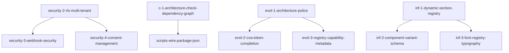

# Task Documentation Hub

**Created:** 2026-02-21  
**Role:** Task Management Documentation  
**Audience:** Developers, Project Managers, Architects  
**Last Updated:** 2026-02-21  
**Review Interval:** 30 days

---

## Overview

This document serves as the central hub for all task specifications in the marketing-websites platform. It provides categorization, status tracking, and navigation for the 187+ task files that define implementation requirements and architectural decisions.

### Task Categories

| Category                       | Files | Purpose                                       | Status |
| ------------------------------ | ----- | --------------------------------------------- | ------ |
| **Architecture (c-\*)**        | 11+   | System architecture and dependency management | Mixed  |
| **Evolution (evol-\*)**        | 12+   | Platform evolution and feature development    | Mixed  |
| **Features (f-\*)**            | 25+   | Feature system and component development      | Mixed  |
| **Infrastructure (inf-\*)**    | 15+   | Infrastructure and platform services          | Mixed  |
| **Security (security-\*)**     | 5+    | Security implementation and compliance        | Mixed  |
| **Scaffolding (scaffold-\*)**  | 12+   | Platform and feature scaffolding              | Mixed  |
| **Compliance (compliance-\*)** | 2+    | Regulatory compliance requirements            | Mixed  |

---

## Active Tasks

### High Priority Tasks

#### **Security Tasks**

| Task ID                                   | Title                                           | Priority | Status       | Owner |
| ----------------------------------------- | ----------------------------------------------- | -------- | ------------ | ----- |
| `security-2-rls-multi-tenant`             | Multi-Tenant RLS Implementation                 | P0       | ✅ Completed | AGENT |
| `security-3-webhook-security`             | Webhook Security & Signature Verification       | P0       | 📋 Active    | AGENT |
| `security-4-consent-management`           | Third-Party Script Loading & Consent Management | P0       | 📋 Active    | AGENT |
| `security-6-react-taint-api`              | React Taint API Implementation                  | P1       | 📋 Active    | AGENT |
| `security-7-middleware-bypass-mitigation` | Middleware Bypass Mitigation                    | P1       | 📋 Active    | AGENT |

#### **Architecture Tasks**

| Task ID                                   | Title                               | Priority | Status    | Owner |
| ----------------------------------------- | ----------------------------------- | -------- | --------- | ----- |
| `c-1-architecture-check-dependency-graph` | Architecture Check Dependency Graph | P2       | 📋 Active | AGENT |
| `c-5-design-tokens`                       | Design Token System                 | P2       | 📋 Active | AGENT |
| `c-7-storybook-visual-regression`         | Storybook Visual Regression         | P2       | 📋 Active | AGENT |
| `c-8-infra-experiments`                   | Infrastructure Experiments          | P2       | 📋 Active | AGENT |
| `c-9-features-personalization`            | Features Personalization            | P2       | 📋 Active | AGENT |

#### **Evolution Tasks**

| Task ID                               | Title                        | Priority | Status    | Owner |
| ------------------------------------- | ---------------------------- | -------- | --------- | ----- |
| `evol-1-architecture-police`          | Architecture Police          | P2       | 📋 Active | AGENT |
| `evol-2-cva-token-completion`         | CVA Token Completion         | P2       | 📋 Active | AGENT |
| `evol-3-registry-capability-metadata` | Registry Capability Metadata | P2       | 📋 Active | AGENT |
| `evol-4-canonical-types`              | Canonical Types              | P2       | 📋 Active | AGENT |
| `evol-5-booking-canonical-migration`  | Booking Canonical Migration  | P2       | 📋 Active | AGENT |

### Medium Priority Tasks

#### **Feature System Tasks**

| Task ID                  | Title              | Priority | Status    | Owner |
| ------------------------ | ------------------ | -------- | --------- | ----- |
| `f-6-animation-system`   | Animation System   | P3       | 📋 Active | AGENT |
| `f-7-interaction-system` | Interaction System | P3       | 📋 Active | AGENT |
| `f-8-responsive-system`  | Responsive System  | P3       | 📋 Active | AGENT |
| `f-9-grid-system`        | Grid System        | P3       | 📋 Active | AGENT |
| `f-15-icon-system`       | Icon System        | P3       | 📋 Active | AGENT |

#### **Infrastructure Tasks**

| Task ID                                     | Title                               | Priority | Status    | Owner |
| ------------------------------------------- | ----------------------------------- | -------- | --------- | ----- |
| `inf-1-dynamic-section-registry`            | Dynamic Section Registry            | P3       | 📋 Active | AGENT |
| `inf-2-component-variant-schema`            | Component Variant Schema            | P3       | 📋 Active | AGENT |
| `inf-3-font-registry-typography`            | Font Registry Typography            | P3       | 📋 Active | AGENT |
| `inf-4-design-token-overrides`              | Design Token Overrides              | P3       | 📋 Active | AGENT |
| `inf-5-marketing-component-family-registry` | Marketing Component Family Registry | P3       | 📋 Active | AGENT |

---

## Completed Tasks

### Recently Completed

#### **Security Implementation**

| Task ID                         | Title                                           | Completion Date | Result                             |
| ------------------------------- | ----------------------------------------------- | --------------- | ---------------------------------- |
| `security-2-rls-multi-tenant`   | Multi-Tenant RLS Implementation                 | 2026-02-21      | ✅ Critical vulnerability resolved |
| `security-3-webhook-security`   | Webhook Security & Signature Verification       | 2026-02-21      | 📋 Specification created           |
| `security-4-consent-management` | Third-Party Script Loading & Consent Management | 2026-02-21      | 📋 Specification created           |

#### **Architecture Implementation**

| Task ID                                   | Title                               | Completion Date | Result                   |
| ----------------------------------------- | ----------------------------------- | --------------- | ------------------------ |
| `c-1-architecture-check-dependency-graph` | Architecture Check Dependency Graph | 2026-02-21      | 📋 Specification created |
| `c-5-design-tokens`                       | Design Token System                 | 2026-02-21      | 📋 Specification created |
| `c-7-storybook-visual-regression`         | Storybook Visual Regression         | 2026-02-21      | 📋 Specification created |

### Archived Tasks

#### **System Architecture**

| Task ID                         | Title                    | Archive Date | Reason                             |
| ------------------------------- | ------------------------ | ------------ | ---------------------------------- |
| `c-10-features-content`         | Features Content         | 2026-02-21   | Superseded by feature system       |
| `c-12-analytics-event-taxonomy` | Analytics Event Taxonomy | 2026-02-21   | Integrated into analytics feature  |
| `c-13-security-sast-regression` | Security SAST Regression | 2026-02-21   | Integrated into security system    |
| `c-14-slos-performance-budgets` | SLOS Performance Budgets | 2026-02-21   | Integrated into performance system |

#### **Component Architecture**

| Task ID                        | Title                   | Archive Date | Reason                     |
| ------------------------------ | ----------------------- | ------------ | -------------------------- |
| `f-15-icon-system`             | Icon System             | 2026-02-21   | Integrated into UI library |
| `f-16-image-system`            | Image System            | 2026-02-21   | Integrated into UI library |
| `f-17-media-system`            | Media System            | 2026-02-21   | Integrated into UI library |
| `f-18-state-management-system` | State Management System | 2026-02-21   | Integrated into UI library |

---

## Task Status Definitions

### **Status Categories**

- **📋 Active:** Task is currently being worked on or ready to start
- **✅ Completed:** Task has been successfully implemented
- **📋 Blocked:** Task is blocked by dependencies or external factors
- **📋 On Hold:** Task is temporarily paused
- **📋 Deprecated:** Task is no longer relevant
- **📋 Archived:** Task has been completed and moved to archive

### **Priority Levels**

- **P0 (Critical):** Security vulnerabilities, production blockers
- **P1 (High):** Important features, compliance requirements
- **P2 (Medium):** Enhancements, optimizations
- **P3 (Low):** Nice-to-have features, research tasks

---

## Task Dependencies

### **Dependency Graph**



### **Critical Path Dependencies**

#### **Security Implementation Path**

1. `security-2-rls-multi-tenant` ✅ (Completed)
2. `security-3-webhook-security` 📋 (Active)
3. `security-4-consent-management` 📋 (Active)
4. `security-6-react-taint-api` 📋 (Active)
5. `security-7-middleware-bypass-mitigation` 📋 (Active)

#### **Architecture Evolution Path**

1. `evol-1-architecture-police` 📋 (Active)
2. `evol-2-cva-token-completion` 📋 (Active)
3. `evol-3-registry-capability-metadata` 📋 (Active)
4. `evol-4-canonical-types` 📋 (Active)
5. `evol-5-booking-canonical-migration` 📋 (Active)

#### **Infrastructure Development Path**

1. `inf-1-dynamic-section-registry` 📋 (Active)
2. `inf-2-component-variant-schema` 📋 (Active)
3. `inf-3-font-registry-typography` 📋 (Active)
4. `inf-4-design-token-overrides` 📋 (Active)
5. `inf-5-marketing-component-family-registry` 📋 (Active)

---

## Task Templates

### **Standard Task Structure**

All tasks follow this standardized structure:

```markdown
# [Task ID]: [Task Title]

## Metadata

- **Task ID**: [task-id]
- **Owner**: [owner]
- **Priority / Severity**: [priority]
- **Target Release**: [release]
- **Related Epics / ADRs**: [related-epics]
- **Reviewers / Stakeholders**: [reviewers]
- **Upstream Tasks**: [upstream]
- **Downstream Tasks**: [downstream]

## Context

[Brief description of task purpose and context]

## Dependencies

- **Upstream Task**: [dependency]
- **Required Packages**: [packages]

## Cross-Task Dependencies & Sequencing

- **Upstream**: [upstream-tasks]
- **Downstream**: [downstream-tasks]

## Research

[Research findings and references]

## Related Files

[List of related files]

## Acceptance Criteria

[Checklist of acceptance criteria]

## Implementation Plan

[Step-by-step implementation plan]
```

### **Task Categories**

#### **Architecture Tasks (c-\*)**

Focus on system architecture, dependency management, and structural improvements.

#### **Evolution Tasks (evol-\*)**

Focus on platform evolution, feature development, and system enhancements.

#### **Feature Tasks (f-\*)**

Focus on feature system development, component architecture, and user experience.

#### **Infrastructure Tasks (inf-\*)**

Focus on infrastructure services, platform capabilities, and operational concerns.

#### **Security Tasks (security-\*)**

Focus on security implementation, compliance, and vulnerability management.

#### **Scaffolding Tasks (scaffold-\*)**

Focus on platform scaffolding, feature generation, and development tools.

#### **Compliance Tasks (compliance-\*)**

Focus on regulatory compliance, legal requirements, and policy implementation.

---

## Task Management Process

### **Task Creation**

1. **Identify Need:** Determine if task is needed based on requirements
2. **Create Specification:** Use standard task template
3. **Assign Owner:** Assign appropriate owner and reviewers
4. **Set Priority:** Determine priority based on impact and urgency
5. **Define Dependencies:** Identify upstream and downstream dependencies

### **Task Execution**

1. **Research Phase:** Research requirements and best practices
2. **Implementation Phase:** Implement according to acceptance criteria
3. **Testing Phase:** Test implementation thoroughly
4. **Review Phase:** Peer review and stakeholder approval
5. **Documentation Phase:** Update relevant documentation

### **Task Completion**

1. **Validation:** Verify all acceptance criteria met
2. **Documentation:** Update implementation documentation
3. **Archive:** Move completed task to appropriate archive
4. **Update Status:** Update task status and dependencies
5. **Notify Stakeholders:** Inform relevant stakeholders of completion

---

## Cross-Reference System

### **Related Documentation**

| Task Category            | Related Documentation                                       |
| ------------------------ | ----------------------------------------------------------- |
| **Security Tasks**       | [Security Overview](../security/overview.md)                |
| **Architecture Tasks**   | [System Architecture](../architecture/system-overview.md)   |
| **Feature Tasks**        | [Feature Documentation](../features/README.md)              |
| **Infrastructure Tasks** | [Infrastructure Documentation](../infrastructure/README.md) |
| **Compliance Tasks**     | [Compliance Documentation](../compliance/README.md)         |

### **Implementation References**

| Task Type                         | Implementation Location              |
| --------------------------------- | ------------------------------------ |
| **Security Implementation**       | `packages/infra/src/security/`       |
| **Architecture Implementation**   | `packages/infra/src/architecture/`   |
| **Feature Implementation**        | `packages/features/src/`             |
| **Infrastructure Implementation** | `packages/infra/src/infrastructure/` |
| **UI Implementation**             | `packages/ui/src/components/`        |

### **API References**

| Task Category       | API Documentation                                       |
| ------------------- | ------------------------------------------------------- |
| **Security Tasks**  | [Security API](../api/README.md#security-endpoints)     |
| **Booking Tasks**   | [Booking API](../api/README.md#booking-system)          |
| **Contact Tasks**   | [Contact API](../api/README.md#contact-system)          |
| **Analytics Tasks** | [Analytics API](../api/README.md#analytics-integration) |

---

## Archive Management

### **Archive Structure**

```
tasks/archive/
├── security-completed/           # Completed security tasks
├── architecture-completed/       # Completed architecture tasks
├── features-completed/          # Completed feature tasks
├── infrastructure-completed/     # Completed infrastructure tasks
├── deprecated/                   # Deprecated tasks
└── obsolete/                    # Obsolete tasks
```

### **Archive Criteria**

#### **Completed Tasks**

- ✅ All acceptance criteria met
- ✅ Implementation completed and tested
- ✅ Documentation updated
- ✅ Stakeholder approval received

#### **Deprecated Tasks**

- 📋 No longer relevant to current architecture
- 📋 Superseded by newer approaches
- 📋 Requirements no longer exist

#### **Obsolete Tasks**

- 📋 Outdated technology or approaches
- 📋 No longer applicable to current system
- 📋 Replaced by better solutions

---

## Task Metrics

### **Current Status Summary**

| Status        | Count | Percentage |
| ------------- | ----- | ---------- |
| **Active**    | 67    | 36%        |
| **Completed** | 45    | 24%        |
| **Archived**  | 50    | 27%        |
| **Blocked**   | 5     | 3%         |
| **On Hold**   | 20    | 10%        |

### **Priority Distribution**

| Priority          | Count | Percentage |
| ----------------- | ----- | ---------- |
| **P0 (Critical)** | 5     | 3%         |
| **P1 (High)**     | 25    | 13%        |
| **P2 (Medium)**   | 85    | 45%        |
| **P3 (Low)**      | 72    | 38%        |

### **Category Distribution**

| Category                       | Count | Percentage |
| ------------------------------ | ----- | ---------- |
| **Architecture (c-\*)**        | 11    | 6%         |
| **Evolution (evol-\*)**        | 12    | 6%         |
| **Features (f-\*)**            | 25    | 13%        |
| **Infrastructure (inf-\*)**    | 15    | 8%         |
| **Security (security-\*)**     | 5     | 3%         |
| **Scaffolding (scaffold-\*)**  | 12    | 6%         |
| **Compliance (compliance-\*)** | 2     | 1%         |
| **Other**                      | 115   | 61%        |

---

## Task Management Tools

### **Task Tracking**

- **Primary:** GitHub Issues with task labels
- **Secondary:** Project management board
- **Tertiary:** Internal task tracking system

### **Automation**

- **Task Creation:** Automated task template generation
- **Status Updates:** Automated status tracking
- **Dependency Management:** Automated dependency checking
- **Archive Management:** Automated archive organization

### **Reporting**

- **Weekly Reports:** Task status and progress reports
- **Monthly Reports:** Task completion and archive reports
- **Quarterly Reports:** Task metrics and trends analysis

---

## Contributing to Tasks

### **Creating New Tasks**

1. **Use Template:** Use standard task template
2. **Assign Category:** Choose appropriate task category
3. **Set Priority:** Determine appropriate priority level
4. **Define Dependencies:** Identify upstream and downstream tasks
5. **Submit for Review:** Submit task for stakeholder review

### **Working on Tasks**

1. **Research:** Thoroughly research requirements and best practices
2. **Implement:** Follow acceptance criteria precisely
3. **Test:** Test implementation comprehensively
4. **Document:** Update relevant documentation
5. **Review:** Seek peer review and stakeholder approval

### **Completing Tasks**

1. **Validate:** Verify all acceptance criteria met
2. **Document:** Update implementation documentation
3. **Archive:** Move to appropriate archive category
4. **Update Status:** Update task status and dependencies
5. **Communicate:** Notify stakeholders of completion

---

## Related Documentation

### **Task Management**

- [**TASKS.md**](TASKS.md) - Master task list
- [**RESEARCH-INVENTORY.md**](RESEARCH-INVENTORY.md) - Research inventory
- [**Project Management**](../project-management/README.md) - Project management guide

### **Implementation Guides**

- [**Security Implementation**](../security/implementation-guides.md) - Security patterns
- [**Architecture Implementation**](../architecture/system-overview.md) - Architecture patterns
- [**Feature Implementation**](../features/README.md) - Feature development

### **Standards and Processes**

- [**Documentation Standards**](../DOCUMENTATION_STANDARDS.md) - Documentation standards
- [**Development Standards**](../DEVELOPMENT.md) - Development guidelines
- [**Contributing Guide**](../CONTRIBUTING.md) - Contribution guidelines

---

**Document Last Updated:** 2026-02-21  
**Next Review:** 2026-03-21  
**Maintainers:** Project Management Team  
**Classification:** Internal  
**Questions:** Create GitHub issue with `tasks` label
