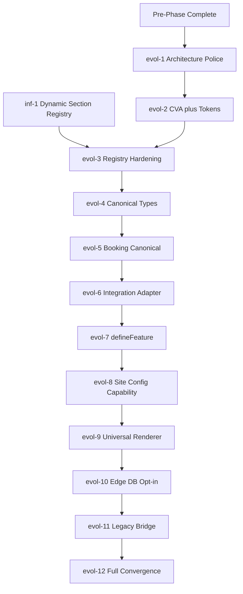

# Task Index — 26-Week Organic Evolution

**Purpose:** Single source of truth for evolution task sequencing and specs. Aligned with [THEGOAL.md](../THEGOAL.md) and [ROADMAP.md](../ROADMAP.md).

**Last Updated:** 2026-02-20

---

## For AI / iteration

- **Next task:** Use table "What to Work On Next" below; then open the spec from the row (e.g. `tasks/evol-1-architecture-police.md`).
- **Resolve spec from task ID:** Spec file is `tasks/<task-id-slug>.md` (e.g. `evol-1` → `evol-1-architecture-police.md`, `inf-2` → `inf-2-component-variant-schema.md`). Links in tables are canonical.
- **Context before coding:** Read [.context/RULES.md](../.context/RULES.md) (task execution non-negotiables) and [THEGOAL.md](../THEGOAL.md); for concepts→files use [.context/MAP.md](../.context/MAP.md).
- **All open task IDs (flat):** evol-1, evol-2, evol-3, evol-4, evol-5, evol-5a, evol-5b, evol-6, evol-7, evol-7a, evol-7b, evol-8, evol-9, evol-9a, evol-9b, evol-10, evol-11, evol-12 | inf-1..15, c-5 | security-2, security-3, security-4, security-6, security-7 | infrastructure-1..6 | compliance-1, compliance-2 | f-6, f-7, f-8, f-9, f-15..18, f-19, f-20, f-21, f-22, f-24..30, f-36, f-38, f-39, f-40 | integration-wiring-client-pages, scripts-wire-package-json

---

## 1. Prioritized Execution Plan

### Critical Path (Evolution)

### What to Work On Next

| Priority | Task(s)                                       | Condition                          |
| -------- | --------------------------------------------- | ---------------------------------- |
| P0 (now) | evol-1                                        | Starting Phase 1                   |
| P0       | inf-1                                         | Before evol-3                      |
| P1       | evol-2                                        | After evol-1                       |
| P2       | evol-3                                        | After evol-2 + inf-1               |
| Parallel | security-\*, infrastructure-\*, compliance-\* | Non-blocking; schedule by capacity |

### Infra Task Ordering (inf-\*)

- **Phase 1:** inf-1 (prereq evol-3), inf-2 (aligns evol-3), c-5 (aligns evol-2), inf-4 (token overrides)
- **Phase 2:** inf-10 (satisfies evol-6)
- **Phase 3:** inf-14 (evolved by evol-7)
- **Standalone / as-needed:** inf-3, inf-5..9, inf-11..13, inf-15

---

## 2. Evolution (Phases 0–5)

### 2.0 Pre-Phase (Week 0) — ✅ Complete (Archived)

| Task | Description                                                           | Status   | Spec                                                                                                                       |
| ---- | --------------------------------------------------------------------- | -------- | -------------------------------------------------------------------------------------------------------------------------- |
| 0-1  | Fix critical CI failures                                              | Archived | [archive/0-1-fix-critical-ci-failures.md](archive/0-1-fix-critical-ci-failures.md)                                         |
| 0-2  | Replace internal bookings with persistent storage (BookingRepository) | Archived | [archive/0-2-replace-internal-bookings-persistent-storage.md](archive/0-2-replace-internal-bookings-persistent-storage.md) |
| 0-3  | Fix tenant context security                                           | Archived | [archive/0-3-fix-tenant-context-security.md](archive/0-3-fix-tenant-context-security.md)                                   |

**Checkpoint:** CI green, tenant context fixed, BookingRepository interface in place.

---

### 2.1 Phase 1 (Weeks 1–4) — Foundation Locked

| Task   | Description                                 | Spec                                                                             |
| ------ | ------------------------------------------- | -------------------------------------------------------------------------------- |
| evol-1 | Architecture Police (ESLint rules)          | [evol-1-architecture-police.md](evol-1-architecture-police.md)                   |
| evol-2 | CVA completion + token system               | [evol-2-cva-token-completion.md](evol-2-cva-token-completion.md)                 |
| evol-3 | Registry hardening with capability metadata | [evol-3-registry-capability-metadata.md](evol-3-registry-capability-metadata.md) |

**Execution order:** evol-1 → evol-2 → evol-3. inf-1 (dynamic section registry) is prerequisite for evol-3.

**Checkpoint:** Zero lint errors; registries hardened.

---

### 2.2 Phase 2 (Weeks 5–10) — Data Contracts Seeded

| Task   | Description                               | Spec                                                                             |
| ------ | ----------------------------------------- | -------------------------------------------------------------------------------- |
| evol-4 | Canonical types (Lead, Booking)           | [evol-4-canonical-types.md](evol-4-canonical-types.md)                           |
| evol-5 | Migrate booking to canonical + repository | [evol-5-booking-canonical-migration.md](evol-5-booking-canonical-migration.md)   |
| evol-6 | Integration adapter registry              | [evol-6-integration-adapter-registry.md](evol-6-integration-adapter-registry.md) |

**Sub-tasks:** evol-5a ([evol-5a-booking-canonical-types.md](evol-5a-booking-canonical-types.md)), evol-5b ([evol-5b-booking-repository-migration.md](evol-5b-booking-repository-migration.md)).

**Prerequisites:** ADR-012 ([docs/adr/0012-canonical-types-data-contracts.md](../docs/adr/0012-canonical-types-data-contracts.md)) before evol-4; 0-2 (BookingRepository) before evol-5.

**Checkpoint:** Booking uses canonical types.

---

### 2.3 Phase 3 (Weeks 11–16) — Capability Core Active

| Task   | Description                                      | Spec                                                                                       |
| ------ | ------------------------------------------------ | ------------------------------------------------------------------------------------------ |
| evol-7 | Feature → capability refactoring (defineFeature) | [evol-7-define-feature.md](evol-7-define-feature.md)                                       |
| evol-8 | Site config → capability activation              | [evol-8-site-config-capability-activation.md](evol-8-site-config-capability-activation.md) |

**Sub-tasks:** evol-7a ([evol-7a-define-feature-infra.md](evol-7a-define-feature-infra.md)), evol-7b ([evol-7b-booking-feature-registration.md](evol-7b-booking-feature-registration.md)).

**Checkpoint:** Features self-declare capabilities.

---

### 2.4 Phase 4 (Weeks 17–22) — Universal Renderer Proven

| Task    | Description                      | Spec                                                               |
| ------- | -------------------------------- | ------------------------------------------------------------------ |
| evol-9  | Universal renderer (new clients) | [evol-9-universal-renderer.md](evol-9-universal-renderer.md)       |
| evol-10 | Edge database opt-in             | [evol-10-edge-database-opt-in.md](evol-10-edge-database-opt-in.md) |

**Sub-tasks:** evol-9a ([evol-9a-activate-capabilities.md](evol-9a-activate-capabilities.md)), evol-9b ([evol-9b-universal-page.md](evol-9b-universal-page.md)).

**Checkpoint:** New client launched on universal renderer.

---

### 2.5 Phase 5 (Weeks 23–26) — Platform Converged

| Task    | Description               | Spec                                                                         |
| ------- | ------------------------- | ---------------------------------------------------------------------------- |
| evol-11 | Legacy bridge             | [evol-11-legacy-bridge.md](evol-11-legacy-bridge.md)                         |
| evol-12 | Full platform convergence | [evol-12-full-platform-convergence.md](evol-12-full-platform-convergence.md) |

**Checkpoint:** Legacy + modern coexist; migration path clear.

---

## 3. Parallel Tracks (Non-Blocking)

These do not block Phase 1–2 evolution sequencing. Schedule by capacity.

### Security

| Task       | Description                                                    | Spec                                                                                     |
| ---------- | -------------------------------------------------------------- | ---------------------------------------------------------------------------------------- |
| security-2 | Multi-tenant RLS — Supabase RLS, tenant boundaries             | [security-2-rls-multi-tenant.md](security-2-rls-multi-tenant.md)                         |
| security-3 | Webhook security — HMAC, replay protection, idempotency        | [security-3-webhook-security.md](security-3-webhook-security.md)                         |
| security-4 | Consent management — consent-gated third-party scripts         | [security-4-consent-management.md](security-4-consent-management.md)                     |
| security-6 | React Taint API — prevent Server Action data leakage           | [security-6-react-taint-api.md](security-6-react-taint-api.md)                           |
| security-7 | Middleware bypass mitigation — CVE-2025-29927 defense-in-depth | [security-7-middleware-bypass-mitigation.md](security-7-middleware-bypass-mitigation.md) |

**Archived:** security-1 (server action hardening), security-5 (pnpm supply chain) — see [archive/ARCHIVE.md](archive/ARCHIVE.md).

### Infrastructure

| Task             | Description                                                               | Spec                                                                                               |
| ---------------- | ------------------------------------------------------------------------- | -------------------------------------------------------------------------------------------------- |
| infrastructure-1 | Observability & OpenTelemetry — tracing, tenant-aware IDs                 | [infrastructure-1-observability-opentelemetry.md](infrastructure-1-observability-opentelemetry.md) |
| infrastructure-2 | E2E testing — multi-tenant E2E, visual regression                         | [infrastructure-2-e2e-testing.md](infrastructure-2-e2e-testing.md)                                 |
| infrastructure-3 | Integration resilience — retry, circuit breaker, DLQ                      | [infrastructure-3-integration-resilience.md](infrastructure-3-integration-resilience.md)           |
| infrastructure-4 | Partytown — offload third-party scripts to Web Workers                    | [infrastructure-4-partytown-integration.md](infrastructure-4-partytown-integration.md)             |
| infrastructure-5 | Contract testing with Pact — consumer-driven API contracts                | [infrastructure-5-contract-testing-pact.md](infrastructure-5-contract-testing-pact.md)             |
| infrastructure-6 | Scaffold MCP — AI governance via scaffold.yaml, architectural consistency | [infrastructure-6-scaffold-mcp.md](infrastructure-6-scaffold-mcp.md)                               |

### Compliance

| Task         | Description                                           | Spec                                                                   |
| ------------ | ----------------------------------------------------- | ---------------------------------------------------------------------- |
| compliance-1 | CCPA 2026 updates — lookback, DROP, minors            | [compliance-1-ccpa-2026-updates.md](compliance-1-ccpa-2026-updates.md) |
| compliance-2 | EU AI Act — governance, human review, compliance docs | [compliance-2-eu-ai-act.md](compliance-2-eu-ai-act.md)                 |

---

## 4. Supporting / Infra Tasks (inf-1..15)

| Task   | Phase / Role | Purpose                                                            | Spec                                                                                         |
| ------ | ------------ | ------------------------------------------------------------------ | -------------------------------------------------------------------------------------------- |
| inf-1  | Phase 1      | Prerequisite for evol-3 — config-driven section registration       | [inf-1-dynamic-section-registry.md](inf-1-dynamic-section-registry.md)                       |
| inf-2  | Phase 1      | Aligns evol-3 — arbitrary variant strings in SiteConfig            | [inf-2-component-variant-schema.md](inf-2-component-variant-schema.md)                       |
| inf-3  | Standalone   | Font registry / typography — custom fonts, type scale              | [inf-3-font-registry-typography.md](inf-3-font-registry-typography.md)                       |
| inf-4  | Phase 1      | Design token overrides from site.config                            | [inf-4-design-token-overrides.md](inf-4-design-token-overrides.md)                           |
| inf-5  | Standalone   | Marketing component family registry — pluggable families           | [inf-5-marketing-component-family-registry.md](inf-5-marketing-component-family-registry.md) |
| inf-6  | Standalone   | Block / content type registry — content blocks as config           | [inf-6-block-content-type-registry.md](inf-6-block-content-type-registry.md)                 |
| inf-7  | Standalone   | generate-component CLI with --family and --variant                 | [inf-7-generate-component-family-variant.md](inf-7-generate-component-family-variant.md)     |
| inf-8  | Standalone   | Layout template registry — custom page layout by ID                | [inf-8-layout-template-registry.md](inf-8-layout-template-registry.md)                       |
| inf-9  | Standalone   | Industry extensibility — custom industry IDs beyond 12             | [inf-9-industry-extensibility.md](inf-9-industry-extensibility.md)                           |
| inf-10 | Phase 2      | Satisfies evol-6 — integration adapter registry                    | [inf-10-integration-adapter-registry.md](inf-10-integration-adapter-registry.md)             |
| inf-11 | Standalone   | Component catalog / discovery — browse by tag, industry            | [inf-11-component-catalog-discovery.md](inf-11-component-catalog-discovery.md)               |
| inf-12 | Standalone   | Theme preset library — curated presets (minimal, bold)             | [inf-12-theme-preset-library.md](inf-12-theme-preset-library.md)                             |
| inf-13 | Standalone   | Animation / motion presets — named presets (fadeIn, slideUp)       | [inf-13-animation-motion-presets.md](inf-13-animation-motion-presets.md)                     |
| inf-14 | Phase 3      | Evolved by evol-7 — feature plugin interface                       | [inf-14-feature-plugin-interface.md](inf-14-feature-plugin-interface.md)                     |
| inf-15 | Standalone   | Structured data schema registry — custom schema.org JSON-LD        | [inf-15-structured-data-schema-registry.md](inf-15-structured-data-schema-registry.md)       |
| c-5    | Phase 1      | Design tokens; extended by evol-2 — three-layer token architecture | [c-5-design-tokens.md](c-5-design-tokens.md)                                                 |

---

## 5. System Specs (f-\*)

Specification and system-design docs for reference implementations; not immediate execution items. Topic mappings: [RESEARCH-INVENTORY.md](RESEARCH-INVENTORY.md) (R-INFRA, R-MOTION, etc.).

| Domain      | Tasks                                      | Specs                                                                                                                                                                                                                                                                                                                                                                                                                  |
| ----------- | ------------------------------------------ | ---------------------------------------------------------------------------------------------------------------------------------------------------------------------------------------------------------------------------------------------------------------------------------------------------------------------------------------------------------------------------------------------------------------------- |
| Design/UI   | f-6, f-7, f-8, f-9, f-15, f-16, f-17, f-18 | [f-6-animation-system.md](f-6-animation-system.md), [f-7-interaction-system.md](f-7-interaction-system.md), [f-8-responsive-system.md](f-8-responsive-system.md), [f-9-grid-system.md](f-9-grid-system.md), [f-15-icon-system.md](f-15-icon-system.md), [f-16-image-system.md](f-16-image-system.md), [f-17-media-system.md](f-17-media-system.md), [f-18-state-management-system.md](f-18-state-management-system.md) |
| Forms/Data  | f-19, f-20                                 | [f-19-form-system.md](f-19-form-system.md), [f-20-validation-system.md](f-20-validation-system.md)                                                                                                                                                                                                                                                                                                                     |
| Reliability | f-21, f-22                                 | [f-21-error-handling-system.md](f-21-error-handling-system.md), [f-22-loading-system.md](f-22-loading-system.md)                                                                                                                                                                                                                                                                                                       |
| Quality/Ops | f-24..f-30                                 | [f-24-performance-system.md](f-24-performance-system.md), [f-25-testing-system.md](f-25-testing-system.md), [f-26-documentation-system.md](f-26-documentation-system.md), [f-27-development-system.md](f-27-development-system.md), [f-28-build-system.md](f-28-build-system.md), [f-29-deployment-system.md](f-29-deployment-system.md), [f-30-monitoring-system.md](f-30-monitoring-system.md)                       |
| Platform    | f-36, f-38, f-39, f-40                     | [f-36-style-system.md](f-36-style-system.md), [f-38-configuration-system.md](f-38-configuration-system.md), [f-39-plugin-system.md](f-39-plugin-system.md), [f-40-extension-system.md](f-40-extension-system.md)                                                                                                                                                                                                       |

---

## 6. Miscellaneous

| Task                            | Description                                                             | Spec                                                                     |
| ------------------------------- | ----------------------------------------------------------------------- | ------------------------------------------------------------------------ |
| integration-wiring-client-pages | Wire scheduling, chat, reviews, maps into client pages from site.config | [integration-wiring-client-pages.md](integration-wiring-client-pages.md) |
| scripts-wire-package-json       | Add scripts from scripts/ to root package.json for CI/DevEx             | [scripts-wire-package-json.md](scripts-wire-package-json.md)             |

---

## 7. Future / Beyond Evolution (Scaffold Tasks)

Scaffold tasks (scaffold-ai-platform-_, scaffold-features-_, scaffold-content-platform-\*, etc.) track future work for Phase 7+ (AI platform, content platform, marketing ops, tenant-core). **Out of scope** for the 26-week evolution. See [scaffold-gap-analysis-2026-02.md](scaffold-gap-analysis-2026-02.md).

---

## 8. Documentation & References

| Resource                                       | Purpose                                     | When to use                                        |
| ---------------------------------------------- | ------------------------------------------- | -------------------------------------------------- |
| [THEGOAL.md](../THEGOAL.md)                    | Target architecture, phase checkpoints      | Before phase work; understand end state            |
| [ROADMAP.md](../ROADMAP.md)                    | Organic evolution §, phase summary          | Confirm phase scope and timeline                   |
| [.context/MAP.md](../.context/MAP.md)          | Concept → file mapping (AI discoverability) | Find files by concept (e.g. CaCA, canonical types) |
| [.context/RULES.md](../.context/RULES.md)      | Task execution non-negotiables, guardrails  | Before every task; validation chain                |
| [CLAUDE.md](../CLAUDE.md)                      | Repo overview, commands, conventions        | Commands, stack, structure                         |
| [AGENTS.md](../AGENTS.md)                      | Agent briefing, doc map                     | Short briefing, doc map                            |
| [docs/README.md](../docs/README.md)            | Documentation hub (Diátaxis)                | Navigate docs by purpose                           |
| [docs/architecture/](../docs/architecture/)    | Layer model, module boundaries              | Dependency rules, layers                           |
| [docs/adr/](../docs/adr/)                      | Architecture Decision Records               | Why decisions were made                            |
| [RESEARCH-INVENTORY.md](RESEARCH-INVENTORY.md) | Topic index, task→research mapping          | Research for a task; topic IDs (R-\*)              |
| [CONTRIBUTING.md](../CONTRIBUTING.md)          | PR and commit workflow                      | Before commit/PR                                   |

Note: [docs/architecture/evolution-roadmap.md](../docs/architecture/evolution-roadmap.md) redirects to ROADMAP § Organic Evolution.

---

## 9. Archived

Completed or superseded tasks: [archive/ARCHIVE.md](archive/ARCHIVE.md). Includes 0-1..0-3, 6-8\*, 6-9\*, security-1, security-5, d-8, and other archived specs.

---

## 10. Maintenance

- **When adding a task:** Add to the appropriate section in TASKS.md with spec link and phase/priority.
- **When archiving:** Move spec to archive/, add to ARCHIVE.md, remove from open index.
- **When completing:** Mark in task spec; consider moving to archive when phase checkpoint is done.
