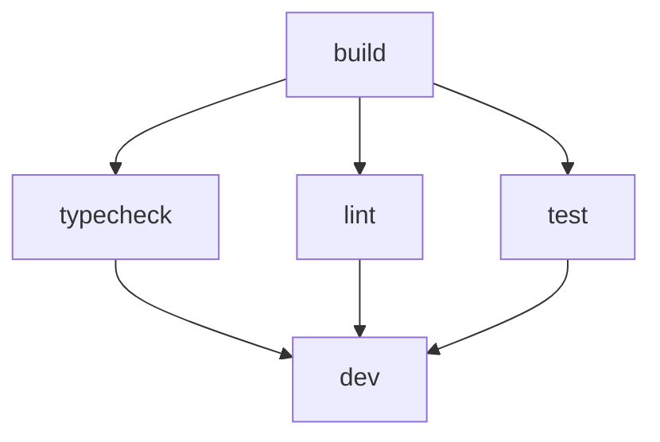

# DOMAIN-37-003: Build Configuration Over-Engineering

## Overview

Simplify over-engineered build configuration in turbo.json, remove redundant tasks, and streamline the build pipeline for better maintainability.

## Current State Analysis

### Problem Identification

- **Redundant Tasks**: Separate `typecheck` and `type-check` tasks doing the same thing
- **Over-Complex Configuration**: 12 tasks with overlapping responsibilities
- **Excessive Inputs**: Complex input patterns that could be simplified
- **Maintenance Overhead**: Complex build configuration hard to maintain

### Complexity Issues

1. **Duplicate Tasks**: `typecheck` and `type-check` perform identical functions
2. **Overlapping Responsibilities**: Multiple tasks with similar purposes
3. **Complex Input Patterns**: Excessive file watching and input specifications
4. **Cache Inefficiency**: Redundant caching strategies

## Implementation Plan

### Phase 1: Configuration Audit (Week 1)

1. **Task Analysis**
   - Identify duplicate or redundant tasks
   - Analyze task dependencies and overlaps
   - Document task purposes and responsibilities

2. **Input Pattern Review**
   - Examine input file specifications
   - Identify redundant input patterns
   - Assess caching efficiency

### Phase 2: Simplification Strategy (Week 2)

1. **Task Consolidation**

   ```json
   // Current: Duplicate tasks
   "typecheck": {
     "dependsOn": ["^build"],
     "cache": true,
     "outputs": ["*.tsbuildinfo"],
     "inputs": ["**/*.ts", "**/*.tsx", "tsconfig.json", "*.d.ts"]
   },
   "type-check": {
     "dependsOn": ["^typecheck"],
     "cache": true,
     "outputs": ["*.tsbuildinfo"],
     "inputs": ["**/*.ts", "**/*.tsx", "tsconfig.json", "*.d.ts"]
   }

   // Simplified: Single task
   "typecheck": {
     "dependsOn": ["^build"],
     "cache": true,
     "outputs": ["*.tsbuildinfo"],
     "inputs": ["**/*.ts", "**/*.tsx", "tsconfig.json", "*.d.ts"]
   }
   ```

2. **Input Pattern Optimization**

   ```json
   // Current: Complex input patterns
   "inputs": [
     "src/**",
     "public/**",
     "package.json",
     "tsconfig.json",
     "next.config.*",
     "tailwind.config.*"
   ]

   // Simplified: Essential inputs only
   "inputs": ["src/**", "package.json", "tsconfig.json"]
   ```

### Phase 3: Configuration Refactoring (Week 3-4)

1. **Task Streamlining**
   - Remove duplicate tasks
   - Merge similar functionality
   - Optimize dependency chains

2. **Cache Optimization**
   - Consolidate caching strategies
   - Improve cache hit rates
   - Reduce cache invalidation

## Acceptance Criteria

### Functional Requirements

- [ ] All build functionality preserved
- [ ] No breaking changes for developers
- [ ] Improved build performance
- [ ] Simplified maintenance

### Performance Requirements

- [ ] Build time reduction: 10-15%
- [ ] Cache hit rate improvement: 20%
- [ ] Reduced configuration complexity
- [ ] Better developer experience

### Code Quality Requirements

- [ ] Cleaner configuration files
- [ ] Reduced redundancy
- [ ] Better task organization
- [ ] Improved documentation

## Implementation Details

### Priority Consolidations

1. **Type Checking Tasks**
   - Remove `type-check` (duplicate of `typecheck`)
   - Consolidate `lint:fsd` into main `lint` task
   - Merge `format:check` into `format` task

2. **Build Tasks**
   - Optimize `build` task inputs
   - Simplify dependency chains
   - Improve caching strategies

### Simplified Configuration Structure

```json
{
  "$schema": "https://turbo.build/schema.json",
  "cacheDir": ".turbo",
  "globalEnv": ["NODE_ENV", "VERCEL", "DATABASE_URL", "NEXT_PUBLIC_SUPABASE_URL"],
  "tasks": {
    "build": {
      "dependsOn": ["^build"],
      "outputs": ["dist/**", ".next/**"],
      "cache": true,
      "inputs": ["src/**", "package.json", "tsconfig.json"]
    },
    "typecheck": {
      "dependsOn": ["^build"],
      "cache": true,
      "outputs": ["*.tsbuildinfo"],
      "inputs": ["**/*.ts", "**/*.tsx", "tsconfig.json"]
    },
    "lint": {
      "cache": true,
      "inputs": ["**/*.ts", "**/*.tsx", "eslint.config.*"]
    },
    "test": {
      "dependsOn": ["^build"],
      "cache": true,
      "outputs": ["coverage/**"],
      "inputs": ["**/*.test.*", "vitest.config.*"]
    },
    "dev": {
      "cache": false,
      "persistent": true,
      "dependsOn": ["^build"]
    }
  }
}
```

### Task Dependency Optimization



## Testing Strategy

### Build Compatibility Testing

- [ ] All build targets work correctly
- [ ] Dependency chains function properly
- [ ] Cache strategies effective
- [ ] Performance improvements measurable

### Developer Experience Testing

- [ ] Build commands work as expected
- [ ] Error messages remain helpful
- [ ] Development workflow unchanged
- [ ] IDE integration maintained

## Risk Mitigation

### Breaking Changes

- Maintain command compatibility
- Provide migration guides for any changes
- Implement deprecation warnings

### Performance Regression

- Benchmark current build times
- Monitor performance during refactoring
- Rollback strategy for performance issues

## Success Metrics

### Quantitative Metrics

- Configuration size reduction: 30-40%
- Build time improvement: 10-15%
- Cache hit rate improvement: 20%
- Task count reduction: 25%

### Qualitative Metrics

- Simplified maintenance
- Better developer understanding
- Improved debugging experience
- Enhanced configuration clarity

## Future Considerations

### Expansion Readiness

- Maintain configuration flexibility
- Design for easy task addition
- Document configuration patterns

### Tooling Integration

- Ensure IDE plugin compatibility
- Maintain build tool integration
- Support future build features

---

**Status**: Pending  
**Priority**: High  
**Estimated Effort**: 2-3 weeks  
**Dependencies**: None  
**Owner**: Development Team
